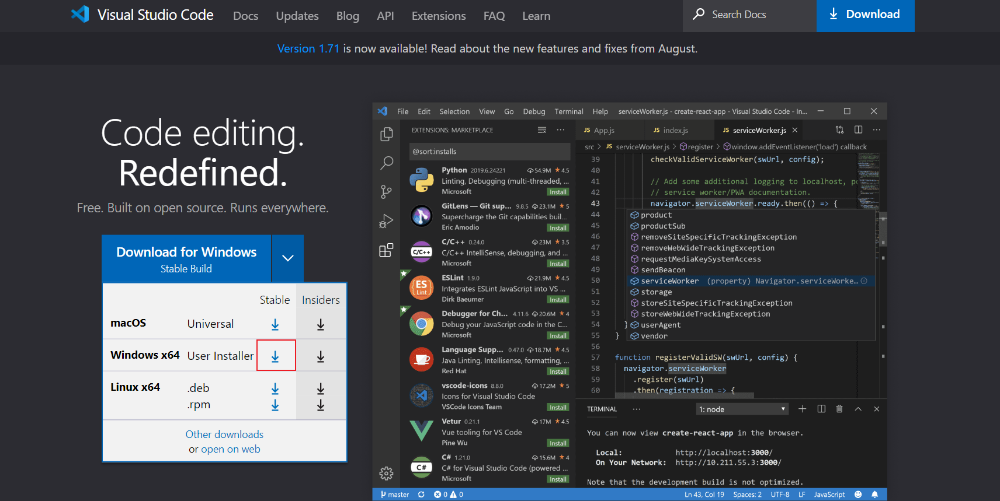
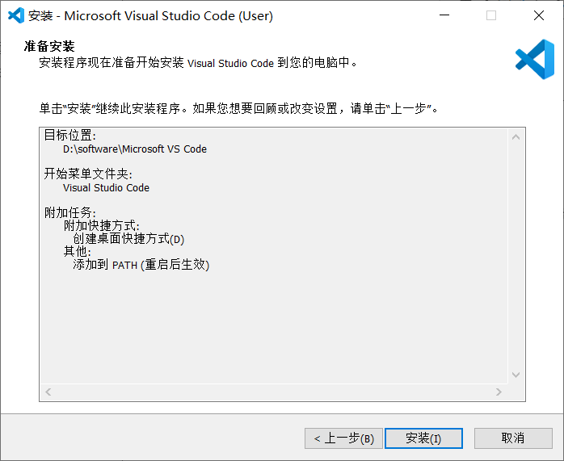
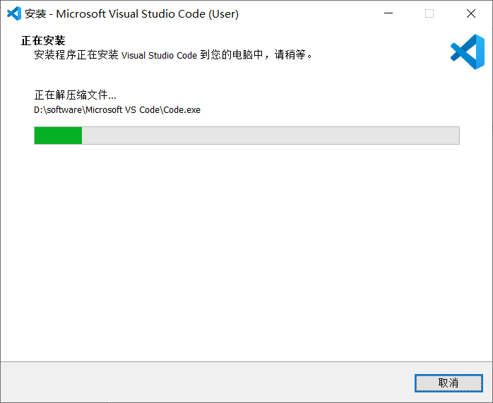
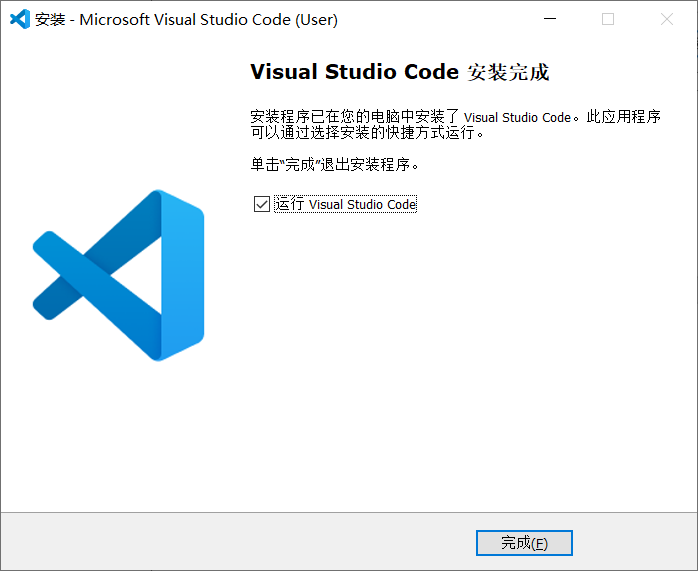
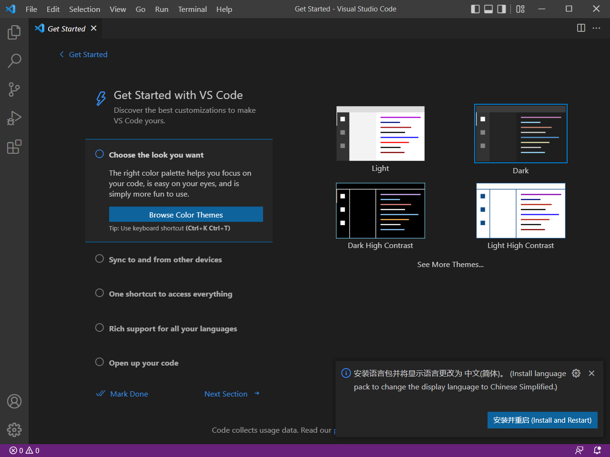
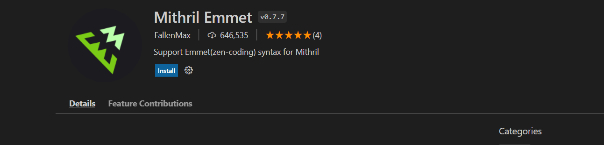
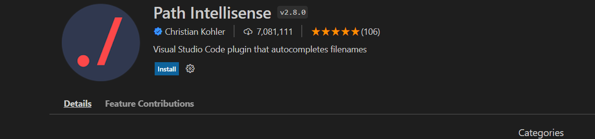

- [1. 邂逅前端开发](#1-邂逅前端开发)
  - [1.1. 软件开发、软件开发体系](#11-软件开发软件开发体系)
  - [1.2. 完善的应用程序包括哪些？](#12-完善的应用程序包括哪些)
  - [1.3. 前端开发的内容](#13-前端开发的内容)
  - [1.4. 学习方法和学习建议](#14-学习方法和学习建议)
- [2. 邂逅Web开发](#2-邂逅web开发)
  - [2.1. 电脑配置、推荐软件](#21-电脑配置推荐软件)
  - [2.2. 网站和网页的关系](#22-网站和网页的关系)
  - [2.3. 网页的显示过程（重要）](#23-网页的显示过程重要)
  - [2.4. 网页的组成部分](#24-网页的组成部分)
- [3. 浏览器和浏览器内核](#3-浏览器和浏览器内核)
- [4. VS Code 安装文档](#4-vs-code-安装文档)
  - [4.1. 下载](#41-下载)
  - [4.2. 安装](#42-安装)
  - [4.3. 插件安装](#43-插件安装)
    - [1、Chinese (Simplified) Language Pack](#1chinese-simplified-language-pack)
    - [2、HTML CSS Support](#2html-css-support)
    - [3、JavaScript (ES6) code snippets](#3javascript-es6-code-snippets)
    - [4、Mithril Emmet](#4mithril-emmet)
    - [5、Path Intellisense](#5path-intellisense)
    - [6、Vue 3 Snippets](#6vue-3-snippets)
    - [7、Auto Close Tag](#7auto-close-tag)
    - [8、Auto Rename Tag](#8auto-rename-tag)
    - [9、open in browser](#9open-in-browser)
    - [10、Live Server](#10live-server)
    - [11、Vue Language Features (Volar)](#11vue-language-features-volar)
    - [12、TypeScript Vue Plugin (Volar)](#12typescript-vue-plugin-volar)
    - [13、File Utils](#13file-utils)
    - [14、IntelliJ IDEA Keybindings](#14intellij-idea-keybindings)
  - [4.4. 配置](#44-配置)
- [5. VS Code 的使用](#5-vs-code-的使用)
  - [5.1 使用方式](#51-使用方式)
  - [5.2 相关设置](#52-相关设置)
  - [5.3 快捷键](#53-快捷键)
    - [5.4 Emmet 快捷键](#54-emmet-快捷键)
  - [5.5 常用扩展](#55-常用扩展)


## 1. 邂逅前端开发

### 1.1. 软件开发、软件开发体系


### 1.2. 完善的应用程序包括哪些？

* 服务器开发
* iOS开发、Android开发
* Web开发
* 桌面开发（window mac os）


### 1.3. 前端开发的内容

* 前端开发的任务；
  * web开发、小程序开发
  * 移动端、桌面端（electron、vscode）、服务器开发（Node）
* 前端开发的路线


### 1.4. 学习方法和学习建议

* 学习任何新的东西的，最好了解它的历史、局限性、本质；
* 知识进行分类：
  * 常用的知识：必须非常熟练；
  * 不常用的知识：知道有他，知道在哪里查；


## 2. 邂逅Web开发

### 2.1. 电脑配置、推荐软件


### 2.2. 网站和网页的关系


### 2.3. 网页的显示过程（重要）

* 用户角度
* 前端工程师
* 服务器是什么？


### 2.4. 网页的组成部分

* HTML：网页的结构
* CSS：网页的样式（美化）
* JavaScript：网页的交互（灵魂）


## 3. 浏览器和浏览器内核

常见的浏览器

核心部分浏览器内核：渲染引擎

## 4. VS Code 安装文档

### 4.1. 下载

进入VS Code官网：https://code.visualstudio.com，点击 `DownLoad for Windows`下载windows版本

 

当然也可以点击旁边的箭头，下载Windows版本 或 Mac OS 版本

 

- 备注：
  - Stable：稳定版
  - Insiders：内测版

> 注意：上述下载软件安装包的过程，大家可以不用操作，因为在提供的课程资料中，已经为大家准备好了安装包 。


### 4.2. 安装

   

双击安装包，选择`我同意此协议`，再点击`下一步`

 


选择安装路径（也可以使用默认值: C:\Users\super\AppData\Local\Programs\Microsoft VS Code），点击`下一步` 。

 


继续点击下一步

 


可以勾选创建桌面快捷方式，如果不想使用vscode作为代码默认打开方式，可以取消`将code注册为受支持的文件类型的编辑器`，点击下一步

 


点击安装，开始安装 

 

 

 


安装完成，运行VS Code。




点击左下角的 "设置"  -> "主题" -> "主题颜色"，然后可以根据自己的喜好，选择喜欢的主题颜色。


### 4.3. 插件安装

 

VS Code提供了非常丰富的插件功能，根据你的需要，安装对应的插件可以大大提高开发效率。

完成前端开发，常见插件介绍：


#### 1、Chinese (Simplified) Language Pack

适用于 VS Code 的中文（简体）语言包

 


#### 2、HTML CSS Support

在编写样式表的时候，自动补全功能大大缩减了编写时间。

 


#### 3、JavaScript (ES6) code snippets

支持ES6语法提示

 


#### 4、Mithril Emmet

一个能大幅度提高前端开发效率的一个工具，用于补全代码

 


#### 5、Path Intellisense

路径提示插件

 


#### 6、Vue 3 Snippets

在 Vue 2 或者 Vue 3 开发中提供代码片段，语法高亮和格式化的 VS Code 插件，能极大提高你的开发效率。

 


#### 7、Auto Close Tag

自动闭合HTML/XML标签

 


#### 8、Auto Rename Tag

自动完成另一侧标签的同步修改

 


#### 9、open in browser

vscode不像IDE一样能够直接在浏览器中打开html，而该插件支持快捷键与鼠标右键快速在浏览器中打开html文件，支持自定义打开指定的浏览器，包括：Firefox，Chrome，Opera，IE以及Safari

 


#### 10、Live Server

一个具有实时加载功能的小型服务器，也就是说我们可以在项目中实时用live-server作为一个实时服务器实时查看开发的网页或项目效果。


#### 11、Vue Language Features (Volar)

一个专门为 Vue 3 构建的语言支持插件。它基于@vue/reactivity按需计算一切，实现原生 TypeScript 语言服务级别的性能。 


#### 12、TypeScript Vue Plugin (Volar)

TypeScript Vue Plugin是一个对Vue.js框架进行扩展的插件，它允许开发者使用TypeScript语言编写Vue组件和应用程序，并提供了更好的类型检查和编辑器支持。通过使用TypeScript Vue Plugin，开发者可以在编写Vue应用时获得更好的开发体验和代码可维护性。

 


#### 13、File Utils

File Utils插件,可以方便快捷的来创建、复制、移动、重命名文件和目录。 


#### 14、IntelliJ IDEA Keybindings

安装VSCode的插件 IntelliJ IDEA Keybindings 即可在VSCode中使用IDEA的快捷键。

 


### 4.4. 配置

打开配置面板，根据自己的喜好，可以修改字体、背景样式等偏好设置


## 5. VS Code 的使用

### 5.1 使用方式

```
整个目录拖进vsode
在vscode里面新建文件和目录
```

### 5.2 相关设置

```
自动保存：  设置 -> Auto Save
字体大小：  设置 -> Font Size
目录结构缩进距离： 设置 ->  Tree: Indent
合并单个目录结构： 设置 ->  Compact Folders  去掉前面的√
颜色主题
文件图标主题
```

### 5.3 快捷键

```
代码自动格式化： alt + shift + f
复制当前行到下一行： 连续按 ctrl+c ctrl+v
```

#### 5.4 Emmet 快捷键

```
!
标签名+tab
```

更多Emmet快捷键： https://docs.emmet.io/abbreviations/syntax/

```
设置语言为zh-CN
设置 -> Emmet: Variables 点击添加项 选择 lang 值 zh-CN
```

### 5.5 常用扩展

```
Chinese (Simplified) (简体中文) Language Pack for Visual Studio Code
open in browser
Live Server
Chinese Lorem
```
