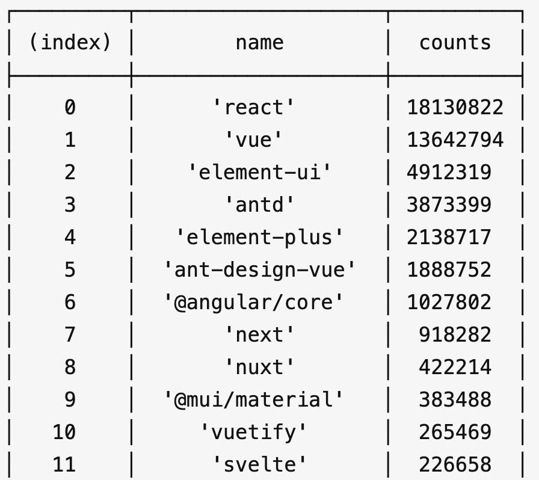
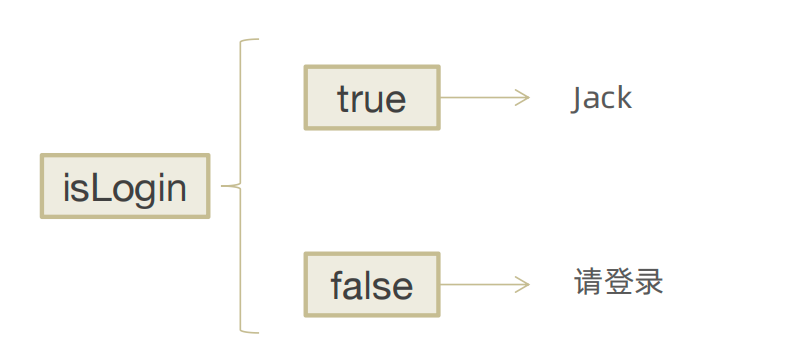
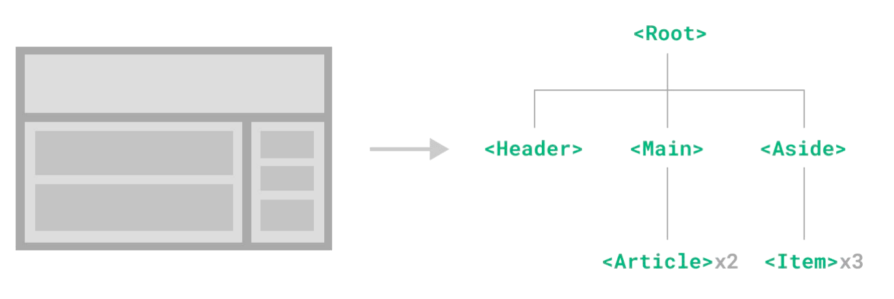
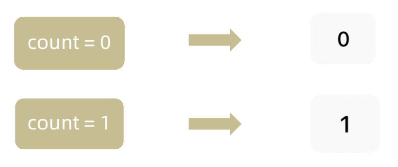
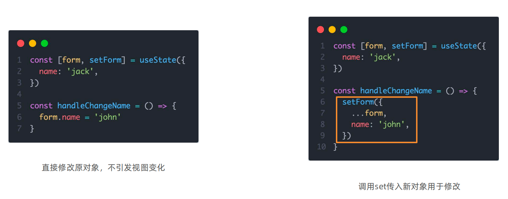

# 01-React基础

- [React介绍](#react介绍)
  - [React的优势](#react的优势)
  - [React的市场情况](#react的市场情况)
- [开发环境创建](#开发环境创建)
- [JSX基础](#jsx基础)
  - [什么是JSX](#什么是jsx)
  - [JSX的本质](#jsx的本质)
  - [JSX高频场景-JS表达式](#jsx高频场景-js表达式)
  - [JSX高频场景-列表渲染](#jsx高频场景-列表渲染)
  - [JSX高频场景-条件渲染](#jsx高频场景-条件渲染)
  - [JSX高频场景-复杂条件渲染](#jsx高频场景-复杂条件渲染)
- [React的事件绑定](#react的事件绑定)
  - [基础实现](#基础实现)
  - [使用事件参数](#使用事件参数)
  - [传递自定义参数](#传递自定义参数)
  - [同时传递事件对象和自定义参数](#同时传递事件对象和自定义参数)
- [React组件基础使用](#react组件基础使用)
  - [组件是什么](#组件是什么)
  - [组件基础使用](#组件基础使用)
- [组件状态管理-useState](#组件状态管理-usestate)
  - [基础使用](#基础使用)
  - [状态的修改规则](#状态的修改规则)
  - [修改对象状态](#修改对象状态)
- [组件的基础样式处理](#组件的基础样式处理)
- [B站评论案例](#b站评论案例)
  - [基础模版](#基础模版)
  - [完成版本](#完成版本)


# React介绍
React由Meta公司开发，是一个用于 构建Web和原生交互界面的库


## React的优势
相较于传统基于DOM开发的优势

1. 组件化的开发方式
2. 不错的性能

相较于其它前端框架的优势

1. 丰富的生态
2. 跨平台支持
## React的市场情况
全球最流行，大厂必备


# 开发环境创建
create-react-app是一个快速创建React开发环境的工具，底层由Webpack构件，封装了配置细节，开箱即用
执行命令：
```bash
npx create-react-app react-basic
```

1. npx -  Node.js工具命令，查找并执行后续的包命令
2. create-react-app - 核心包（固定写法），用于创建React项目
3. react-basic  React项目的名称（可以自定义）
:::warning
创建React项目的更多方式
[https://zh-hans.react.dev/learn/start-a-new-react-project](https://zh-hans.react.dev/learn/start-a-new-react-project)
:::
# JSX基础
## 什么是JSX
> 概念：JSX是JavaScript和XMl(HTML)的缩写，表示在JS代码中编写HTML模版结构，它是React中构建UI的方式

```jsx
const message = 'this is message'

function App(){
  return (
    <div>
      <h1>this is title</h1>
      {message}
    </div>
  )
}
```
优势：

1. HTML的声明式模版写法
2. JavaScript的可编程能力
## JSX的本质
> JSX并不是标准的JS语法，它是 JS的语法扩展，浏览器本身不能识别，需要通过解析工具做解析之后才能在浏览器中使用


## JSX高频场景-JS表达式
> 在JSX中可以通过 `大括号语法{}` 识别JavaScript中的表达式，比如常见的变量、函数调用、方法调用等等

1. 使用引号传递字符串
2. 使用JS变量
3. 函数调用和方法调用
4. 使用JavaScript对象
:::warning
注意：if语句、switch语句、变量声明不属于表达式，不能出现在{}中
:::
```jsx
const message = 'this is message'

function getAge(){
  return 18
}

function App(){
  return (
    <div>
      <h1>this is title</h1>
      {/* 字符串识别 */}
      {'this is str'}
      {/* 变量识别 */}
      {message}
      {/* 变量识别 */}
      {message}
      {/* 函数调用 渲染为函数的返回值 */}
      {getAge()}
    </div>
  )
}
```
## JSX高频场景-列表渲染

> 在JSX中可以使用原生js种的`map方法` 实现列表渲染

```jsx
const list = [
  {id:1001, name:'Vue'},
  {id:1002, name: 'React'},
  {id:1003, name: 'Angular'}
]

function App(){
  return (
    <ul>
      {list.map(item=><li key={item.id}>{item}</li>)}
    </ul>
  )
}
```
## JSX高频场景-条件渲染

> 在React中，可以通过逻辑与运算符&&、三元表达式(?:) 实现基础的条件渲染

```jsx
const flag = true
const loading = false

function App(){
  return (
    <>
      {flag && <span>this is span</span>}
      {loading ? <span>loading...</span>:<span>this is span</span>}
    </>
  )
}
```
## JSX高频场景-复杂条件渲染

> 需求：列表中需要根据文章的状态适配
> 解决方案：自定义函数 + 判断语句

```jsx
const type = 1  // 0|1|3

function getArticleJSX(){
  if(type === 0){
    return <div>无图模式模版</div>
  }else if(type === 1){
    return <div>单图模式模版</div>
  }else(type === 3){
    return <div>三图模式模版</div>
  }
}

function App(){
  return (
    <>
      { getArticleJSX() }
    </>
  )
}
```
# React的事件绑定
## 基础实现
> React中的事件绑定，通过语法 `on + 事件名称 = { 事件处理程序 }`，整体上遵循驼峰命名法

```jsx
function App(){
  const clickHandler = ()=>{
    console.log('button按钮点击了')
  }
  return (
    <button onClick={clickHandler}>click me</button>
  )
}
```
## 使用事件参数
> 在事件回调函数中设置形参e即可

```jsx
function App(){
  const clickHandler = (e)=>{
    console.log('button按钮点击了', e)
  }
  return (
    <button onClick={clickHandler}>click me</button>
  )
}
```
## 传递自定义参数
> 语法：事件绑定的位置改造成箭头函数的写法，在执行clickHandler实际处理业务函数的时候传递实参

```jsx
function App(){
  const clickHandler = (name)=>{
    console.log('button按钮点击了', name)
  }
  return (
    <button onClick={()=>clickHandler('jack')}>click me</button>
  )
}
```
:::warning
注意：不能直接写函数调用，这里事件绑定需要一个函数引用
:::
## 同时传递事件对象和自定义参数
> 语法：在事件绑定的位置传递事件实参e和自定义参数，clickHandler中声明形参，注意顺序对应

```jsx
function App(){
  const clickHandler = (name,e)=>{
    console.log('button按钮点击了', name,e)
  }
  return (
    <button onClick={(e)=>clickHandler('jack',e)}>click me</button>
  )
}
```
# React组件基础使用
## 组件是什么
概念：一个组件就是一个用户界面的一部分，它可以有自己的逻辑和外观，组件之间可以互相嵌套，也可以服用多次


## 组件基础使用
> 在React中，一个组件就是**首字母大写的函数**，内部存放了组件的逻辑和视图UI, 渲染组件只需要把组件当成标签书写即可

```jsx
// 1. 定义组件
function Button(){
  return <button>click me</button>
}

// 2. 使用组件
function App(){
  return (
    <div>
      {/* 自闭和 */}
      <Button/>
      {/* 成对标签 */}
      <Button></Button>
    </div>
  )
}
```
# 组件状态管理-useState
## 基础使用
> useState 是一个 React Hook（函数），它允许我们向组件添加一个`状态变量`, 从而控制影响组件的渲染结果
> 和普通JS变量不同的是，状态变量一旦发生变化组件的视图UI也会跟着变化（数据驱动视图）


```jsx
function App(){
  const [ count, setCount ] = React.useState(0)
  return (
    <div>
      <button onClick={()=>setCount(count+1)}>{ count }</button>
    </div>
  )
}
```
## 状态的修改规则
> 在React中状态被认为是只读的，我们应该始终`替换它而不是修改它`, 直接修改状态不能引发视图更新


## 修改对象状态
> 对于对象类型的状态变量，应该始终给set方法一个`全新的对象` 来进行修改


# 组件的基础样式处理
> React组件基础的样式控制有俩种方式，行内样式和class类名控制

```jsx
<div style={{ color:'red'}}>this is div</div>
```

```css
.foo{
  color: red;
}
```

```jsx
import './index.css'

function App(){
  return (
    <div>
      <span className="foo">this is span</span>
    </div>
  )
}
```
# B站评论案例


1. 渲染评论列表
2. 删除评论实现
3. 渲染导航Tab和高亮实现
4. 评论列表排序功能实现
## 基础模版
```tsx
import { useState } from 'react'
import './App.scss'
import avatar from './images/bozai.png'

/**
 * 评论列表的渲染和操作
 *
 * 1. 根据状态渲染评论列表
 * 2. 删除评论
 */

// 评论列表数据
const defaultList = [
  {
    // 评论id
    rpid: 3,
    // 用户信息
    user: {
      uid: '13258165',
      avatar: '',
      uname: '周杰伦',
    },
    // 评论内容
    content: '哎哟，不错哦',
    // 评论时间
    ctime: '10-18 08:15',
    like: 88,
  },
  {
    rpid: 2,
    user: {
      uid: '36080105',
      avatar: '',
      uname: '许嵩',
    },
    content: '我寻你千百度 日出到迟暮',
    ctime: '11-13 11:29',
    like: 88,
  },
  {
    rpid: 1,
    user: {
      uid: '30009257',
      avatar,
      uname: '黑马前端',
    },
    content: '学前端就来黑马',
    ctime: '10-19 09:00',
    like: 66,
  },
]
// 当前登录用户信息
const user = {
  // 用户id
  uid: '30009257',
  // 用户头像
  avatar,
  // 用户昵称
  uname: '黑马前端',
}

/**
 * 导航 Tab 的渲染和操作
 *
 * 1. 渲染导航 Tab 和高亮
 * 2. 评论列表排序
 *  最热 => 喜欢数量降序
 *  最新 => 创建时间降序
 */

// 导航 Tab 数组
const tabs = [
  { type: 'hot', text: '最热' },
  { type: 'time', text: '最新' },
]

const App = () => {
  return (
    <div className="app">
      {/* 导航 Tab */}
      <div className="reply-navigation">
        <ul className="nav-bar">
          <li className="nav-title">
            <span className="nav-title-text">评论</span>
            {/* 评论数量 */}
            <span className="total-reply">{10}</span>
          </li>
          <li className="nav-sort">
            {/* 高亮类名： active */}
            <span className='nav-item'>最新</span>
            <span className='nav-item'>最热</span>
          </li>
        </ul>
      </div>

      <div className="reply-wrap">
        {/* 发表评论 */}
        <div className="box-normal">
          {/* 当前用户头像 */}
          <div className="reply-box-avatar">
            <div className="bili-avatar">
              
            </div>
          </div>
          <div className="reply-box-wrap">
            {/* 评论框 */}
            <textarea
              className="reply-box-textarea"
              placeholder="发一条友善的评论"
            />
            {/* 发布按钮 */}
            <div className="reply-box-send">
              <div className="send-text">发布</div>
            </div>
          </div>
        </div>
        {/* 评论列表 */}
        <div className="reply-list">
          {/* 评论项 */}
          <div className="reply-item">
            {/* 头像 */}
            <div className="root-reply-avatar">
              <div className="bili-avatar">
                
              </div>
            </div>

            <div className="content-wrap">
              {/* 用户名 */}
              <div className="user-info">
                <div className="user-name">jack</div>
              </div>
              {/* 评论内容 */}
              <div className="root-reply">
                <span className="reply-content">这是一条评论回复</span>
                <div className="reply-info">
                  {/* 评论时间 */}
                  <span className="reply-time">{'2023-11-11'}</span>
                  {/* 评论数量 */}
                  <span className="reply-time">点赞数:{100}</span>
                  <span className="delete-btn">
                    删除
                  </span>

                </div>
              </div>
            </div>
          </div>
        </div>
      </div>
    </div>
  )
}

export default App
```

```css
.app {
  width: 80%;
  margin: 50px auto;
}

.reply-navigation {
  margin-bottom: 22px;

  .nav-bar {
    display: flex;
    align-items: center;
    margin: 0;
    padding: 0;
    list-style: none;

    .nav-title {
      display: flex;
      align-items: center;
      width: 114px;
      font-size: 20px;

      .nav-title-text {
        color: #18191c;
        font-weight: 500;
      }
      .total-reply {
        margin: 0 36px 0 6px;
        color: #9499a0;
        font-weight: normal;
        font-size: 13px;
      }
    }

    .nav-sort {
      display: flex;
      align-items: center;
      color: #9499a0;
      font-size: 13px;

      .nav-item {
        cursor: pointer;

        &:hover {
          color: #00aeec;
        }

        &:last-child::after {
          display: none;
        }
        &::after {
          content: ' ';
          display: inline-block;
          height: 10px;
          width: 1px;
          margin: -1px 12px;
          background-color: #9499a0;
        }
      }

      .nav-item.active {
        color: #18191c;
      }
    }
  }
}

.reply-wrap {
  position: relative;
}
.box-normal {
  display: flex;
  transition: 0.2s;

  .reply-box-avatar {
    display: flex;
    align-items: center;
    justify-content: center;
    width: 80px;
    height: 50px;
  }

  .reply-box-wrap {
    display: flex;
    position: relative;
    flex: 1;

    .reply-box-textarea {
      width: 100%;
      height: 50px;
      padding: 5px 10px;
      box-sizing: border-box;
      color: #181931;
      font-family: inherit;
      line-height: 38px;
      background-color: #f1f2f3;
      border: 1px solid #f1f2f3;
      border-radius: 6px;
      outline: none;
      resize: none;
      transition: 0.2s;

      &::placeholder {
        color: #9499a0;
        font-size: 12px;
      }
      &:focus {
        height: 60px;
        background-color: #fff;
        border-color: #c9ccd0;
      }
    }
  }

  .reply-box-send {
    position: relative;
    display: flex;
    flex-basis: 86px;
    align-items: center;
    justify-content: center;
    margin-left: 10px;
    border-radius: 4px;
    cursor: pointer;
    transition: 0.2s;

    & .send-text {
      position: absolute;
      z-index: 1;
      color: #fff;
      font-size: 16px;
    }
    &::after {
      position: absolute;
      width: 100%;
      height: 100%;
      background-color: #00aeec;
      border-radius: 4px;
      opacity: 0.5;
      content: '';
    }
    &:hover::after {
      opacity: 1;
    }
  }
}
.bili-avatar {
  position: relative;
  display: block;
  width: 48px;
  height: 48px;
  margin: 0;
  padding: 0;
  border-radius: 50%;
}
.bili-avatar-img {
  position: absolute;
  top: 50%;
  left: 50%;
  display: block;
  width: 48px;
  height: 48px;
  object-fit: cover;
  border: none;
  border-radius: 50%;
  image-rendering: -webkit-optimize-contrast;
  transform: translate(-50%, -50%);
}

// 评论列表
.reply-list {
  margin-top: 14px;
}
.reply-item {
  padding: 22px 0 0 80px;
  .root-reply-avatar {
    position: absolute;
    left: 0;
    display: flex;
    justify-content: center;
    width: 80px;
    cursor: pointer;
  }

  .content-wrap {
    position: relative;
    flex: 1;

    &::after {
      content: ' ';
      display: block;
      height: 1px;
      width: 100%;
      margin-top: 14px;
      background-color: #e3e5e7;
    }

    .user-info {
      display: flex;
      align-items: center;
      margin-bottom: 4px;

      .user-name {
        height: 30px;
        margin-right: 5px;
        color: #61666d;
        font-size: 13px;
        line-height: 30px;
        cursor: pointer;
      }
    }

    .root-reply {
      position: relative;
      padding: 2px 0;
      color: #181931;
      font-size: 15px;
      line-height: 24px;
      .reply-info {
        position: relative;
        display: flex;
        align-items: center;
        margin-top: 2px;
        color: #9499a0;
        font-size: 13px;

        .reply-time {
          width: 76px;
          margin-right: 20px;
        }
        .reply-like {
          display: flex;
          align-items: center;
          margin-right: 19px;

          .like-icon {
            width: 14px;
            height: 14px;
            margin-right: 5px;
            color: #9499a0;
            background-position: -153px -25px;
            &:hover {
              background-position: -218px -25px;
            }
          }
          .like-icon.liked {
            background-position: -154px -89px;
          }
        }
        .reply-dislike {
          display: flex;
          align-items: center;
          margin-right: 19px;
          .dislike-icon {
            width: 16px;
            height: 16px;
            background-position: -153px -153px;
            &:hover {
              background-position: -217px -153px;
            }
          }
          .dislike-icon.disliked {
            background-position: -154px -217px;
          }
        }
        .delete-btn {
          cursor: pointer;
          &:hover {
            color: #00aeec;
          }
        }
      }
    }
  }
}

.reply-none {
  height: 64px;
  margin-bottom: 80px;
  color: #99a2aa;
  font-size: 13px;
  line-height: 64px;
  text-align: center;
}
```
## 完成版本
```jsx
 import { useState } from 'react'
import './App.scss'
import avatar from './images/bozai.png'
import orderBy from 'lodash/orderBy'

/**
 * 评论列表的渲染和操作
 *
 * 1. 根据状态渲染评论列表
 * 2. 删除评论
 */

// 评论列表数据
const defaultList = [
  {
    // 评论id
    rpid: 3,
    // 用户信息
    user: {
      uid: '13258165',
      avatar: '',
      uname: '周杰伦',
    },
    // 评论内容
    content: '哎哟，不错哦',
    // 评论时间
    ctime: '10-18 08:15',
    like: 88,
  },
  {
    rpid: 2,
    user: {
      uid: '36080105',
      avatar: '',
      uname: '许嵩',
    },
    content: '我寻你千百度 日出到迟暮',
    ctime: '11-13 11:29',
    like: 88,
  },
  {
    rpid: 1,
    user: {
      uid: '30009257',
      avatar,
      uname: '黑马前端',
    },
    content: '学前端就来黑马',
    ctime: '10-19 09:00',
    like: 66,
  },
]
// 当前登录用户信息
const user = {
  // 用户id
  uid: '30009257',
  // 用户头像
  avatar,
  // 用户昵称
  uname: '黑马前端',
}

/**
 * 导航 Tab 的渲染和操作
 *
 * 1. 渲染导航 Tab 和高亮
 * 2. 评论列表排序
 *  最热 => 喜欢数量降序
 *  最新 => 创建时间降序
 */

// 导航 Tab 数组
const tabs = [
  { type: 'hot', text: '最热' },
  { type: 'time', text: '最新' },
]

const App = () => {
  // 导航 Tab 高亮的状态
  const [activeTab, setActiveTab] = useState('hot')
  const [list, setList] = useState(defaultList)

  // 删除评论
  const onDelete = rpid => {
    // 如果要删除数组中的元素，需要调用 filter 方法，并且一定要调用 setList 才能更新状态
    setList(list.filter(item => item.rpid !== rpid))
  }

  // tab 高亮切换
  const onToggle = type => {
    setActiveTab(type)
    let newList
    if (type === 'time') {
      // 按照时间降序排序
      // orderBy(对谁进行排序, 按照谁来排, 顺序)
      newList = orderBy(list, 'ctime', 'desc')
    } else {
      // 按照喜欢数量降序排序
      newList = orderBy(list, 'like', 'desc')
    }
    setList(newList)
  }

  return (
    <div className="app">
      {/* 导航 Tab */}
      <div className="reply-navigation">
        <ul className="nav-bar">
          <li className="nav-title">
            <span className="nav-title-text">评论</span>
            {/* 评论数量 */}
            <span className="total-reply">{list.length}</span>
          </li>
          <li className="nav-sort">
            {/* 高亮类名： active */}
            {tabs.map(item => {
              return (
                <div
                  key={item.type}
                  className={
                    item.type === activeTab ? 'nav-item active' : 'nav-item'
                  }
                  onClick={() => onToggle(item.type)}
                >
                  {item.text}
                </div>
              )
            })}
          </li>
        </ul>
      </div>

      <div className="reply-wrap">
        {/* 发表评论 */}
        <div className="box-normal">
          {/* 当前用户头像 */}
          <div className="reply-box-avatar">
            <div className="bili-avatar">
              
            </div>
          </div>
          <div className="reply-box-wrap">
            {/* 评论框 */}
            <textarea
              className="reply-box-textarea"
              placeholder="发一条友善的评论"
            />
            {/* 发布按钮 */}
            <div className="reply-box-send">
              <div className="send-text">发布</div>
            </div>
          </div>
        </div>
        {/* 评论列表 */}
        <div className="reply-list">
          {/* 评论项 */}
          {list.map(item => {
            return (
              <div key={item.rpid} className="reply-item">
                {/* 头像 */}
                <div className="root-reply-avatar">
                  <div className="bili-avatar">
                    
                  </div>
                </div>

                <div className="content-wrap">
                  {/* 用户名 */}
                  <div className="user-info">
                    <div className="user-name">{item.user.uname}</div>
                  </div>
                  {/* 评论内容 */}
                  <div className="root-reply">
                    <span className="reply-content">{item.content}</span>
                    <div className="reply-info">
                      {/* 评论时间 */}
                      <span className="reply-time">{item.ctime}</span>
                      {/* 评论数量 */}
                      <span className="reply-time">点赞数:{item.like}</span>
                      {user.uid === item.user.uid && (
                        <span
                          className="delete-btn"
                          onClick={() => onDelete(item.rpid)}
                        >
                          删除
                        </span>
                      )}
                    </div>
                  </div>
                </div>
              </div>
            )
          })}
        </div>
      </div>
    </div>
  )
}

export default App
```

