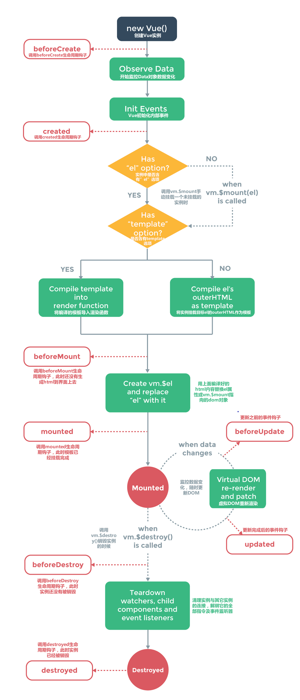
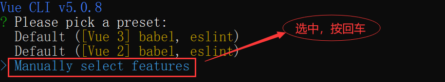
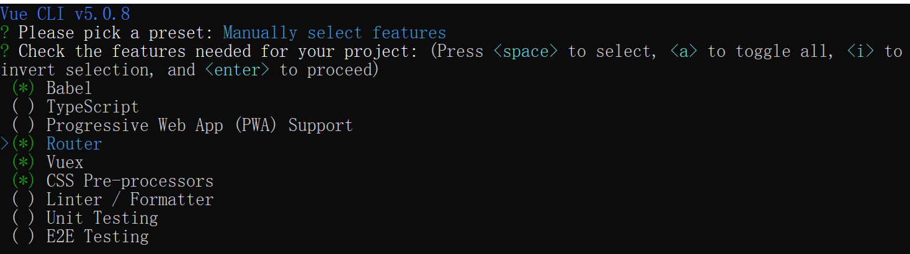
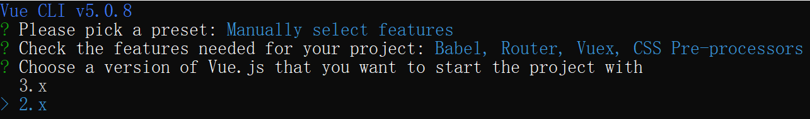
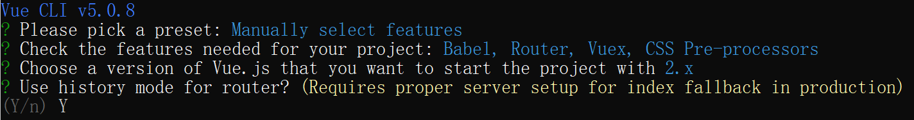
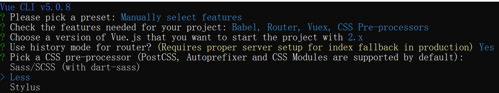
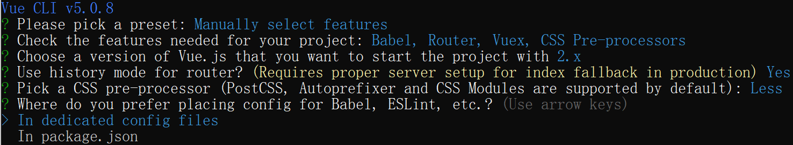
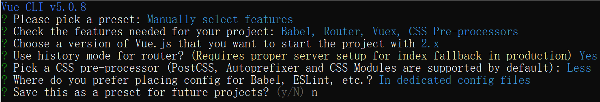
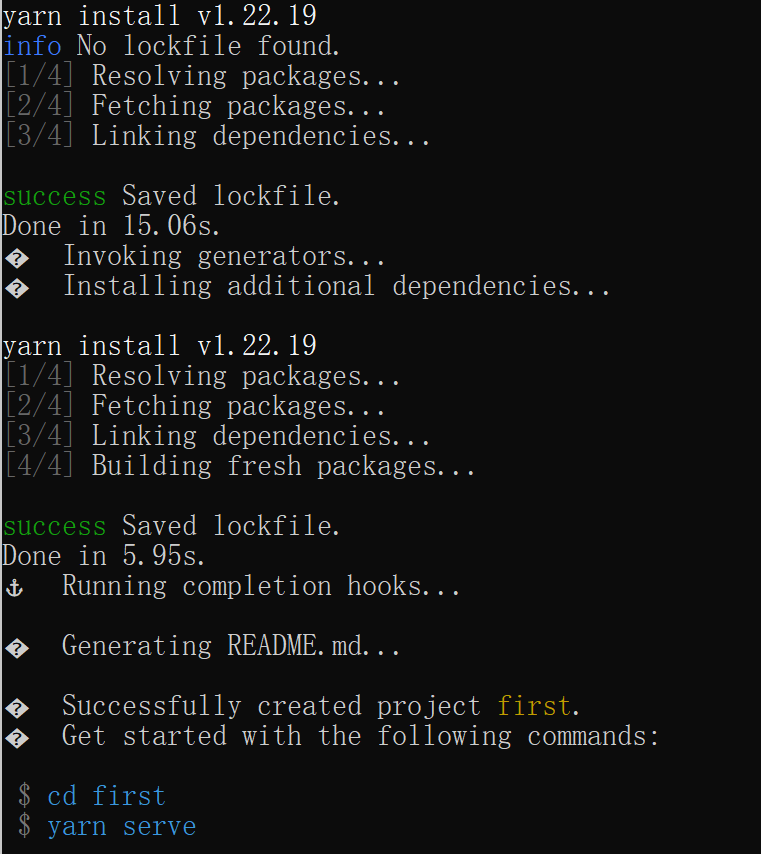
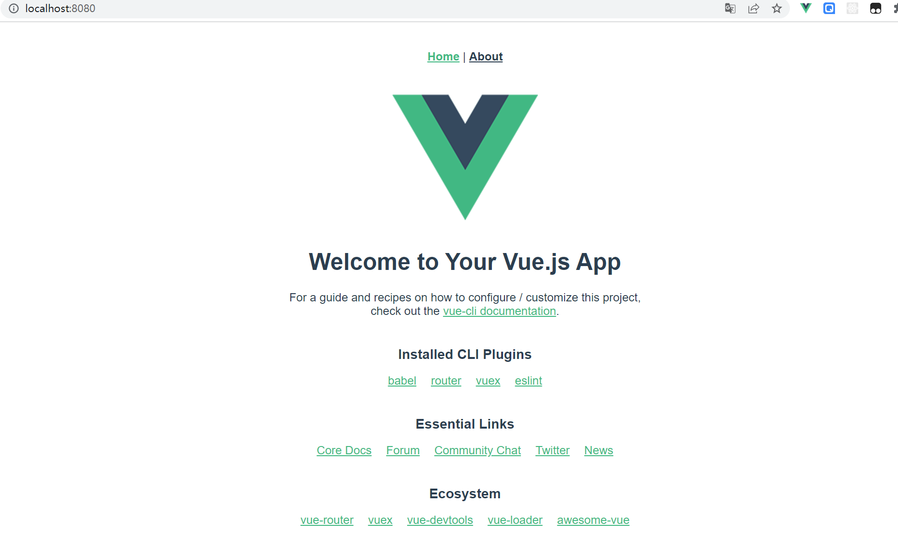

# 一、vue介绍

网盘地址： https://www.aliyundrive.com/s/2A6w17TNADy 

## 1.1- 官网

* 英文官网：http://vuejs.org
* 中文官网：https://cn.vuejs.org
* `Vue2`中文官网：https://v2.cn.vuejs.org

## 1.2- `Vue`介绍

> * `Vue (读音 /vjuː/，类似于 view)` 是一套用于构建用户界面的**渐进式框架**。
> * 作者: 尤雨溪

## 1.3- `Vue`的特点

> * 遵循`MVVM`模式
>
> * 编码简洁, 体积小, 运行效率高, 适合移动/PC端开发
>
> * 它本身只关注界面, 也可以配合其它第三方库开发项目

## 1.4- `Vue`周边库

> * ` vue-cli（vue脚手架）`
>
> * `axios`
>
> * `vue-router`（路由）
>
> * `vuex`（状态管理）
>
> * `element-ui`（`UI`组件库）
>
>   ……

## 1.5- `Vue` 环境的配置

* 直接引入

  ```shell
  # 下载地址
  https://v2.cn.vuejs.org/v2/guide/installation.html
  ```

  

* `CDN` 引入

  ```html
  <!-- 开发环境版本，包含完整的警告和调试模式 -->
  <script src="https://cdn.jsdelivr.net/npm/vue@2/dist/vue.js"></script>
  <!-- 生产环境版本，删除了警告 -->
  <script src="https://cdn.jsdelivr.net/npm/vue@2"></script>
  ```

* `NPM` 安装

  ```shell
  # 最新稳定版
  $ npm install vue
  ```

## 1-1- `JS`-`Vue`-React操作DOM

### 1-1-1- `js`操作DOM

```html
<!DOCTYPE html>
<html lang="en">
<head>
	<meta charset="UTF-8">
	<title>Title</title>
</head>
<body>
	<div id="root">
		<input type="text">
		<div></div>
	</div>
</body>
<script>
	const inp = document.querySelector("#root input");
	const div = document.querySelector("#root div");
	let str = "我是一只小小小小鸟，怎么飞也飞不高！";
	inp.value = div.innerHTML = str;
	inp.oninput = (e)=>{
		div.innerHTML = str = e.target.value;
	}
</script>
</html>
```


### 1-1-2- React操作DOM

```html
<!DOCTYPE html>
<html lang="en">
<head>
	<meta charset="UTF-8">
	<title>Title</title>
	<script src="lib/react.development.js"></script>
	<script src="lib/react-dom.development.js"></script>
	<script src="lib/babel.min.js"></script>
</head>
<body>
<div id="root">

</div>
</body>
<script type="text/babel">
	
	const root = ReactDOM.createRoot(document.querySelector("#root"));
	const App = () => {
		const [str,setStr] = React.useState("我确定你就是那只匹着羊皮的狼！");
		return (
			<>
				<input onInput={(e)=>setStr(e.target.value)} defaultValue={str} type="text"/>
				<input onChange={(e)=>setStr(e.target.value)} value={str} type="text"/>
				<div>{str}</div>
			</>
		);
	}
	root.render(<App/>);
</script>
</html>
```


### 1-1-3- `Vue`操作DOM

```html
<!DOCTYPE html>
<html lang="en">
<head>
	<meta charset="UTF-8">
	<title>Title</title>
	<script src="lib/vue.js"></script>
</head>
<body>
	<div id="root">
		<input type="text" v-model="str">
		<div>{{str}}</div>
	</div>
</body>
<script>
	const vm = new Vue({
		el:"#root",
		data:{
			str:"我现在要开始学习VUE"
		}
	})
</script>
</html>
```


# 二- `Vue` 的基本用法及模板语法

> `Vue.js` 使用了基于 HTML 的模板语法，允许开发者声明式地将 DOM 绑定至底层` Vue` 实例的数据。所有 `Vue.js` 的模板都是合法的 HTML，所以能被遵循规范的浏览器和 HTML 解析器解析。
>
> 在底层的实现上，`Vue` 将模板编译成虚拟 DOM 渲染函数。结合响应系统，`Vue` 能够智能地计算出最少需要重新渲染多少组件，并把 DOM 操作次数减到最少。

## 2-1- `Vue`实例

```html
<!DOCTYPE html>
<html lang="en">
<head>
	<meta charset="UTF-8">
	<title>Title</title>
	<!--1- 引入核心模块，提供了构造函数Vue	-->
	<script src="lib/vue.js"></script>
</head>
<body>

</body>
<script>
	// 1- vm即是Vue实例。
	// 2- Vue构造函数接收一个配置对象。
	// 3- 配置对象中可以设置data属性（类型是一个对象）
	// 4- data对象的属性会作为vm的实例属性(记住)。
	// 5- 建议将方法放置到methods属性中（类型也是一个对象）
	// const vm = new Vue({
	// 	// 实例中的数据
	// 	data:{
	// 		a:1,
	// 		b:2,
	// 		c:{
	// 			userName:"zhangsan"
	// 		},
	// 		d:[1,2,3]
	// 	},
	// 	// 定义方法
	// 	methods:{
	// 		fn(){
	//
	// 		}
	// 	}
	// });
	// console.log(vm);
	
	
	// 关于data的特点：
	// 1- data中的属性会作为Vue实例中的属性
	// 2- data的属性值发生改变，那么Vue实例中对应的属性值也会发生改变
	// 3- Vue实例中的属性值发生改变，那么data中的属性值也会发生改变。
	const data = {
		a:1
	}
	const vm = new Vue({
		data
	});
	data.a = 100;
	vm.a = 200;
	console.log(vm.a,data.a);
</script>
</html>
```


## 2-2- `Vue`挂载

```html
<!DOCTYPE html>
<html lang="en">
<head>
	<meta charset="UTF-8">
	<title>Title</title>
	<script src="lib/vue.js"></script>
</head>
<body>
	<div class="root" id="root">
		<h1>{{str}}</h1>
		<h1>{{this.str}}</h1>
		<h1>{{vm.str}}</h1>
	</div>
</body>
<script>
	// 注意重点：在Vue模板中可以直接使用Vue实例中的属性或方法（不需要使用this,不需要使用this)
	// 注意重点：模块中可以使用this(不建议），说明模块所处的环境上下文中的this指向的是Vue实例。
	// 挂载（Vue实例挂载）：指定Vue实例应用的范围（元素）
	const vm = new Vue({
		// 将ID为root的元素作为Vue实例挂载的元素（挂载的元素自此可以称为Vue模板）
		// el:document.querySelector("#root"),
		
		// 将ID为root的元素作为Vue实例挂载的元素（挂载的元素自此可以称为Vue模板）
		// el:"#root",
		
		// 将class为root的元素作为Vue实例挂载的元素（ 不建议）
		// el:".root",
		
		// 将标签名字为div的元素作为Vue实例挂载的元素（ 不建议）
		// el:"div",
		
		// el:"body",// 不允许
		// el:"html",// 不允许
		data:{
			str:"我现在开始学习Vue,第一步要进行挂载",
			vm:{
				str:"vm"
			}
		}
	})
</script>
</html>
```


## 2-3- 相同Vue实例挂载到不同元素

```html
<!DOCTYPE html>
<html lang="en">
<head>
	<meta charset="UTF-8">
	<title>Title</title>
	<script src="lib/vue.js"></script>
</head>
<body>
	<div>
		<h1>{{str}}</h1>
	</div>
	<div>
		<h1>{{str}}</h1>
	</div>
</body>
<script>
	// 只会将第一个家客户条件的元素作为挂载元素
	new Vue({
		el:"div",
		data:{
			str:"one"
		}
	})
</script>
</html>
```


## 2-4- 不同Vue实例挂载到不同元素

```html
<!DOCTYPE html>
<html lang="en">
<head>
	<meta charset="UTF-8">
	<title>Title</title>
	<script src="lib/vue.js"></script>
</head>
<body>
<div id="one">
	<h1>{{str}}</h1>
</div>
<div id="two">
	<h1>{{str}}</h1>
</div>
</body>
<script>
	// 同一个页面，支持多个实例挂载至不同元素中。
	new Vue({
		el:"#one",
		data:{
			str:"one"
		}
	})
	new Vue({
		el:"#two",
		data:{
			str:"two"
		}
	})
</script>
</html>
```

## 2-5- 模板中的插值表达式{{}}

```html
<!DOCTYPE html>
<html lang="en">
<head>
	<meta charset="UTF-8">
	<title>Title</title>
	<script src="lib/vue.js"></script>
</head>
<body>
	<div id="root">
		<!--将Vue实例下的属性num进行渲染-->
		<p>{{num}}</p>
		<!--将Vue实例下的属性str进行渲染-->
		<p>{{str}}</p>
		<!--将字符串进行渲染-->
		<p>{{"str"}}</p>
		<!--将数字进行渲染-->
		<p>{{1}}</p>
		<!--将Vue实例下的属性bol进行渲染-->
		<p>{{bol}}</p>
		<!--将布尔值进行渲染-->
		<p>{{false}}</p>
		<!--将Vue实例下的属性fn进行渲染-->
		<p>{{fn}}</p>
		<!--将Vue实例下的fn函数运行的结果进行渲染-->
		<p>{{fn()}}</p>
		<!--将Vue实例下的属性arr进行渲染-->
		<p>{{arr}}</p>
		<!--将Vue实例下的属性obj进行渲染-->
		<p>{{obj}}</p>
		<p>{{null}}</p>
		<p>{{undefined}}</p>
		<p>{{sex===1?"男":"女"}}</p>
		<p>{{str.split("").reverse().join("")}}</p>
		<template></template>
	</div>
</body>
<script>
	// 总结1：插值表达式支持字符串，数字，布尔，对象，数组，方法
	// 总结2：undefined,null不会进行任何输出（与React相同）
	// 总结3：数组不支持直接展开（React支持）
	// 总结4：支持输出对象（React不支持）
	// 总结5：Vue中包裹标签为<template></template>
	
	new Vue({
		el:"#root",
		data:{
			num:1,
			str:"师法魔级超",
			bol:true,
			arr:[1,2,3,4],
			sex:1,
			obj:{
				userName:"zhangsan"
			}
		},
		methods:{
			fn(){
				return this.str.split("").reverse().join("");
			}
		}
	})
</script>
</html>
```


# 三- `Vue`中的指令(重点)

极简插件：https://chrome.zzzmh.cn/#/index

> 指令 (Directives) 是带有 `v-` 前缀的特殊 attribute。指令 attribute 的值预期是**单个 JavaScript 表达式** (`v-for` 是例外情况，稍后我们再讨论)。指令的职责是，当表达式的值改变时，将其产生的连带影响，响应式地作用于 DOM。
>
> 指令即是特殊的属性（以v-为前缀）
>
> 指令分为内置指令与自定义指令。
>
> 注意：组件是对标签的扩展，指令是对属性的扩展。

## 3-1- v-html与v-text

```html
<!DOCTYPE html>
<html lang="en">
<head>
	<meta charset="UTF-8">
	<title>Title</title>
	<script src="lib/vue.js"></script>
</head>
<body>
	<div id="root">
		<h3>v-text</h3>
		<p v-text="userName">{{str}}</p>
		<p v-text='userName'>{{str}}</p>
		<p v-text=userName>{{str}}</p>
		<p v-text=`userName`>{{str}}</p>
		<hr/>
		<h3>v-html</h3>
		<p v-html="userName">{{str}}</p>
		<p v-html='userName'>{{str}}</p>
		<p v-html=userName>{{str}}</p>
		<p v-html=`userName`>{{str}}</p>
		<template v-html="userName">123</template>
	</div>
</body>
<script>
	// 响应式：视图是通过数据进行驱动的（当数据发生改变，视图会根据所使用的数据的变化而变化）
	// 响应式即是视图会响应最新的数据。
	// v-text与v-html的共同特点：
	// 1- 值是一个字符串
	// 2- 该字符串会作为Vue实例的属性名，将对应的属性值在指令所在的标签中进行输出。
	// 3- 会覆盖原有数据。
	// 4- 属性值可以使用双引号，单引号
	// 5- 属性值也可以省略双引号，单引号
	// 6- 如果使用的是反引号会将包裹的值在标签中直接输出
	// 7- 无法与template结合使用。
	// v-text与v-html的区别:
	// v-text不支持HTML标签而v-html支持。
	new Vue({
		el:"#root",
		data:{
			str:"我是一个字符串",
			userName:"zhangsan"
		}
	})
	
</script>
</html>
```


## 3-2- v-if v-else-if v-else(条件渲染)

```html
<!DOCTYPE html>
<html lang="en">
<head>
	<meta charset="UTF-8">
	<title>Title</title>
	<script src="lib/vue.js"></script>
</head>
<body>
<div id="root">
	<p>{{isShow}}</p>
	<p>{{isShow && "你好&&"}}</p>
	<p>{{isShow || "你好||"}}</p>
	<!-- 三元表达式	-->
	<p>{{sex===1?"男":"女"}}</p>
	<p>{{fn()}}</p>
	<!--多条件1-->
	<p>{{getAgeStr()}}</p>
	<!--多条件2-使用指令-->
	<p v-if="age>80">老年</p>
	<p v-else-if="age>40">中年</p>
	<p v-else-if="age>28">壮年</p>
	<p v-else-if="age>18">青年</p>
	<p v-else-if="age>12">少年</p>
	<p v-else-if="age>6">儿童</p>
	<p v-else>婴儿</p>
	<hr/>
	<template v-if="isLogin">您好，欢迎您的到来！</template>
	<template v-else>
		<input type="text" placeholder="请输入管理员账号">
		<input type="text" placeholder="请输入管理员密码">
	</template>
</div>
</body>
<script>
	// 注意1：v-if以及v-else-if的值是一个布尔值，如果成立则渲染指令所在的元素，不成立则不渲染
	// 注意2：v-else-if需要与v-if结合使用
	// 注意3：v-else=需要与v-if或v-else结合使用
	// 注意4：v-if,v-else-if,v-else指令所在的元素之间不要出现其它元素。
	
	new Vue({
		el:"#root",
		data:{
			isShow:true,
			sex:1,
			age:100,
			isLogin:true
		},
		methods:{
			fn(){
				return this.sex===1?"男":"女"
			},
			getAgeStr(){
				if(this.age>80) return "老年";
				if(this.age>40) return "中年"
				if(this.age>28) return "壮年"
				if(this.age>18) return "青年"
				if(this.age>12) return "少年"
				if(this.age>6) return "儿童"
				return "婴儿"
			}
		}
	})
</script>
</html>
```


## 3-3- v-show

```html
<!DOCTYPE html>
<html lang="en">
<head>
	<meta charset="UTF-8">
	<title>Title</title>
	<script src="lib/vue.js"></script>
</head>
<body>
<div id="root">
<!--	<p v-if="isShow">v-if</p>-->
<!--	<p v-show="isShow">v-show</p>-->
<!--	<p v-show='isShow'>1</p>-->
<!--	<p v-show=isShow>2</p>-->
	<p v-show="'isShow'">3</p>
	<p v-show="''">4</p>
	<p v-show="1">5</p>
	<p v-show="0">6</p>
	<p v-show="true">7</p>
	<p v-show="false">8</p>
	<p v-show="null">9</p>
	<p v-show="undefined">10</p>
</div>
</body>
<script>
	// v-if与v-show的值都是布尔值。
	// v-if为true表示渲染元素，false表示不渲染元素
	// v-show为true表示显示元素，false表示隐藏元素（通过display:none）
	// 注意1：空字符串，0，undefined,null作为判断条件相当于false
	// 注意2：非空字符串，1作为判断条件相当于true
	new Vue({
		el:"#root",
		data:{
			// isShow:true
		}
	})
</script>
</html>
```


## 3-4- v-bind(属性渲染)-重点中的重点

### 3-4-1- 基本用法

```html
<!DOCTYPE html>
<html lang="en">
<head>
	<meta charset="UTF-8">
	<title>Title</title>
	<script src="lib/vue.js"></script>
</head>
<body>
<div id="root">
	<!--未使用v-bind,直接设置属性值，而不需要使用Vue的实例属性	-->
	
	<hr/>
	<!-- 将Vue实例属性imgSrc的值作为src的属性值。	-->
	
	<hr/>
	<!-- 使用v-bind,直接设置属性值，而不需要使用Vue的实例属性	-->
	
	<hr/>
	<a href="http://www.baidu.com">百度</a>
	<hr/>
	<!-- 将字符串作为href的属性值-->
	<a v-bind:href='"http://www.baidu.com"'>{{siteName}}</a>
	<hr/>
	<!-- 将实例属性siteHref作为href的属性值	-->
	<a v-bind:href="siteHref">{{"百度3"}}</a>
	<hr/>
	<!-- 将实例属性w的值作为img的属性的名字。	-->
	
	
	<hr/>
	<a :href="siteHref">{{"百度3"}}</a>
	
	
</div>
</body>
<script>
	// v-bind:属性名 有一个简写形式：冒号
	new Vue({
		el:"#root",
		data:{
			imgSrc:"https://img12.360buyimg.com/pop/s590x470_jfs/t1/169453/32/37700/50662/64ae6e63Fffd824d7/f6409309d91610b1.jpg.avif",
			imgW:200,
			imgH:400,
			siteName:"百度2",
			siteHref:"http://www.baidu.com",
			w:"width",
			h:"height",
			s:"src"
		}
	})
</script>
</html>
```


### 3-4-2- style特殊

```html
<!DOCTYPE html>
<html lang="en">
<head>
	<meta charset="UTF-8">
	<title>Title</title>
	<script src="lib/vue.js"></script>
</head>
<body>
<div id="root">
	<!-- 字符串	-->
	<p style="background:yellow;color:red;">1</p>
	<p :style="'background:yellow;color:red;'">2</p>
	<p :style='"background:yellow;color:red;"'>3</p>
	<p :style ="one">4</p>
	<!-- 对象	-->
	<p :style="{background:'green',color:'pink'}">5</p>
	<p :style="two">6</p>
	<!-- 数组	-->
	<p :style="[{background:'yellow'},{color:'red'}]">7</p>
	<p :style="[bg,cl]">8</p>
</div>
</body>
<script>
	new Vue({
		el:"#root",
		data:{
			one:"background:yellow;color:red;",
			two:{background:'green',color:'pink'},
			bg:{
				background:"yellow"
			},
			cl:{
				color:"red"
			}
		}
	})
</script>
</html>
```


### 3-4-3- class特殊

```html
<!DOCTYPE html>
<html lang="en">
<head>
	<meta charset="UTF-8">
	<title>Title</title>
	<style>
		.bg{
			background:yellow;
		}
		.cl{
			color:red;
		}
	</style>
	<script src="lib/vue.js"></script>
</head>
<body>
<div id="root">
	<!-- 字符串	-->
	<p class="bg">1</p>
	<p class="cl">2</p>
	<p class="bg cl">3</p>
	<p :class="'bg cl'">4</p>
	<p :class="one">5</p>
	<!-- 对象：常用	-->
	<!-- class绑定的值可以是对象，对象的属性名即是样式类的名字，值是布尔。如果为true类生效，否则无效	-->
	<p :class="{bg:false,cl:true}">6</p>
	<!-- 数组	-->
	<p :class="['bg','cl']">7</p>
	
	
</div>
</body>
<script>
	new Vue({
		el:"#root",
		data:{
			one:'bg cl'
		}
	})
	
</script>
</html>
```

## 3-5- v-on 事件

### 3-5-1- 基本用法

```html
<!DOCTYPE html>
<html lang="en">
<head>
	<meta charset="UTF-8">
	<title>Title</title>
	<script src="lib/vue.js"></script>
</head>
<body>
<div id="root">
	<h3>{{num}}</h3>
<!--	未简写：-->
	<!-- 1-语句	-->
<!--	<button v-on:click="num++">加1</button>-->
	<!-- 2-函数:当点击按钮会调用Vue实例中的函数changeNum	-->
<!--	<button v-on:click="changeNum">加2</button>-->
	<!-- 3-调用函数:函数名后加括号不会被立即调用	-->
<!--	<button v-on:click="changeNum2(3,$event)">加3</button>-->
	
	<!-- 1-语句	-->
	<button @click="num++">加1</button>
	<!-- 2-函数:当点击按钮会调用Vue实例中的函数changeNum	-->
	<button @click="changeNum">加2</button>
	<!-- 3-调用函数:函数名后加括号不会被立即调用	-->
	<button @click="changeNum2(3,$event)">加3</button>
</div>
</body>
<script>
	// 语句：如果操作语句比较简单，建议直接写语句
	// 函数：如果操作比较复杂或要在多个不同的地方调用且不需要传递参数使用函数
	// 调用函数：如果操作比较复杂或要在多个不同的地方调用且需要传递参数使用调用函数
	//         如果要传递事件对象可以通过$event
	// v-on可以简写：@
	new Vue({
		el:"#root",
		data:{
			num:0
		},
		methods:{
			changeNum(e){
				this.num+=2;
				// console.log("changeNum",this)
				// console.log(e.target.innerText)
			},
			changeNum2(num,e){
				this.num+=num;
				// console.log("changeNum2",num)
				console.log(e.target.innerText)
			}
		}
	})
</script>
</html>
```


### 3-5-2- 注意事项

```html
<!DOCTYPE html>
<html lang="en">
<head>
	<meta charset="UTF-8">
	<title>Title</title>
	<script src="lib/vue.js"></script>
</head>
<body>
<div id="app">
	{{str}}
	<!--原生-->
	<button onclick="fn()">点我呀</button>
	<!--v-bind-->
	<button v-bind:onclick="fn()">点我呀</button>
	<button v-bind:onclick="'fn()'">点我呀</button>
	<!--v-on-->
	<!--语句	-->
	<button v-on:click="str+='!'">点我呀</button>
	<!--语句:调用函数，传递参数方便	-->
	<button v-on:click="changeStr()">点我呀</button>
	<!--函数：事件触发会调用该函数	-->
	<button v-on:click="changeStr">点我呀</button>
	<hr/>
	<!--	简写：-->
	<button @click="changeStr">简写</button>
	<hr/>
	<button @click="alert(str)">注意：如果语句调用的是函数，那么需要查看函数是否为自定义的（内置函数不支持）</button>
	

</div>
</body>
<script>
	new Vue({
		el: "#app",
		data: {
			str: "my"
		},
		methods: {
			changeStr() {
				this.str += "!";
			},
			fn() {
				console.log("methods->fn", this)
				return "fn()";
			},
			alert(str){
				alert(str);
			}
		}
	})
	
	function fn() {
		console.log("fn", this)
	}
</script>
</html>
```


### 3-5-3- 修饰符

#### 3-5-3-1- prevent

```html
<!DOCTYPE html>
<html lang="en">
<head>
	<meta charset="UTF-8">
	<title>Title</title>
	<script src="lib/vue.js"></script>
</head>
<body>
<div id="app">
	<a @click.prevent="fn" href="http://www.baidu.com">百度</a>
	<hr/>
	<form action="https://www.baidu.com/s" target="_blank">
		<input name="wd" type="text">
		<button @click.prevent="fn2">搜索</button>
	</form>
	<hr/>
	<div @contextmenu.prevent="fn3" :style="{width:'100px',height:'100px',background:'red'}">大家好！</div>
</div>
</body>
<script>
	new Vue({
		el:"#app",
		methods:{
			fn(e){
				// e.preventDefault();
				alert(e.target.innerText);
			},
			fn2(e){
				// e.preventDefault();
				alert(e.target.innerText);
			},
			fn3(e){
				// e.preventDefault();
				console.log("fn3",e.target.innerText);
			}
		}
	})
</script>
</html>
```

#### 3-5-3-2- stop

```html
<!DOCTYPE html>
<html lang="en">
<head>
	<meta charset="UTF-8">
	<title>Title</title>
	<script src="lib/vue.js"></script>
</head>
<body>
<div id="app">
	<div  @click="outterHandler" style="width:500px;height:300px;background:yellow">
		<div  @click.stop="middlerHandler" style="width:300px;height:200px;background:red">
			<button @click.stop="innerHandler">点击</button>
		</div>
	</div>
</div>
</body>
<script>
	new Vue({
		el:"#app",
		methods:{
			outterHandler(e){
				// e.stopPropagation()
				console.log("outterHandler");
			},
			middlerHandler(e){
				// e.stopPropagation()
				console.log("middlerHandler");
			},
			innerHandler(e){
				// e.stopPropagation()
				console.log("innerHandler");
			}
		}
	})
</script>
</html>
```


#### 3-5-3-3- once

```html
<!DOCTYPE html>
<html lang="en">
<head>
	<meta charset="UTF-8">
	<title>Title</title>
	<script src="lib/vue.js"></script>
</head>
<body>
<div id="app">
	<form action="https://www.baidu.com/s">
		<input type="text" name="wd">
		<button @click.once="search">搜索</button>
	</form>
</div>
</body>
<script>
	// once:事件只会作用一次
	new Vue({
		el:"#app",
		methods:{
			search(e){
				e.preventDefault();
				alert(1);
			}
		}
	})
</script>
</html>
```


#### 3-5-3-4- 修饰符的串联

```html
<!DOCTYPE html>
<html lang="en">
<head>
	<meta charset="UTF-8">
	<title>Title</title>
	<script src="lib/vue.js"></script>
</head>
<body>
<div id="app">
	<form @click="my" action="https://www.baidu.com/s">
		<input @click.stop type="text" name="wd">
		<button @click.prevent.stop.once="search">搜索</button>
	</form>
</div>
</body>
<script>
	// 修饰符串联：可以同时使用多个修饰符
	new Vue({
		el:"#app",
		methods:{
			my(){
				alert("my");
			},
			search(e){
				alert(1);
			}
		}
	})
</script>
</html>
```


#### 3-5-3-5- 键盘事件的修饰符

```html
<!DOCTYPE html>
<html lang="en">
<head>
	<meta charset="UTF-8">
	<title>Title</title>
	<script src="lib/vue.js"></script>
</head>
<body>
<div id="app">
	<input placeholder="13" type="text" @keyup.13="fn">
	<input placeholder="enter" type="text" @keyup.enter="fn">
	<input placeholder="a" type="text" @keyup.a="fn">
	<input placeholder="65" type="text" @keyup.65="fn">
	<input placeholder="left" type="text" @keyup.left="fn">
	<input placeholder="37" type="text" @keyup.37="fn">
	<input placeholder="space" type="text" @keyup.space="fn">
	<input placeholder="ctrl" type="text" @keydown.ctrl="fn">
	<input placeholder="ctrl+c" type="text" @keydown.ctrl.c="fn">
	<input placeholder="alt" type="text" @keydown.prevent.alt="fn">
	<input type="text">
	
</div>
</body>
<script>
	new Vue({
		el:"#app",
		methods:{
			fn(e){
				console.log("运行啦！",e.keyCode);
			}
			// fn(e){
			// 	if(e.keyCode === 13)
			// 		console.log("运行啦！");
			// }
		}
	})
</script>
</html>
```

### 3-5-4- 模拟百度一

```html
<!DOCTYPE html>
<html lang="en">
<head>
	<meta charset="UTF-8">
	<title>Title</title>
	<style>
		*{
			padding:0;
			margin:0;
		}
		p{
			border:1px solid green;
		}
	</style>
	<script src="lib/vue.js"></script>
</head>
<body>
<div id="app">
	<form action="https://www.baidu.com/s">
		<input @input="search" autocomplete="off" type="text" name="wd">
		<button>搜索</button>
	</form>
	<p :key="item.sa" v-for="item in g">{{item.q}}</p>
</div>
</body>
<script type="module">
	import jsonp from "./lib/myJsonp.js";
	new Vue({
		el:"#app",
		data:{
			g:[]
		},
		methods:{
			search(e){
				const wd = e.target.value.trim();
				jsonp("https://www.baidu.com/sugrec",{
					params:{
						prod:"pc",
						wd
					},
					// 与服务端约定好的查询字符串名字，用于传递函数名
					jsonp:"cb"
				}).then(({g=[]})=>{
					this.g = g;
				})
				
			}
		}
	})
</script>
</html>
```

### 3-5-5- 模拟百度-完成

```html
<!DOCTYPE html>
<html lang="en">
<head>
	<meta charset="UTF-8">
	<title>Title</title>
	<style>
		*{
			padding:0;
			margin:0;
		}
		p{
			border:1px solid green;
		}
		p.active{
			background:gray;
		}
	</style>
	<script src="lib/vue.js"></script>
</head>
<body>
<div id="app">
	<form action="https://www.baidu.com/s">
		<input @focus="isRender=true" @blur="isRender=false" @keyup.38.40="changeActiveIndex" v-model="wd" @input="search" autocomplete="off" type="text" name="wd">
		<button>搜索</button>
	</form>
	<template v-if="isRender">
		<p :key="item.sa" :class="{active:activeIndex===index}" v-for="(item,index) in g">{{item.q}}</p>
	</template>

</div>
</body>
<script type="module">
	import jsonp from "./lib/myJsonp.js";
	new Vue({
		el:"#app",
		data:{
			g:[],
			isRender:true,
			wd:"",
			q:"",// 搜索的关键词
			activeIndex:-1,// 选中的下标
		},
		methods:{
			changeActiveIndex(e){
				if(e.keyCode === 38){
					this.activeIndex--;
					if(this.activeIndex<-1){
						this.activeIndex = this.g.length-1;
					}
					
				}else{
					this.activeIndex++;
					if(this.activeIndex>this.g.length-1){
						this.activeIndex=-1;
					}
				}
				// 如果选中的activeIndex的值为-1，那么将this.q作为文本框的内容
				if(this.activeIndex === -1) this.wd = this.q;
				// 如果选中的activeIndex不是-1，那么将 this.g[this.activeIndex].q作为文本框的内容
				else this.wd = this.g[this.activeIndex].q;
				
			},
			search(e){
				if(this.timer) clearTimeout(this.timer);
				this.timer = setTimeout(()=>{
					jsonp("https://www.baidu.com/sugrec",{
						params:{
							prod:"pc",
							wd:this.wd
						},
						// 与服务端约定好的查询字符串名字，用于传递函数名
						jsonp:"cb"
					}).then(({g=[],q})=>{
						this.g = g;
						this.q = q;
					})
				},300);
				
				
			}
		}
	})
</script>
</html>
```


## 3-6- v-model

### 3-6-1- 基本用法

```html
<!DOCTYPE html>
<html lang="en">
<head>
	<meta charset="UTF-8">
	<title>Title</title>
	<script src="lib/vue.js"></script>
</head>
<body>
<div id="root">
	<!-- 单向绑定：视图不会更新数据，但数据发生改变视图会改变	-->
<!--	<input v-bind:value="str" type="text">-->
<!--	<input :value="str" type="text">-->
	
	<!-- 双向绑定：视图发生改变数据会变，数据改变视图也会改变	-->
<!--	<input @input="changeStr" :value="str" type="text">-->
<!--	<input @input="str=$event.target.value" :value="str" type="text">-->
<!--	<input @input="changeStr2($event)" :value="str" type="text">-->
	
	<!-- 可以通过v-model指令实现双向绑定	-->
	<input v-model="str" type="text">
	<!-- 注意：v-model只可以与表单元素结合使用-->
<!--	<div v-model="str"></div>-->
	<h3>{{str}}</h3>
</div>
</body>
<script>
	new Vue({
		el:"#root",
		data:{
			str:"大家好！我叫刘德华！"
		},
		methods:{
			changeStr(e){
				this.str = e.target.value;
				// console.log(e.target.value)
			},
			changeStr2(e){
				this.str = e.target.value;
			}
		}
	})
</script>
</html>
```


### 3-6-2- 修饰符

```html
<!DOCTYPE html>
<html lang="en">
<head>
	<meta charset="UTF-8">
	<title>Title</title>
	<script src="lib/vue.js"></script>
</head>
<body>
<div id="root">
	<!-- 修饰符trim:去除左右空格	-->
<!--	<input v-model.trim="str" type="text">-->
<!--	<h3>青龙{{str}}白虎</h3>-->

<!-- 修饰符number:类型保持为number	-->
<!--	<input type="text" v-model.number="a">+<input type="text" v-model.number="b"> <button @click="sum=a+b">=</button>-->
<!--	<input v-model="sum" type="text">-->

<!-- 修饰符lazy:当失去焦点之后数据才会进行改变。-->
	<input v-model.lazy="str" type="text">
	<h3>{{str}}</h3>
	<h3>{{str}}</h3>
	<h3>{{str}}</h3>
	<h3>{{str}}</h3>
	<h3>{{str}}</h3>
	<h3>{{str}}</h3>
</div>
</body>
<script>
	new Vue({
		el:"#root",
		data:{
			str:"蔡徐坤",
			a:1,
			b:2,
			sum:3
		}
	})
</script>
</html>
```

### 3-6-3- 语法糖

```html
<!DOCTYPE html>
<html lang="en">
<head>
	<meta charset="UTF-8">
	<title>Title</title>
	<script src="lib/vue.js"></script>
</head>
<body>
<div id="app">
	<!-- 单项数据绑定 -->
<!--	<input v-bind:value="userName" type="text">-->
<!--	<input :value="userName" type="text">-->
	
	<!-- 双向绑定:当输入数据后事件会被执行，$event是事件对象，$event.target是input元素	-->
<!--	<input type="text" @input="userName=$event.target.value" :value="userName"/>-->
	
	<!--
		双向绑定：v-model的本质是@input与:value的结合体（语法糖）
		v-model:value中的:value部分可以省略
	-->
	<!--未简写-->
	<input type="text" v-model:value.lazy="userName">
	<!--简写：	-->
	<input type="text" v-model="userName">
</div>
</body>
<script>
	// v-bind与v-model的区别：
	// 1- v-model有修饰符：number lazy trim
	// 2- v-model是针对于表单元素而言的。
	new Vue({
		el:"#app",
		data:{
			userName:"zhangsan"
		}
	})
</script>
</html>
```


### 3-6-4- 设置表单的初始值以及获取表单内容

```html
<!DOCTYPE html>
<html lang="en">
<head>
	<meta charset="UTF-8">
	<title>Title</title>
	<script src="lib/vue.js"></script>
</head>
<body>
<div id="app">
	<form v-on:submit="submitHandler">
		<p>用户名：<input v-model="userName" type="text"></p>
		<p>城市：
			<select v-model.number="city">
				<option value="1">北京</option>
				<option value="2">上海</option>
				<option value="3">深圳</option>
				<option value="4">西安</option>
				<option value="5">成都</option>
				<option value="6">武汉</option>
				<option value="7">南白滩</option>
			</select>
		</p>
		<p>性别：
			<input v-model.number="sex" name="sex" type="radio" value="1">男
			<input v-model.number="sex" name="sex" type="radio" value="2">女
		</p>
		<p>
			爱好：
			<input v-model.number="hobby" type="checkbox" value="1">学习
			<input v-model.number="hobby" type="checkbox" value="2">睡觉
			<input v-model.number="hobby" type="checkbox" value="3">吃饭
			<input v-model.number="hobby" type="checkbox" value="4">品茗
		</p>
		<button>提交</button>
	</form>
	
</div>
</body>
<script>
	new Vue({
		el:"#app",
		data:{
			userName:"zhangsan",
			city:2,
			sex:2,
			hobby:[1,2,3]
		},
		methods:{
			submitHandler(e){
				e.preventDefault();
				console.log("用户名",this.userName);
				console.log("城市",this.city);
				console.log("性别",this.sex);
				console.log("爱好",this.hobby,this.hobby.length);
				
			}
		}
	})
</script>
</html>
```


## 3-7- v-for(重点)

### 3-7-1- 基本用法

```html
<!DOCTYPE html>
<html lang="en">
<head>
	<meta charset="UTF-8">
	<title>Title</title>
	<script src="lib/vue.js"></script>
</head>
<body>
<div id="root">
	<!-- 1- 数组-->
<!--	<div v-for="item in arr">{{item}}</div>-->
<!--	<div v-for="(value,index) in arr">{{index}}：{{value}}</div>-->
	
	<!-- 2- 对象-->
<!--	<div v-for="item in obj">{{item}}</div>-->
<!--	<div v-for="(value,key) in obj">{{key}}:{{value}}</div>-->
	
	
	<!-- 3- 数字-->
<!--	<div v-for="item in num">{{item}}</div>-->
<!--	<div v-for="(n,i) in num">{{i}}:{{n}}</div>-->
	<!-- 4- 字符串-->
<!--	<div v-for="item in str">{{item}}</div>-->
<!--	<div v-for="(s,i) in str">{{i}}:{{s}}</div>-->
</div>
</body>
<script>
	new Vue({
		el:"#root",
		data:{
			arr:["zhangsan","wangwu","zhaoliu","yanqi","shenba","qianjiu"],
			obj:{
				userName:"zhangsan",
				age:12
			},
			num:10,// [1,2,3,4,5,6,7,8,9,10]
			str:"我爱你中国，我亲爱的母亲，我为你流泪也为你自豪！"
		}
	})
</script>
</html>
```


### 3-7-2- key

```html
<!DOCTYPE html>
<html lang="en">
<head>
	<meta charset="UTF-8">
	<title>Title</title>
	<script src="lib/vue.js"></script>
</head>
<body>
<div id="root">
<!-- 使用ID-->
<!--	<div :key="item.id" v-for="item in arr">-->
<!--		<h3>《{{item.bookName}}》</h3>-->
<!--		<p>作者：{{item.author}}</p>-->
<!--		<hr/>-->
<!--	</div>-->
	
<!-- 使用下标 -->
	<div :key="index" v-for="(item,index) in arr">
		<h3>《{{item.bookName}}》</h3>
		<p>作者：{{item.author}}</p>
		<hr/>
	</div>
</div>
</body>
<script>
	new Vue({
		el:"#root",
		data:{
			arr:[
				{
					id:1,
					bookName:"天龙八部",
					author:"金庸"
				},{
					id:2,
					bookName: "一念永恒",
					author:"耳根"
				}
			]
		}
	})
</script>
</html>
```

### 3-7-3- key管理重复元素

> 如果使用v-if v-else-if v-else 时候，遇到元素被重复使用，那么可以通过key来解决。

```html
<!DOCTYPE html>
<html lang="en">
<head>
	<meta charset="UTF-8">
	<title>Title</title>
	<script src="lib/vue.js"></script>
</head>
<body>
	<div id="app">
		<template v-if="loginType==='email'">
			<label for="email">邮箱：</label> <input key="email" placeholder="请输入邮箱" type="text" id="email">
		</template>
		<template v-else-if="loginType==='phone'">
			<label for="phone">手机：</label> <input key="phone" placeholder="请输入手机号" type="text" id="phone">
		</template>
		<button @click="changeLoginType">更换登陆方式</button>
	</div>
</body>
<script>
	// 初次渲染：<label for="email">邮箱：</label> <input key="email" placeholder="请输入邮箱" type="text" id="email">
	// 更改方式：<label for="phone">手机：</label> <input key="phone" placeholder="请输入手机号" type="text" id="phone">
	new Vue({
		el:"#app",
		data:{
			loginType:"email"
		},
		methods:{
			changeLoginType(){
				if(this.loginType === "email") this.loginType = "phone";
				else this.loginType = "email";
			}
		}
	})
</script>
</html>
```


## 3-8- 案例

### 3-8-1- 乞丐版切换

```html
<!DOCTYPE html>
<html lang="en">
<head>
	<meta charset="UTF-8">
	<style>
		#root button {
			padding: 5px;
			margin: 5px;
		}
		
		#root button.active {
			background: red;
		}
		
		#root div {
			width: 500px;
			height: 300px;
			border: 1px solid green;
		}
	</style>
	<title>Title</title>
	<script src="lib/vue.min.js"></script>
</head>
<body>
<div id="root">
	<button @click="index=0" :class="{active:index===0}">体育</button>
	<button @click="index=1" :class="{active:index===1}">娱乐</button>
	<button @click="index=2" :class="{active:index===2}">财经</button>
	<div v-show="index===0">体育新闻列表</div>
	<div v-show="index===1">娱乐新闻列表</div>
	<div v-show="index===2">财经新闻列表</div>
</div>
</body>
<script>
	new Vue({
		el:"#root",
		data:{
			index:0
		}
	})
</script>
</html>
```


### 3-8-2- 加强版切换

```html
<!DOCTYPE html>
<html lang="en">
<head>
	<meta charset="UTF-8">
	<style>
		#root button {
			padding: 5px;
			margin: 5px;
		}
		
		#root button.active {
			background: red;
		}
		
		#root div {
			width: 600px;
			height: 300px;
			border: 1px solid green;
		}
	</style>
	<title>Title</title>
	<script src="lib/vue.js"></script>
</head>
<body>
<div id="root">
	<button @click="index=i" :class="{active:index===i}" :key="item.id" v-for="(item,i) in newsList">{{item.typeName}}</button>
	<div v-show="index===i" v-for="(data,i) in newsList">
		<p v-for="info in data.items">
			<a :href="info.newsHref" target="_blank">{{info.newsTitle}}</a>
		</p>
	</div>
</div>
</body>
<script>
	new Vue({
		el:"#root",
		data:{
			index:0,
			newsList:[
				{
					id:1,
					typeName:"体育",
					items:[
						{
							id:11,
							newsTitle:"CBA选秀大会：陈国豪当选状元 邹阳意外跌至第五",
							newsHref:"https://fans.sports.qq.com/post.htm?id=1771451668139868317&mid=63#1_allWithElite"
						},
						{
							id:12,
							newsTitle:"从大山里的孩子到CBA职业球员，云南滑翔机矣进宏的故事有多励志？",
							newsHref:"https://new.qq.com/rain/a/20230715V03AI700"
						}
					]
				},
				{
					id:2,
					typeName:"娱乐",
					items:[
						{
							id:21,
							newsTitle:"《奔跑吧》后期团队回应！坦言压力很大，曝最后一期能播且很精彩",
							newsHref:"https://new.qq.com/rain/a/20230715V04IB500"
						},
						{
							id:22,
							newsTitle:"朱珠一边拍戏一边带娃，抱着女儿候场好心酸，两岁珠宝颜值复刻妈妈",
							newsHref:"https://new.qq.com/rain/a/20230715V041EZ00"
						}
					]
				},
				{
					id:3,
					typeName:"财经",
					items:[
						{
							id:31,
							newsTitle:"经济学家姚余栋：房地产是“黄金坑”，能熬出来，还有实实在在的需求",
							newsHref:"https://new.qq.com/rain/a/20230713V09O3D00"
						},
						{
							id:32,
							newsTitle:"国常会：我国正处于经济恢复的关键期 要做好能源电力保供工作",
							newsHref:"https://new.qq.com/rain/a/20230714A08E8400"
						}
					]
				}
			]
		}
	})
</script>
</html>
```

## 3-9- v-cloak

```html
<!DOCTYPE html>
<html lang="en">
<head>
	<meta charset="UTF-8">
	<title>Title</title>
	<style>
		[v-cloak]{
			display:none;
		}
	</style>
	<script src="lib/vue.js"></script>
</head>
<body>
<div id="app" v-cloak>
	<p v-for="(item,index) in arr" :key="index">{{item}}</p>
</div>
</body>
<script>
	// 当挂载完成后，Vue会将v-cloak属性移除。解决屏幕闪烁问题
	// 1- 在未挂载完Vue时，会增加v-cloak属性，为该属性增加样式display:none;将拥有该属性的元素隐藏
	// 2- 当挂载完成后，Vue会将v-cloak属性移除。样式不会起作用，即会显示元素。
	setTimeout(()=>{
		new Vue({
			el:"#app",
			data:{
				arr:[1,2,3,4]
			}
		})
	},3000)
	
</script>
</html>
```

## 3-10- v-pre 与 v-once

```html
<!DOCTYPE html>
<html lang="en">
<head>
	<meta charset="UTF-8">
	<title>Title</title>
	<script src="lib/vue.js"></script>
</head>
<body>
<div id="app">
	<input type="text" v-model="str">
	<p>{{str}}</p>
	<p v-pre>大家好，你们现在学习的是Vue,可以借助插值表达式{{str}}输出数据状态str</p>
	<p v-once>str的初始值为：{{str}}</p>
</div>
</body>
<script>
	// v-pre:为元素增加该指令后，该元素即被数据响应跳过。（不会对其元素进行解析）
	// v-once:只响应初始值，后续数据再次发生改变，使用该指令的元素不会对数据进行响应。
	new Vue({
		el: "#app",
		data: {
			str: "你现在过的还好吗？"
		}
	})
</script>
</html>
```


# 四- 过滤器（重点）

> 过滤器用于对数据进行格式化处理。

## 4-1- 过滤器的基本使用

```html
<!DOCTYPE html>
<html lang="en">
<head>
	<meta charset="UTF-8">
	<title>Title</title>
	<script src="lib/vue.js"></script>
</head>
<body>
<div id="app">
	<div v-for="item in goodsList" :key="item.id">
		<p>商品名称：{{item.goodsName}}</p>
		<p>商品价格1：{{item.goodsPrice | currency}}</p>
		<p>商品价格2：{{item.goodsPrice | currency2(1,"$")}}</p>
		<p>上架时间：{{item.addTime | date}}</p>
		<hr/>
	</div>
</div>
</body>
<script>
	// 1- 过滤器的本质是一个函数
	// 2- 过滤器应用主要有两种：1-插值{{}} 2-属性渲染v-bind:xxx="过滤器"
	// 3- 过滤器分为全局过滤器以及局部过滤器
	// 4- 过滤器在使用时：
	//    4-1 数据 | 过滤器的名字   （|：管道符）
	//    4-2 数据 | 过滤器的名字(参数1，参数2，...)   （|：管道符）
	// 5- 定义过滤器：
	//    5-1 在Vue配置对象中增加属性filters,值是一个对象
	//    5-2 filters对象的属性名即是过滤器的名字，属性值是函数。
	//    5-3 过滤器函数返回的值即是过滤后要渲染的内容。
	//    5-4 过滤器函数接收的第一个参数即是要被过滤的数据
	//    5-5 过滤器接收的第二个参数开始才是使用过滤器传递的参数
	//        比如使用时 100.12345 | currency(1) ,过滤器  currency(v,n){/*v:100,n:1*/}
	
	new Vue({
		el:"#app",
		data:{
			goodsList:[
				{
					id:1,
					goodsName:"葡萄",
					goodsPrice:12.345,
					addTime:Date.now()
				},{
					id:2,
					goodsName:"梨",
					goodsPrice: 45.678,
					addTime: Date.now()-998887666
				}
			]
		},
		filters:{
			// v是被过滤的数据
			currency(v){
				return "￥"+v.toFixed(2);
			},
			currency2(v,n=2,type="￥"){
				console.log(v,n);
				return type+v.toFixed(n);
			},
			// 声明了一个名字为date的过滤器，t即是要过滤的数据
			date(t){
				const timer = new Date(t);
				return timer.getFullYear()+"-"+
						(timer.getMonth()+1).toString().padStart(2,0)+"-"+
						timer.getDate().toString().padStart(2,0)+" "+
						timer.getHours().toString().padStart(2,0)+":"+
						timer.getMinutes().toString().padStart(2,0)+":"+
						timer.getSeconds().toString().padStart(2,0);
			}
		}
	})
</script>
</html>
```

## 4-2- 过滤器的串联

```html
<!DOCTYPE html>
<html lang="en">
<head>
	<meta charset="UTF-8">
	<title>Title</title>
	<script src="lib/vue.js"></script>
</head>
<body>
<div id="app">
	{{one | date | sliceNum(4)}}
</div>
</body>
<script>
	// 串联：可以使用多个过滤器
	new Vue({
		el:"#app",
		data:{
			one:Date.now()
		},
		filters:{
			date(v){
				const timer = new Date(v);
				return timer.getFullYear()+"-"+
						(timer.getMonth()+1).toString().padStart(2,0)+"-"+
						timer.getDate().toString().padStart(2,0)+" "+
						timer.getHours().toString().padStart(2,0)+":"+
						timer.getMinutes().toString().padStart(2,0)+":"+
						timer.getSeconds().toString().padStart(2,0);
			},
			sliceNum(v,n=2){
				return v.slice(0,n);
			}
		}
	})
</script>
</html>
```

## 4-3- 过滤器的属性渲染

```html
<!DOCTYPE html>
<html lang="en">
<head>
	<meta charset="UTF-8">
	<title>Title</title>
	<script src="lib/vue.js"></script>
</head>
<body>
<div id="app">
	<button @click="getHospitalList">获取数据</button>
	<h3 v-if="isLoading">正在拼命加载中……</h3>
	<template v-else>
		<div v-for="item in hospitalList">
			<h3>{{item.hosname | book}}</h3>
<!--			-->
			
			<hr/>
		</div>
	</template>
	
</div>
</body>
<script>
	new Vue({
		el:"#app",
		data:{
			hospitalList:[],
			isLoading:false
		},
		methods:{
			async getHospitalList(){
				this.isLoading = true;
				// 1
				// fetch("./data.json").then(value=>{
				// 	value.json().then(res=>{
				// 		console.log(res);
				// 	})
				// })
				
				// 2
				// fetch("./data.json").then(value=>{
				// 	return value.json()
				// }).then(res=>{
				// 	console.log(res);
				// })
				
				// 3
				const res = await fetch("./data.json").then(value=>{
					return value.json()
				})
				this.hospitalList = res.data.content;
				this.isLoading = false;
			}
		},
		filters:{
			book(v){
			    return "《"+v+"》";
			},
			base64(v){
				return "data:image/jpeg;base64,"+v;
			}
			
		}
	})
</script>
</html>
```

## 4-4- 全局过滤器

```html
<!DOCTYPE html>
<html lang="en">
<head>
	<meta charset="UTF-8">
	<title>Title</title>
	<script src="lib/vue.js"></script>
</head>
<body>
<div id="app">
	<div v-for="item in goodsList" :key="item.id">
		<p>商品名字：{{item.goodsName}}</p>
		<p>商品价格：{{item.goodsPrice | currency}}</p>
		<p>上架时间：{{item.addTime | date}}</p>
		<hr/>
	</div>
</div>
<div id="root">
	<div v-for="item in newsList">
		<p>新闻名字：{{item.newsTitle}}</p>
		<p>新闻时间：{{item.newsTime | date}}</p>
	</div>
</div>
</body>
<script>
	// 全局过滤器：可以在不同的Vue实例以及组件中使用。
	// 第一个参数是过滤器的名字，第二个参数是过滤器的方法
	Vue.filter("date",function(t){
		const timer = new Date(t);
		return timer.getFullYear() + "-" +
				(timer.getMonth() + 1).toString().padStart(2, 0) + "-" +
				timer.getDate().toString().padStart(2, 0) + " " +
				timer.getHours().toString().padStart(2, 0) + ":" +
				timer.getMinutes().toString().padStart(2, 0) + ":" +
				timer.getSeconds().toString().padStart(2, 0);
	})
	Vue.filter("currency",function(v,n=2,type="$"){
		return type+v.toFixed(n);
	})
	new Vue({
		el: "#app",
		data: {
			goodsList: [
				{
					id: 1,
					goodsName: "葡萄",
					goodsPrice: 12.345,
					addTime: Date.now()
				}, {
					id: 2,
					goodsName: "梨",
					goodsPrice: 45.678,
					addTime: Date.now() - 998887666
				}
			]
		}
	})
	new Vue({
		el:"#root",
		data:{
			newsList:[
				{
					id:1,
					newsTitle:"新闻一号",
					newsTime:Date.now()
				},
				{
					id:2,
					newsTitle:"新闻二号",
					newsTime:Date.now()
				}
			]
		}
	})
</script>
</html>
```

## 4-5- 将过滤器放置外部

```html
<!DOCTYPE html>
<html lang="en">
<head>
	<meta charset="UTF-8">
	<title>Title</title>
	<script src="lib/vue.js"></script>
</head>
<body>
<div id="app">
	<div v-for="item in goodsList" :key="item.id">
		<p>商品名字：{{item.goodsName}}</p>
		<p>商品价格：{{item.goodsPrice | currency}}</p>
		<p>上架时间：{{item.addTime | date}}</p>
		<hr/>
	</div>
</div>
<div id="root">
	<div v-for="item in newsList">
		<p>新闻名字：{{item.newsTitle}}</p>
		<p>新闻时间：{{item.newsTime | date}}</p>
	</div>
</div>
</body>
<script type="module">
	import filters from "./lib/vue-filters.js";
	for(let key in filters){
		Vue.filter(key,filters[key])
	}
	
	new Vue({
		el: "#app",
		data: {
			goodsList: [
				{
					id: 1,
					goodsName: "葡萄",
					goodsPrice: 12.345,
					addTime: Date.now()
				}, {
					id: 2,
					goodsName: "梨",
					goodsPrice: 45.678,
					addTime: Date.now() - 998887666
				}
			]
		}
	})
	new Vue({
		el:"#root",
		data:{
			newsList:[
				{
					id:1,
					newsTitle:"新闻一号",
					newsTime:Date.now()
				},
				{
					id:2,
					newsTitle:"新闻二号",
					newsTime:Date.now()
				}
			]
		}
	})
</script>
</html>
```

* liv->vue-filters.js

  ```js
  export default {
  	date(t){
  		const timer = new Date(t);
  		return timer.getFullYear() + "-" +
  			(timer.getMonth() + 1).toString().padStart(2, 0) + "-" +
  			timer.getDate().toString().padStart(2, 0) + " " +
  			timer.getHours().toString().padStart(2, 0) + ":" +
  			timer.getMinutes().toString().padStart(2, 0) + ":" +
  			timer.getSeconds().toString().padStart(2, 0);
  	},
  	currency(v,n=2,type="$"){
  		return type+v.toFixed(n);
  	}
  }
  ```

  

# 五- 计算属性(重点)

> * 相当于React 当中的 useMemo 方法。
> * 计算属性的本质是一个函数，但是在模板中要作为属性来使用。
> * 可以使用实例中的属性进行复杂的逻辑运算，并将结果进行缓存。
> * 如果影响结果的实例属性发生改变，那么计算属性函数会重新计算结果，如果未改变会从缓存中提取结果。
> * 在什么时候用：当逻辑复杂，结果受多个数据状态影响且需要缓存时使用。

## 5-1- 基本使用

```html
<!DOCTYPE html>
<html lang="en">
<head>
	<meta charset="UTF-8">
	<title>Title</title>
	<script src="lib/vue.js"></script>
</head>
<body>
	<div id="app">
		<input type="text" v-model="str">
		
		<!--
			插值表达式的运算是Vue模块中的语法。
			如果表达式较简单且不会被重复使用建议采用插值表达式。
			如果需要在多处需要进行计算的话，那么不建议。
			如果程序较复杂，那么会让Vue模板过重，阅读困难，不建议。
			如果数据发生改变，插值表达式也会重新计算。
		-->
		<h3>插值表达式</h3>
		<p>{{str.split("").reverse().join("")}}</p>
		<p>{{str.split("").reverse().join("")}}</p>
		<hr/>
		<!--
			函数是定义在methods属性中.
			可以被重复使用，可以书写复杂的逻辑。
			可以传递参数。
			函数中的this指向Vue实例.
			如果函数设置为箭头函数，那么this指向的是window
			如果数据状态发生改变，那么函数会被再次调用。
			如果函数在模块中调用多次，那么当数据状态发生改变，那么调用多次。
			没有缓存。
		-->
		<h3>函数</h3>
		<p>{{reverseFn()}}</p>
		<p>{{reverseFn()}}</p>
		<hr/>
		<!--
			1- 过滤器是通过Vue配置对象下的filters对象来定义的
			2- filters对象的属性名即是过滤器的名字
			3- 过滤器的类型是一个函数
			4- 过滤器接收的第一个参数是要被过滤的数据，后面参数是自定义的，返回的结果是要在视图中输出的内容
			5- 过滤器在使用时需要写在视图中的管道符的右侧。也可以额外传递参数。
			6- 过滤器函数中的this指向的是window.在过滤器中无法操作Vue实例中的数据状态。
			7- 应用场景：对数据进行格式化处理，操作的数据不同，可以重复使用。（不是更新数据的）
			8- 没有缓存。
		-->
		<h3>过滤器</h3>
		<p>{{str | reverseFilter}}</p>
		<p>{{str | reverseFilter}}</p>
		<hr/>
		<!--
			1- 计算属性是通过在Vue配置对象中的computed对象中定义的
			2- computed对象的属性名即是计算属性的名字
			3- 计算属性的本质是一个函数(也可以是对象控制读写），但要作为属性来使用.
			4- 计算属性只有一个形参，即Vue实例。在使用时由于作为属性来使用，所以无法传递参数。
			5- 本质：写的是函数，但是Vue会将该函数执行，并将其结果进行缓存，并作为当前实例的属性来处理。
			6- 函数的返回值即是输出的内容(计算属性的值）
			7- 关于缓存：计算属性的结果可以被一个或多个数据状态控制，只要有一个数据状态发生改变，那么计算属性会被重新执行（即重新计算结果）。
		    8- 应用场景：偏向于某一数据的结果（由不同的数据状态计算）
		    9- 不支持异步逻辑
		-->
		<h3>计算属性</h3>
		<input type="text" v-model="reverseCom">
		<p>{{reverseCom}}</p>
		<p>{{reverseCom}}</p>
		<p>{{reverseCom}}</p>
		<p>{{reverseCom}}</p>
		<p>{{reverseCom}}</p>
	</div>
</body>
<script>
	new Vue({
		el:"#app",
		data:{
			str:"我现在在上海！"
		},
		methods:{
			reverseFn(){
				// console.log("reverseFn被调用啦！")
				return this.str.split("").reverse().join("");
			}
		},
		filters:{
			reverseFilter(v){
				// console.log("reverseFilter",this)
				return v.split("").reverse().join("")
			}
		},
		computed:{
			// 1- 函数
			// reverseCom(vm){
			// 	console.log("reverseCom",this===vm);// true
			// 	return this.str.split("").reverse().join("");
			// }
			
			// 2- 对象-读写
			reverseCom:{
				// 接收的参数是Vue实例，返回的结果即是该计算属性的结果
				get(vm){
					console.log(this===vm)
					return this.str.split("").reverse().join("");
				},
				// 在修改计算属性时执行，接收的参数即是修改的值
				set(v){
					this.str = v.split("").reverse().join("");
				}
			}
		}
	})
</script>
</html>
```

## 5-2- 购物车（略）

# 六- 组件（重点中的重点）

> 组件：对标签的扩展。
>
> 组件分为功能性组件以及通用性组件。
>
> 通用：往往会在多个页面中引入并使用，提升复用率。
>
> 功能：可以将页面中的内容拆分成若干组件，在不同的组件中完成对应功能，可以提高阅读性。

## 6-1- 模板的使用

> 模板的特点：
>
> 1- 会替换
>
> 2- 只能是一个根标签。

### 6-1-1- 字符串（较少）

```html
<!DOCTYPE html>
<html lang="en">
<head>
	<meta charset="UTF-8">
	<title>Title</title>
	<script src="lib/vue.js"></script>
</head>
<body>
<div id="app">
	有一个女生，有一天忘记化妆，结果被记旷工一天！
	<h3>{{a}}</h3>
	<h3>{{b}}</h3>
</div>
</body>
<script>
	// 一旦指定了模板，那么会将模板的内容替换掉el所指定的挂载元素。
	new Vue({
		el:"#app",
		data:{
			a:1,
			b:2
		},
		methods:{},
		filters:{},
		computed:{},
		// template:"<div>" +
		// 		"<p>有一个男生，十分爱干净！一天换一双袜子，三十天后再重新从三十双袜子中再找一双穿上！</p>" +
		// 		"<p>{{a}},{{b}}</p>"+
		// 		"</div>"
		
		template:`
			<div>
				<h3>template-字符串</h3>
				<p>{{a}}</p>
				<p>{{b}}</p>
			</div>
		`
	})
</script>
</html>
```


### 6-1-2- script(最少)

```html
<!DOCTYPE html>
<html lang="en">
<head>
	<meta charset="UTF-8">
	<title>Title</title>
	<script src="lib/vue.js"></script>
</head>
<body>
<div id="app">
	有一个女生，有一天忘记化妆，结果被记旷工一天！
	<h3>{{a}}</h3>
	<h3>{{b}}</h3>
</div>
</body>
<script type="x/template" id="tp">
	<div>
		<h3>template-script</h3>
		<p>{{a}}</p>
		<p>{{b}}</p>
	</div>
</script>
<script>
	// 一旦指定了模板，那么会将模板的内容替换掉el所指定的挂载元素。
	new Vue({
		el:"#app",
		data:{
			a:1,
			b:2
		},
		methods:{},
		filters:{},
		computed:{},
		// 指定id为tp的script标签包裹的内容为模板的内容
		template:"#tp"
	})
</script>
</html>
```


### 6-1-2- template（较多）

```html
<!DOCTYPE html>
<html lang="en">
<head>
	<meta charset="UTF-8">
	<title>Title</title>
	<script src="lib/vue.js"></script>
</head>
<body>
<div id="app">
	有一个女生，有一天忘记化妆，结果被记旷工一天！
	<h3>{{a}}</h3>
	<h3>{{b}}</h3>
</div>
<template id="tp">
	<div>
		<h3>template-template</h3>
		<p>{{a}}</p>
		<p>{{b}}</p>
	</div>
</template>
</body>

<script>
	// 一旦指定了模板，那么会将模板的内容替换掉el所指定的挂载元素。
	new Vue({
		el:"#app",
		data:{
			a:1,
			b:2
		},
		methods:{},
		filters:{},
		computed:{},
		// 指定id为tp的script标签包裹的内容为模板的内容
		template:"#tp"
	})
</script>
</html>
```

## 6-2- 定义局部组件

```html
<!DOCTYPE html>
<html lang="en">
<head>
	<meta charset="UTF-8">
	<title>Title</title>
	<script src="lib/vue.js"></script>
</head>
<body>
<div id="app">
	<h3>学习组件</h3>
	<one></one>
	<hr/>
	<Two></Two>
	<Two></Two>
	<Two></Two>
	<Two></Two>
	<Two></Two>
	<hr/>
	<three></three>
	<hr/>
	<comment-on></comment-on>
	<hr/>
	<my-com/>
</div>
</body>
<script type="x/template" id="two">
	<div>
		<h3>two组件</h3>
	</div>
</script>
<template id="three">
	<div>
		<h3>three组件</h3>
	</div>
</template>
<script>
	// 在Vue中声明组件（注册组件），需要在配置对象中设置components属性，属性的名字即是组件的名字
	// 注意：
	// 1- 如果组件名字小写，在视图中小写即可实现渲染
	// 2- 如果组件名字首字母大写，其它小写，那么视图中可以实现渲染（首字母可大写，也可小写）
	// 3- 如果使用驼峰命名，在视图中渲染需要用-进行分割多个单词。
	// 建议：
	// 形式一：首字母大写
	// 形式二：全部小写，单词之间用-分割(建议)
	// 形式三：定义组件采用大驼峰命名，使用时全部小写，岮峰之间使用-
	new Vue({
		el:"#app",
		components:{
			// 注册了一个名字为one的组件
			one:{
				template:`
					<div>
						<h3>one组件</h3>
					</div>
				`
			},
			Two:{
				template:"#two"
			},
			three:{
				template:"#three"
			},
			CommentOn:{
				template:`
					<div>
						<h3>CommentOn</h3>
					</div>
				`
			},
			"my-com":{
				template:`
					<h3>myCom组件</h3>
				`
			}
		}
		
	})
</script>
</html>
```


## 6-3- 组件嵌套

```html
<!DOCTYPE html>
<html lang="en">
<head>
	<meta charset="UTF-8">
	<title>Title</title>
	<script src="lib/vue.js"></script>
</head>
<body>
<div id="app">
	<App></App>
</div>
</body>
<script>
	new Vue({
		el: "#app",
		// 在该components属性中声明的组件只允许在Vue实例中使用
		components: {
			// 声明了一个名字为App的组件
			App: {
				// 指定组件渲染内容
				template: `
					<div>
						<h3>App组件</h3>
						<Child></Child>
					</div>
				`,
				//  在该components属性中声明的组件只允许在组件App中使用
				components: {
					Child: {
						template: `
							<div>
								<h3>Child</h3>
							</div>
						`
					}
				}
			}
			
		}
	})
</script>
</html>
```


## 6-4- 组件示例

```html
<!DOCTYPE html>
<html lang="en">
<head>
	<meta charset="UTF-8">
	<title>Title</title>
	<link href="style/weibo.css" rel="stylesheet" type="text/css" />
	<script src="lib/vue.js"></script>
</head>
<body>
<div class="jyArea">
	<take-comment></take-comment>
	<comment-on></comment-on>
</div>
<template id="takeTp">
	<div class="takeComment">
		<textarea name="textarea" class="takeTextField" id="tijiaoText"></textarea>
		<div class="takeSbmComment">
			<input type="button" class="inputs" value="" />
		</div>
	</div>
</template>
<template id="commentTp">
	<div class="commentOn">
		<div class="noContent">暂无留言</div>
		<div class="messList">
			<div class="reply">
				<p class="replyContent">内容</p>
				<p class="operation">
					<span class="replyTime">2020.03.10 01:01:01</span>
					<span class="handle">
                    	<a href="javascript:;" class="top">0</a>
                        <a href="javascript:;" class="down_icon">9</a>
                        <a href="javascript:;" class="cut">删除</a>
                    </span>
				</p>
			</div>
		</div>
		<page-list></page-list>
	</div>
</template>
</body>
<script>
	new Vue({
		el:".jyArea",
		components:{
			TakeComment:{
				template:"#takeTp"
			},
			CommentOn:{
				template:"#commentTp",
				components:{
					PageList:{
						template:`
							<div class="page">
							    <a href="javascript:;" class="active">1</a>
							    <a href="javascript:;">2</a>
							    <a href="javascript:;">3</a>
							</div>
						`
					}
				}
			}
		}
		
	})
</script>
</html>
```

## 6-5- Vue实例与组件实例的关系

```html
<!DOCTYPE html>
<html lang="en">
<head>
	<meta charset="UTF-8">
	<title>Title</title>
	<script src="lib/vue.js"></script>
</head>
<body>
<div id="app">
	<button @click="fn">点我</button>
	<hr/>
	<one></one>
</div>
</body>
<script>
	Vue.prototype.$useName = "zhangsan";
	const vm = new Vue({
		el:"#app",
		methods:{
			fn(){
				console.log(this === vm);// true
				console.log(this.__proto__ === Vue.prototype);// true
				console.log(vm.__proto__ === Vue.prototype);// true
				console.log(this.$useName)
			}
		},
		components:{
			// Vue配置对象中有什么属性，那么组件配置对象中就可以设置什么属性
			one:{
				template:(`
					<button @click="fn2">one</button>
				`),
				methods:{
					fn2(){
						// this是通过VueComponent实例化出来的
						// 组件实例与Vue实例有什么关联:this.__proto__.__proto__ === Vue.prototype
						// console.log("fn2",this);
						console.log(this.__proto__);// Vue实例
						console.log(this.__proto__.__proto__ === Vue.prototype);
						console.log(this.$useName)
					}
				}
			}
		}
	})
</script>
</html>
```

## 6-6- 组件中使用data

```html
<!DOCTYPE html>
<html lang="en">
<head>
	<meta charset="UTF-8">
	<title>Title</title>
	<script src="lib/vue.js"></script>
</head>
<body>
<div id="app">
	<h3>{{userName}}</h3>
	<hr/>
	<One></One>
</div>
</body>
<script>
	//注意：在组件中声明数据状态data属性，类型是一个函数，返回值必须是一个对象，对象当中的属性即是组件中的数据状态。
	new Vue({
		el:"#app",
		data:{
			userName:"vue实例"
		},
		methods:{},
		filters:{},
		computed:{},
		
		components:{
			One:{
				// 写成工厂函数模式的好处：1- 返回的对象是独一无二的，2-可以在返回之前写一些逻辑
				data(){
					return {
						userName:"one数据状态"
					}
				},
				methods:{},
				filters:{},
				computed:{},
				template:(`
					<h3>one:{{userName}}</h3>
				`)
			}
		}
	})
</script>
</html>
```

## 6-7- 为什么要将data设置为函数

```html
<!DOCTYPE html>
<html lang="en">
<head>
	<meta charset="UTF-8">
	<title>Title</title>
	<script src="lib/vue.js"></script>
</head>
<body>
<div id="app">
	<app></app>
	<app></app>
	<app></app>
	<app></app>
	<app></app>
	<app></app>
	<hr/>
	<biao-ge></biao-ge>
	<biao-ge></biao-ge>
	<biao-ge></biao-ge>
	<biao-ge></biao-ge>
	<biao-ge></biao-ge>
	<biao-ge></biao-ge>
</div>
</body>
<script>
	// 1- 函数必须返回单例模式的对象，可以让组件中的数据独立
	// 2- 可以设置逻辑程序
	let obj = {
		num:1
	}
	new Vue({
		el:"#app",
		components:{
			App:{
				data(){
					console.log("data");
					return {
						num:1
					}
				},
				template:(`
					<button @click="changeNum">{{num}}</button>
				`),
				methods:{
					changeNum(){
						this.num++
					}
				}
			},
			BiaoGe:{
				data(){
					return obj
				},
				template:(`
					<button @click="changeNum">{{num}}</button>
				`),
				methods:{
					changeNum(){
						this.num++;
					}
				}
			}
		}
	})
</script>
</html>
```

## 6-8 父向子传递参数-属性

### 6-8-1- 基本用法

```html
<!DOCTYPE html>
<html lang="en">
<head>
	<meta charset="UTF-8">
	<title>Title</title>
	<script src="lib/vue.js"></script>
</head>
<body>
<div id="app">
	<h3>父：{{userName}}</h3>
	<hr/>
	<app a="1" :b="1" :user-name="userName" :password="passWord"></app>
</div>
</body>
<script>
	// 1- 父向子传递参数通过属性。
	// 2- 子组件不可以直接使用传递过来的属性，需要对其通过props进行设置
	// 3- 属性是只读的，不允许修改。
	// 4- 一旦在props中指定接收的属性后，那么状态也好，函数也好，过滤器等不允许与设置的属性名相同
	new Vue({
		el:"#app",
		data:{
			userName:"zhangsan",
			passWord:123456
		},
		components:{
			App:{
				// 设置允许接收的属性名字
				props:["a","b","userName","password"],
				data(){
					return {
						a:100
					}
				},
				template:(`
					<div>
						<h3>App</h3>
						<p>a:{{a}}</p>
						<p>b:{{b}}</p>
						<p>userName:{{userName}}</p>
						<p>passWord:{{password}}</p>
						<button @click="userName=userName+'!'">{{userName}}</button>
					</div>
				`)
			}
		}
	})
</script>
</html>
```

### 6-8-2- 属性类型限制

```html
<!DOCTYPE html>
<html lang="en">
<head>
	<meta charset="UTF-8">
	<title>Title</title>
	<script src="lib/vue.js"></script>
</head>
<body>
<div id="app">
	<one :a="1"></one>
	<hr/>
	<two :num="1" :user-name="userName"></two>
	<hr/>
	<three :age="90" hobby="游泳" :info="{a:100,b:200}"></three>
</div>
</body>
<script>
	new Vue({
		el:"#app",
		data:{
			userName:"zhangsan"
		},
		components:{
			One:{
				// 1- 数组
				props:["a"],
				template:(`
					<div>
						<p>a:{{a}}</p>
					</div>
				`)
			},
			Two:{
				// 2- 对象,对象中的属性名即是限制类型的属性名
				props:{
					num:Number,// 接收的属性num的类型必须是Number
					userName:String,// 接收的属性userName的类型必须是字符串
				},
				template:(`
					<div>
						<p>num:{{num}}</p>
						<p>userName:{{userName}}</p>
					</div>
				`)
			},
			Three:{
				props:{
					age: {
						type: Number,// 属性age的类型必须是数字
						required: true// 属性age不允许省略
					},
					hobby:{
						type:String,
						default:"学习"
					},
					// 如果数据类型为数组或对象，那么default必须设置为工厂函数，通过该工厂函数返回默认值
					info:{
						type:Object,
						default(){
							return {
								a:1,
								b:2
							}
						}
					},
					arr:{
						type:Array,
						default(){
							return [1,2,3,4]
						}
					}
				},
				template:(`
					<div>
						<p>age:{{age}}</p>
						<p>hobby:{{hobby}}</p>
						<p>info:{{info}}</p>
						<p>arr:{{arr}}</p>
					</div>
				`)
			}
		}
	})
</script>
</html>
```


### 6-8-3- 传递参数示例

```html
<!DOCTYPE html>
<html lang="en">
<head>
	<meta charset="UTF-8">
	<title>Title</title>
	<script src="lib/vue.js"></script>
</head>
<body>
<div id="app">
	<book-list color="blue" title="武侠小说" :book-info="wuxia"></book-list>
	<book-list color="pink" title="言情小说" :book-info="yanqing"></book-list>
	<book-list color="orange" title="玄幻小说" :book-info="xuanhuan"></book-list>
</div>
</body>
<script>
	new Vue({
		el:"#app",
		data:{
			wuxia:[
				{
					id:1,
					bookName:"鹿鼎记",
					author:"金庸"
				},{
					id:2,
					bookName: "圆月弯刀",
					author: "古龙"
				}
			],
			yanqing:[
				{
					id: 3,
					bookName: "情深深雨濛濛",
					author: "琼瑶"
				},{
					id:4,
					bookName: "明朝王爷爱上我",
					author: "佚名"
				}
			],
			xuanhuan:[
				{
					id:5,
					bookName:"斗罗大陆",
					author:"唐家三少"
				},{
					id:6,
					bookName: "吞噬星空",
					author: "我吃西红柿"
				}
			]
		},
		components:{
			BookList:{
				props:{
					bookInfo:{
						type:Array,
						required:true
					},
					title:String,
					color:{
						type:String,
						default:"yellow"
					}
				},
				template:(`
					<div>
						<h3 :style="{color}">{{title}}</h3>
						<div v-for="item in bookInfo" :key="item.id">
							<p>{{item.bookName}}--{{item.author}}</p>
						</div>
						<hr/>
					</div>
				`)
			}
		}
	})
</script>
</html>
```

## 6-9 子父传递参数

### 6-9-1-函数

> 在父级增加函数，函数负责更新数据状态。然后将函数以属性的形式传递给子组件，子组件接收到该函数后可以通过调用该函数更新父级的数据状态。

```html
<!DOCTYPE html>
<html lang="en">
<head>
	<meta charset="UTF-8">
	<title>Title</title>
	<script src="lib/vue.js"></script>
</head>
<body>
<div id="app">
	<button @click="changeIsShow(!isShow)">显示与隐藏</button>
	<app v-show="isShow" :change-is-show="changeIsShow"></app>
</div>
</body>
<script>
	new Vue({
		el:"#app",
		data:{
			isShow:true
		},
		methods:{
			changeIsShow(isShow){
				this.isShow = isShow;
			}
		},
		components:{
			App:{
				props:{
					changeIsShow:Function
				},
				data(){
					return {
						bol:true
					}
				},
				template:(`
					<div style="width:600px;height:300px;background:skyblue;">
						<button @click="changeIsShow(false)">关闭</button>
					</div>
				`)
			}
		}
	})
</script>
</html>
```

### 6-9-2- 自定义事件

```html
<!DOCTYPE html>
<html lang="en">
<head>
	<meta charset="UTF-8">
	<title>Title</title>
	<script src="lib/vue.js"></script>
</head>
<body>
<div id="app">
	<button @click="changeNum(2)">{{num}}</button>
	<hr/>
	<!-- 传递函数	-->
	<one :num="num" :change-num="changeNum"></one>
	<hr/>
	<!-- 自定义事件：自定义了一个名字为suibian,事件处理函数为changeNum的自定义事件 -->
	<two :num="num" @laowang="changeNum(3)" @suibian="changeNum"></two>
</div>
</body>
<script>
	// 总结：
	// 如何设置？
	//  在父级使用组件时，向该组件传递@开头的属性，@右侧为自定义的事件名，事件名的=右侧是事件处理函数
	//  如果设置的事件语句携带了参数，那么在调用时无法传递参数。
	// 如何调用？
	//  在组件中通过this.$emit("自定义事件的名字",参数1，参数2，参数3)
	//  在组件中不需要对自定义事件进行设置（不需要通过props属性进行设置）
	new Vue({
		el:"#app",
		data:{
			num:1
		},
		methods:{
			changeNum(num,b,c,d){
				console.log("changeNum执行啦！",num,b,c,d);
				this.num += num;
			}
		},
		components:{
			One:{
				props:["num","changeNum"],
				template:(`
					<button @click="changeNum(1)">one:{{num}}</button>
				`)
			},
			Two:{
				props:["num"],
				template:(`
					<div>
						<button @click="fn">two:{{num}}</button>
						<button @click="fn2">two:{{num}}</button>
					</div>
				`),
				methods:{
					fn(){
						// 接收的第一个参数是事件的名字，通过this.$emit可以触发自定义的事件
						// $emit函数是Vue.prototype对象中。
						this.$emit("suibian",1,2,3,4);
					},
					fn2(){
						this.$emit("laowang",100,200,300);
					}
				}
			}
		}
	})
</script>
</html>
```


### 6-9-3- sync修饰符

```html
<!DOCTYPE html>
<html lang="en">
<head>
	<meta charset="UTF-8">
	<title>Title</title>
	<script src="lib/vue.js"></script>
</head>
<body>
<div id="app">
	<button @click="changeNum(1)">{{num}}</button>
	<hr/>
	<!-- 自定义事件的名字为suibian	-->
	<one :num="num" @suibian="changeNum"></one>
	<hr/>
	<!-- 自定义事件的名字为update:num	-->
	<two :num="num" @update:num="changeNum"></two>
	<hr/>
	<!-- 
		sync:
			1-向组件传递了属性num 
			2-增加了自定义事件，事件的名字为@update:num,事件处理函数负责更新num的值（接收的值即是更新的值）	-->
	<three :num.sync="num"></three>
	
</div>
</body>
<script>
	new Vue({
		el:"#app",
		data:{
			num:1
		},
		methods:{
			changeNum(num){
				this.num=num;
			}
		},
		components:{
			One:{
				props:["num"],
				template:(`
					<button @click="$emit('suibian',2)">one:{{num}}</button>
				`)
			},
			Two:{
				props:["num"],
				template:(`
					<button @click="$emit('update:num',3)">two:{{num}}</button>
				`)
			},
			Three:{
				props:["num"],
				template:(`
					<button @click="$emit('update:num',4)">three:{{num}}</button>
				`)
			}
		}
	})
</script>
</html>
```

## 6-10- 非父子传递参数

### 6-10-1- 状态提升

> 将数据状态定义在组件的父级。

* components->todoHeader.js

  ```js
  export default {
  	props:{
  		addTaskList:{
  			type:Function,
  			required:true
  		}
  	},
  	template:(`
  		<div class="todo-header">
              <input @keyup.enter="addTaskList" type="text" placeholder="请输入你的任务名称，按回车键确认"/>
          </div>
  	`)
  }
  ```

  

* components->todoMain.js

  ```js
  export const todoMain = {
  	props:["taskList"],
  	methods:{
  		delTodoById(id){
  			if(window.confirm("您确定要删除该任务吗"))
  				this.$emit("update:task-list",this.taskList.filter(v=>v.id !== id))
  		}
  	},
  	template:(`
  		<ul class="todo-main">
              <li v-for="item in taskList" :key="item.id">
                 <label>
                    <input v-model="item.isChecked" type="checkbox"/>
                    <span>{{item.title}}</span>
                 </label>
                 <button @click="delTodoById(item.id)" class="btn btn-danger">删除</button>
              </li>
           </ul>
  	`)
  }
  ```

  

* components->todoFooter.js

  ```js
  const todoFooter = {
  	template:(`
  		<div class="todo-footer">
              <label>
                 <input type="checkbox"/>
              </label>
              <span>已完成0/ 全部2</span>
              <button class="btn btn-danger">清除已完成任务</button>
           </div>
  	`)
  };
  export {
  	todoFooter
  }
  ```

* html

  ```html
  <!DOCTYPE html>
  <html lang="en">
  <head>
  	<meta charset="UTF-8">
  	<title>Title</title>
  	<link rel="stylesheet" href="index.css">
  	<script src="lib/vue.js"></script>
  </head>
  <body>
  <div id="root">
  	<div class="todo-container">
  		<div class="todo-wrap">
  			<todo-header :add-task-list="addTaskList"></todo-header>
  			<todo-main :task-list.sync="taskList"></todo-main>
  			<todo-footer></todo-footer>
  		</div>
  	</div>
  </div>
  </body>
  <script type="module">
  	import todoHeader from "./components/todoHeader.js";
  	import {todoMain} from "./components/todoMain.js";
  	import {todoFooter} from "./components/todoFooter.js";
  	
  	new Vue({
  		el: "#root",
  		data: {
  			// [{id:唯一标识，title:任务标题,isChecked:是否被选中}]
  			taskList: [],// 任务列表
  		},
  		methods: {
  			// 在任务列表头部添加任务
  			addTaskList(e) {
  				// 获取标题
  				const title = e.target.value.trim();
  				// 输入的任务标题的长度是否小于1
  				if (title.length < 1) {
  					alert("请输入任务的标题！")
  					return;
  				}
  				// 判断任务列表中是否已经拥有同名字的任务
  				if (this.taskList.some(v => v.title === title)) {
  					alert("该任务的标题已经存在！请不要重复添加！");
  					return;
  				}
  				// 添加任务
  				this.taskList = [
  					{
  						id:Date.now(),
  						title,
  						isChecked:true
  					},
  					...this.taskList
  				];
  				e.target.value = null;
  			}
  		},
  		components: {
  			// 头部
  			todoHeader,
  			// 主体
  			todoMain,
  			// 底部
  			todoFooter
  		}
  	})
  </script>
  </html>
  ```

### 6-10-2- 事件总线-$emit,$on,$off,$once

```html
<!DOCTYPE html>
<html lang="en">
<head>
	<meta charset="UTF-8">
	<title>Title</title>
	<script src="lib/vue.js"></script>
</head>
<body>
<div id="app">
	<button @click="fn">{{num}}</button>
	<child></child>
</div>
</body>
<script>
	// 可以通过$emit发布消息给订阅者（$on）.
	// 注意：$emit,$on需要是同一实例下面的方法
	// 发布消息：$emit("消息的名字",参数1，参数2，参数3，...)
	// 订阅消息：$on("消息的名字",function(参数1，参数2，参数3，...){})
	// 订阅一次消息：$once("消息的名字",function(参数1，参数2，参数3，...){})
	// 取消订阅：$off("消息的名字")
	new Vue({
		el:"#app",
		data:{
			num:0
		},
		components:{
			Child:{
				template:(`
					<button @click="my">点我</button>
				`),
				methods:{
					my(){
						this.$emit("one",10,20,30)
					}
				},
				mounted(){
					const _this = this;
					this.$on("one",function(a,b,c){
						console.log("on",a,b,c,this===_this);
						this.$off("one");
					})
					this.$once("one",(a,b,c)=>{
						console.log("once",a,b,c,this)
					})
				}
			}
		},
		methods:{
			fn(){
				// 发布名字为one的消息
				this.$emit("one",1,2,3,4)
			}
		},
		// 相当于React当中的UNSAFE_componentWillMount
		// 挂载之前
		beforeMount(){
			// console.log("beforeMount",document.querySelector("button").innerText)
		},
		// 相当于React当中的componentDidMount
		mounted(){
			// console.log("mounted",document.querySelector("button").innerText,this);// 0
			// 生成一个消息的名字为one的订阅者
			this.$on("one",function(a,b,c,d){
				console.log(a,b,c,d);
			})
			this.$on("one",function(a,b,c,d){
				console.log(a,b,c,d);
			})
		}
	})
</script>
</html>
```


### 6-10-3- 全局事件总线

```html
<!DOCTYPE html>
<html lang="en">
<head>
	<meta charset="UTF-8">
	<title>Title</title>
	<script src="lib/vue.js"></script>
</head>
<body>
<div id="app">
	<button @click="fn">点我</button>
	<hr/>
	<Child/>
</div>
</body>
<script>
	Vue.prototype.$bus = new Vue();
	new Vue({
		el: "#app",
		methods: {
			fn() {
				this.$bus.$emit("one","app");
			}
		},
		components: {
			Child: {
				template:(`
					<button @click="my">child</button>
				`),
				methods:{
					my(){
						this.$bus.$emit("one","child");
					}
				},
				mounted(){
					console.log("child",this)
				}
			}
		},
		mounted() {
			console.log("挂载完毕之后执行一次",this)
			this.$bus.$on("one", function (str) {
				console.log("当发布消息one时执行",str)
			})
		}
	})
</script>
</html>
```

## 6-11- 为组件增加事件

```html
<!DOCTYPE html>
<html lang="en">
<head>
	<meta charset="UTF-8">
	<title>Title</title>
	<script src="lib/vue.js"></script>
</head>
<body>
<div id="app">
	<child @click.native="fn" :a="1" :styles="{color:'red'}" ></child>
</div>
</body>
<script>
	// 如果要为组件提供事件，那么需要在事件名后增加修饰符native
	new Vue({
		el:"#app",
		methods:{
			fn(){
				console.log("fn")
			}
		},
		components:{
			Child:{
				props:["styles","a"],
				template:(`
					<div :style="styles">
						child组件
					</div>
				`)
			}
		}
	})
</script>
</html>
```


## 6-12- 全局组件

```html
<!DOCTYPE html>
<html lang="en">
<head>
	<meta charset="UTF-8">
	<title>Title</title>
	<script src="lib/vue.js"></script>
</head>
<body>
<div id="app">
	<Child></Child>
	<one></one>
	<two></two>
</div>
</body>
<script>
	// 全局组件：可以在任意实例以及组件中使用的组件
	// 第一个参数是组件名，第二个参数是组件的配置项
	Vue.component("one",{
		data(){
			return {
				a:1,
				b:2
			}
		},
		methods:{
			fn(){
				this.a ++;
				this.b +=2;
			}
		},
		template:(`
			<div>
				<h3>one</h3>
				<p>a:{{a}}</p>
				<p>b:{{b}}</p>
				<button @click="fn">点击</button>
			</div>
		`)
	});
	Vue.component("two",{
		template:(`
			<div>
				<h3>two</h3>
			</div>
		`)
	})
	new Vue({
		el:"#app",
		components:{
			Child:{
				template:(`
					<div>
						<h3>Child</h3>
						<one></one>
					</div>
				`)
			}
		}
	})
</script>
</html>
```

## 6-13- 动态组件

```html
<!DOCTYPE html>
<html lang="en">
<head>
	<meta charset="UTF-8">
	<title>Title</title>
	<script src="lib/vue.js"></script>
</head>
<body>
<div id="app">
	<button @click="changeIndex">切换</button>
	<!--使用动态组件:component是内置组件，is属性的值是要使用的组件的名字-->
	<component :is="arr[index]"></component>
<!--	<component v-show="index===i" v-for="(item,i) in arr" :is="item" :key="i"></component>-->
	
	<!--未使用动态组件-->
<!--	<one v-if="index===0"></one>-->
<!--	<two v-else-if="index===1"></two>-->
<!--	<three v-else-if="index===2"></three>-->
<!--	<four v-else-if="index===3"></four>-->
</div>
</body>
<script>
	new Vue({
		el:"#app",
		data:{
			arr:["one","two","three","four"],
			index:0
		},
		methods:{
			changeIndex(){
				this.index++;
				if(this.index>3) this.index=0;
			}
		},
		components:{
			One:{
				template:(`
					<div style="background:red">one</div>
				`)
			},
			Two:{
				template:(`
					<div style="background:green">two</div>
				`)
			},
			Three:{
				template:(`
					<div style="background:yellow">three</div>
				`)
			},
			Four:{
				template:(`
					<div style="background:pink">four</div>
				`)
			}
		}
	})
</script>
</html>
```


# 七- ref

> 可以通过ref获取真实DOM.

## 7-1- ref与普通元素结合使用

```html
<!DOCTYPE html>
<html lang="en">
<head>
	<meta charset="UTF-8">
	<title>Title</title>
	<script src="lib/vue.js"></script>
</head>
<body>
<div id="app">
	<input type="text" ref="inp">
	<div ref="my">my</div>
	<button ref="btn" @click="fn">点我</button>
</div>
</body>
<script>
	// 1- 设置：为元素增加ref属性，值为字符串
	// 2- 获取：通过this.$refs.字符串-获取真实DOM
	new Vue({
		el:"#app",
		methods:{
			fn(e){
				console.log(e.target.innerText);
				console.log(document.querySelector("button").innerText);
				console.log(this.$refs.btn.innerText);
				console.log(this.$refs.btn === document.querySelector("button"));// true
				console.log(this.$refs.my);
				this.$refs.my.style.color = "pink";
				console.log(this.$refs.inp.value)
			}
		}
	})
</script>
</html>
```


## 7-2- ref与v-for结合使用

```html
<!DOCTYPE html>
<html lang="en">
<head>
	<meta charset="UTF-8">
	<title>Title</title>
	<script src="lib/vue.js"></script>
</head>
<body>
<div id="app">
	<button @click="fn">你过来呀！</button>
	<div ref="my">1</div>
	<div ref="my">2</div>
	<hr/>
	<p ref="myP" v-for="item in arr" :key="item">{{item}}</p>
</div>
</body>
<script>
	// 注意：如果设置ref的值相同，那么后者会覆盖前者。
	// 注意：如果ref与v-for结合使用，那么获取到的是数组。
	new Vue({
		el:"#app",
		data:{
			arr:[1,2,3,4]
		},
		methods:{
			fn(){
				// console.log(this.$refs.my)
				console.log(this.$refs.myP[0].innerText)
			}
		}
	})
</script>
</html>
```


## 7-3- ref与组件结合使用

```html
<!DOCTYPE html>
<html lang="en">
<head>
	<meta charset="UTF-8">
	<title>Title</title>
	<script src="lib/vue.js"></script>
</head>
<body>
<div id="app">
	<button @click="fn">app</button>
	<hr/>
	<child ref="suibian"></child>
</div>
</body>
<script>
	// ref与组件结合使用，获取到的是该组件实例。
	// 通过该特点可以实现父级操作子组件中的数据状态。
	new Vue({
		el:"#app",
		methods:{
			fn(){
				// console.log(this.$refs.suibian.num);
				this.$refs.suibian.num++;
			}
		},
		components:{
			Child:{
				data(){
					return {
						num:1
					}
				},
				template:(`
					<button @click="num++">{{num}}</button>
				`)
			}
		}
		
	})
</script>
</html>
```


## 7-4- 案例

* 启动数据库：mongod --dbpath e:\mongo
* 进入api目录安装依赖：cnpm i
* 启动api: node server.js

# 八- 自定义指令

## 8-1- 基本使用

```html
<!DOCTYPE html>
<html lang="en">
<head>
	<meta charset="UTF-8">
	<title>Title</title>
	<script src="lib/vue.js"></script>
</head>
<body>
<div id="app">
	<input v-model="bookName" type="text">
	<p>{{bookName}}</p>
	<p>{{bookName | book}}1</p>
	<p v-book>{{bookName}}1</p>
	<p v-red>{{bookName}}</p>
	<p v-green v-book>{{bookName}}</p>
	<p v-color="'pink'">{{bookName}}</p>
	<p v-color="'blue'">{{bookName}}</p>
	<p v-style:background="'red'">{{bookName}}</p>
	<p v-style:background.lazy="'green'">{{bookName}}</p>
</div>
</body>
<script>
	// 说明：过滤器针对的是某一个数据,自定义的指令针对的是元素。
	// 指令分为：内置指令以及自定义指令。
	// 自定义指令分为：全局以及局部指令，通过属性directive
	// 指令：以v-开头的特殊属性。
	// 指令的构成：v-name:arg.modifier=value
	// 1- 无值(value): v-else v-once v-pre v-cloak
	// 2- 有值（value): v-if=value v-else-if=value v-show=value v-html=value v-text=value
	// 3- 有参数（arg): v-bind:arg=value v-model:arg=value v-on:click=value
	// 4- 有修饰符（modifier):v-model.number @click.stop
	new Vue({
		el:"#app",
		data:{
			bookName:"天龙八部"
		},
		filters:{
			book(v){
				return "《"+v+"》";
			}
		},
		directives:{
			// 定义一个名字为book的指令
			// 接收的第一个参数是指令所在的元素对象。
			book(el){
				// 1-this指向的是window,所以在指令中不建议操作实例属性的。
				// console.log(this)
				// 2-自定义的指令是在挂载前执行。初次执行时，数据与视图还未进行绑定：{{bookName}}
				// 3-当数据发生更改后，视图要更新，指令会再次执行，在此处通过document获取的数据是最新的。
				// console.log("book",document.querySelector("p").innerText);
				el.innerText = "《"+el.innerText+"》"
			},
			red(el){
				el.style.color = "red";
			},
			green(el){
				el.style.color = "green";
			},
			color(el,binds){
				//  v-color="'pink'"
				// expression:"'pink'"--->= 右侧
				// modifiers:{}---->修饰符
				// name："color"---->自定义指令的名字
				// rawName:"v-color"--->带v-+name
				// value:"pink"
				// console.log(binds);
				el.style.color = binds.value;
			},
			style(el,binds){
				// arg:"background"--->参数
				if(binds.modifiers.lazy){
					setTimeout(()=>{
						el.style[binds.arg]=binds.value;
					},2000)
				}else{
					el.style[binds.arg]=binds.value;
				}
				
			}
		},
		mounted(){
			console.log("mounted");
		}
	})
</script>
</html>
```

## 8-2- 指令钩子函数-bind

### 8-2-1- 基本使用

```html
<!DOCTYPE html>
<html lang="en">
<head>
	<meta charset="UTF-8">
	<title>Title</title>
	<script src="lib/vue.js"></script>
</head>
<body>
<div id="app">
	<input v-model="bookName" type="text">
	<p v-color="'pink'">{{bookName | book}}</p>
</div>
</body>
<script>
	new Vue({
		el:"#app",
		data:{
			bookName:"天龙八部"
		},
		filters:{
			book(v){
				return "《"+v+"》";
			}
		},
		directives:{
			color:{
                // 在挂载完成前执行，数据发生更新不会再次执行。
				bind(el,binds){
					console.log("bind")
					el.style.color = binds.value;
				}
			}
			// color(el,binds){
			// 	el.style.color = binds.value;
			// }
		}
	})
</script>
</html>
```


### 8-2-2- 应用

```html
<!DOCTYPE html>
<html lang="en">
<head>
	<meta charset="UTF-8">
	<title>Title</title>
	<script src="lib/vue.js"></script>
</head>
<body>
<div id="app">
	<!--未使用自定义指令实现防抖-->
	<input @input="fn" type="text" placeholder="未使用自定义指令实现防抖">
	<!--使用自定义指令	-->
	<input v-debounce.5000="fn2" type="text" placeholder="使用自定义指令1">
	<input v-debounce2="fn2" type="text" placeholder="使用自定义指令2">
</div>
</body>
<script>
	new Vue({
		el:"#app",
		methods:{
			fn(){
				if(this.timer)
					clearTimeout(this.timer);
				this.timer = setTimeout(()=>{
					const xhr = new XMLHttpRequest();
					xhr.open("get","./tp.html");
					xhr.send();
					xhr.onload = function(){
						console.log(xhr.response);
					}
				},300)
				
				
			},
			fn2(){
				const xhr = new XMLHttpRequest();
				xhr.open("get","./tp.html");
				xhr.send();
				xhr.onload = function(){
					console.log(xhr.response);
				}
			}
		},
		directives:{
			debounce2:{
				bind(el,binds){
					let t = 300;
					if(binds.arg){
						t = binds.arg/1;
					}
					console.log(t);
					el.addEventListener("input",()=>{
						if(this.timer) clearTimeout(this.timer);
						this.timer = setTimeout(()=>{
							binds.value();
						},t)
						
					})
				}
			},
			debounce:{
				bind(el,binds){
					let t = 300;
					const arr =Object.keys(binds.modifiers);
					if(arr.length>0){
						t = arr[0]/1;
					}
					el.addEventListener("input",()=>{
						if(this.timer) clearTimeout(this.timer);
						this.timer = setTimeout(()=>{
							binds.value();
						},t)
						
					})
				}
			}
		}
	})
</script>
</html>
```

## 8-3- 指令钩子函数-inserted

```html
<!DOCTYPE html>
<html lang="en">
<head>
	<meta charset="UTF-8">
	<title>Title</title>
	<script src="lib/vue.js"></script>
</head>
<body>
<div id="app">
	<input v-focus ref="inp" v-model="str"  type="text">
	<p>{{str}}</p>
</div>
</body>
<script>
	new Vue({
		el:"#app",
		data:{
			str:"字符串"
		},
		directives:{
			// focus(el){
			// 	setTimeout(()=>{
			// 		document.querySelector("input").focus();
			// 	},200)
			// 	// el.focus();
			// 	// document.querySelector("input").focus();
			// 	// console.log(document.querySelector("input").value)
			// }
			focus:{
				// 当挂载完成之后执行。
				inserted(el){
					console.log(el === document.querySelector("input"))
					el.focus();
					// document.querySelector("input").focus()
					// console.log("inserted",document.querySelector("input").value)
				}
			}
		},
		mounted(){
			// document.querySelector("input").focus();
			// this.$refs.inp.focus();
			console.log("mounted",document.querySelector("input").value)
		}
	})
</script>
</html>
```


## 8-4- 定义全局指令

```html
<!DOCTYPE html>
<html lang="en">
<head>
	<meta charset="UTF-8">
	<title>Title</title>
	<script src="lib/vue.js"></script>
</head>
<body>
<div id="app">
	<h3 v-color="'green'">app</h3>
	<One></One>
</div>
</body>
<script>
	// Vue.directive("color",function(el,binds){
	// 	el.style.color = binds.value;
	// })
	
	Vue.directive("color",{
		bind(el,binds){
			el.style.color = binds.value;
		}
	})
	new Vue({
		el: "#app",
		components: {
			One: {
				data() {
					return {
						str: "字符串",
						red:"red"
					}
				},
				template: (`
					<p v-color="red">{{str}}</p>
				`),
				// 局部指定，在哪里声明只允许在哪里使用
				// directives:{
				// 	color(el,binds){
				// 		el.style.color = binds.value;
				// 	}
				// }
			}
			
		}
	})
</script>
</html>
```


# 九- 侦听

## 9-1- 基本使用

```html
<!DOCTYPE html>
<html lang="en">
<head>
	<meta charset="UTF-8">
	<title>Title</title>
	<script src="lib/vue.js"></script>
</head>
<body>
<div id="app">
	<button @click="num++;a=num+'!'">{{num}}</button>
	<button @click="num++;a=num+'!'">{{num}}</button>
	<button @click="changeNum">{{num}}</button>
	<p>a:{{a}}</p>
	<!--数字-->
	<button @click="num++">{{num}}</button>
	<hr/>
	<!--字符串-->
	<input type="text" v-model="str">
	<hr/>
	<!--对象-->
	<input type="text" v-model="obj.userName">
	<input type="text" v-model.number="obj.age">
	<button @click="changeObj">更改obj</button>
	<p>{{obj}}</p>
	<hr/>
	<!--数组-->
	<button @click="changeArr">更改</button>
	<p>{{arr}}</p>
</div>
</body>
<script>
	// 通过配置watch对象可以实现侦听
	new Vue({
		el: "#app",
		data: {
			num: 1,
			a: "asdfasdf",
			str:"今天有点热！",
			obj:{
				userName:"zhangsan",
				age:12
			},
			arr:[1,2,3,4]
		},
		methods: {
			changeArr(){
				// 支持响应式
				// this.arr.push(this.arr.length+1);
				
				// 更改某一个元素:不支持响应式，也不支持侦听(包括深度侦听也不支持)。
				// this.arr[3] = 100;
				
				// 解决方案一：通过更改数组的引用地址
				// this.arr = this.arr.map((item,index)=>{
				// 	if(index===3) item = 100;
				// 	return item;
				// })
				
				// 解决方案二：通过实例中的$set方法。
				// this.$set(this.arr,3,100);
			},
			changeNum() {
				this.num++;
				this.a = this.num + '!'
			},
			changeObj(){
				this.obj.userName="lisi";
				this.obj.age = 100;
				// this.obj = {
				// 	userName:"lisi",
				// 	age:100
				// }
			}
		},
		watch: {
			/*************数组*****************************************/
			arr(newValue,oldValue){
				console.log("arr",newValue,oldValue);
			}
			// arr:{
			// 	handler(newValue,oldValue){
			// 		console.log("arr",newValue,oldValue);
			// 	},
			// 	deep:true
			// }
			/*************对象*****************************************/
			// 如果对象的引用地址未发生更改，用以下方法无法进行侦听。
			// 如果只是更改对象的属性值，支持响应式，但是无法侦听。
			// obj(newValue,oldValue){
			// 	console.log("obj",newValue,oldValue)
			// },
			
			// 如果对象的属性发生改变，还要进行侦听，要两种方法
			// 方案一：使用深度侦听
			// obj:{
			// 	handler(newValue,oldValue){
			// 		console.log("obj",newValue,oldValue)
			// 	},
			// 	// 深度侦听：属性发生改变也可以侦听到对象。
			// 	deep:true
			// }
			
			// 方案二：侦听对象的属性
			// 当obj下的userName属性发生改变后，会执行
			// "obj.userName"(newValue,oldValue){
			// 	console.log("obj.userName",newValue,oldValue);
			// },
			// "obj.age":{
			// 	handler(newValue,oldValue){
			// 		console.log("obj.age",newValue,oldValue);
			// 	}
			// }
			
			/*************字符串*****************************************/
			// str(newValue,oldValue){
			// 	console.log("str",newValue,oldValue)
			// }
			
			// str:{
			// 	handler(newValue,oldValue){
			// 		console.log("str",newValue,oldValue)
			// 	},
			// 	immediate:true
			// }
			/*************数字*****************************************/
			// 注意：侦听的值类型可以是函数也可以是对象
			// 1- 函数
			// 侦听num-类型是数字
			// 当num发生改变，会执行该函数。
			// 接收两个参数：newValue（修改后的值）,oldValue(修改前的值)
			// 函数中的this指向的是Vue实例。
			// num(newValue,oldValue){
			// 	// console.log("num",newValue,oldValue,this)
			// 	this.a = newValue+"!";
			// }
			
			// 2- 对象
			// num: {
			// 	// 句柄：要干什么。
			// 	handler(newValue, oldValue) {
			// 		// console.log("handler",newValue,oldValue);
			// 		this.a = this.num + "!";
			// 	},
			// 	// true:代表立即执行，且数据发生改变会再次执行
			// 	// false:默认值，只有据发生改变后才会执行
			// 	immediate: true
			// }
			
			
		}
	})
</script>
</html>
```

## 9-2- 切换-侦听

```html
<!DOCTYPE html>
<html lang="en">
<head>
	<meta charset="UTF-8">
	<title>Title</title>
	<style>
		#app button{
			padding:5px;
			margin:5px;
		}
		#app button.active{
			background: red;
		}
		#app div{
			width: 500px;
			height: 300px;
			border:1px solid green;
		}
	</style>
	<script src="lib/vue.js"></script>
</head>
<body>
<div id="app">
	<button :class="{active:index===i}" @click="index=i" v-for="(item,i) in newsList" :key="i">{{item.type}}</button>
	<div>
		<p v-for="item in infoArr" :key="item.id">{{item.newsTitle}}</p>
	</div>
</div>
</body>
<script>
	new Vue({
		el:"#app",
		data:{
			index:1,
			infoArr:[],
			newsList:[
				{
					type:"体育",
					infoList:[
						{
							id:11,
							newsTitle:"体育1"
						},
						{
							id:12,
							newsTitle:"体育2"
						}
					]
				},
				{
					type:"娱乐",
					infoList:[
						{
							id:21,
							newsTitle:"娱乐1"
						},
						{
							id:22,
							newsTitle:"娱乐2"
						}
					]
				},
				{
					type:"财经",
					infoList:[
						{
							id:31,
							newsTitle:"财经1"
						},
						{
							id:32,
							newsTitle:"财经2"
						}
					]
				}
			]
		},
		watch:{
			// index(){
			// 	this.infoArr = this.newsList[this.index].infoList;
			// }
			index:{
				handler(){
					this.infoArr = this.newsList[this.index].infoList;
				},
				immediate:true
			}
		}
	})
</script>
</html>
```


## 9-3- 切换-计算属性

 ```html
 <!DOCTYPE html>
 <html lang="en">
 <head>
 	<meta charset="UTF-8">
 	<title>Title</title>
 	<style>
 		#app button{
 			padding:5px;
 			margin:5px;
 		}
 		#app button.active{
 			background: red;
 		}
 		#app div{
 			width: 500px;
 			height: 300px;
 			border:1px solid green;
 		}
 	</style>
 	<script src="lib/vue.js"></script>
 </head>
 <body>
 <div id="app">
 	<button :class="{active:index===i}" @click="index=i" v-for="(item,i) in newsList" :key="i">{{item.type}}</button>
 	<div>
 		<p v-for="item in infoArr" :key="item.id">{{item.newsTitle}}</p>
 	</div>
 </div>
 </body>
 <script>
 	// 侦听与计算属性的区别：
 	// 1- 侦听是通过watch声明，计算属性是通过computed声明
 	// 2- 侦听不需要返回值，计算属性要有返回值。
 	// 3- 侦听默认不会立即调用。计算属性在模板中调用才会执行
 	// 4- 侦听没有缓存，计算属性有缓存。
 	// 5- 侦听的应用：侦听某一数据发生改变后的一个行为。计算属性：受多个属性的变化而变化。
 	// 6- 侦听支持异步，计算属性不支持异步。
 	new Vue({
 		el:"#app",
 		data:{
 			index:1,
 			newsList:[
 				{
 					type:"体育",
 					infoList:[
 						{
 							id:11,
 							newsTitle:"体育1"
 						},
 						{
 							id:12,
 							newsTitle:"体育2"
 						}
 					]
 				},
 				{
 					type:"娱乐",
 					infoList:[
 						{
 							id:21,
 							newsTitle:"娱乐1"
 						},
 						{
 							id:22,
 							newsTitle:"娱乐2"
 						}
 					]
 				},
 				{
 					type:"财经",
 					infoList:[
 						{
 							id:31,
 							newsTitle:"财经1"
 						},
 						{
 							id:32,
 							newsTitle:"财经2"
 						}
 					]
 				}
 			]
 		},
 		computed:{
 			infoArr(){
 				return this.newsList[this.index].infoList;
 				
 				
 			}
 		}
 	})
 </script>
 </html>
 ```

## 9-4- 搜索-侦听

```html
<!DOCTYPE html>
<html lang="en">
<head>
	<meta charset="UTF-8">
	<title>Title</title>
	<script src="lib/vue.js"></script>
</head>
<body>
<div id="app">
	<input v-model="keyword" type="text">
	<!--非侦听-->
<!--	<p v-show="item.includes(keyword) && keyword" v-for="(item,index) in arr" :key="index">{{item}}</p>-->
	<!--侦听-->
	<p v-for="(item,index) in resultArr" :key="index">{{item}}</p>
</div>
</body>
<script>
	new Vue({
		el:"#app",
		data:{
			keyword:"",
			resultArr:[],
			arr:["zhangsan","lisi","wangwu","zhaoliu","yanqi","shenba","qianjiu","shenshi"]
		},
		watch:{
			keyword(newValue){
				this.resultArr = this.arr.filter(v=>v.includes(newValue.toLowerCase()));
			}
		}
	
	})
</script>
</html>
```


## 9-5- 搜索-计算属性

```html
<!DOCTYPE html>
<html lang="en">
<head>
	<meta charset="UTF-8">
	<title>Title</title>
	<script src="lib/vue.js"></script>
</head>
<body>
<div id="app">
	<input v-model="keyword" type="text">
	<p v-for="(item,index) in resultArr" :key="index">{{item}}</p>
</div>
</body>
<script>
	new Vue({
		el:"#app",
		data:{
			keyword:"",
			arr:["zhangsan","lisi","wangwu","zhaoliu","yanqi","shenba","qianjiu","shenshi"]
		},
		computed:{
			resultArr(){
				if(this.keyword)//zha;lskdjf;laskdjf
					return this.arr.filter(v=>v.includes(this.keyword));
			}
		}
		
	})
</script>
</html>
```


## 9-6- 全名-侦听-计算属性

```html
<!DOCTYPE html>
<html lang="en">
<head>
	<meta charset="UTF-8">
	<title>Title</title>
	<script src="lib/vue.js"></script>
</head>
<body>
<div id="app">
	<input type="text" v-model="firstName" placeholder="请输入姓">+
	<input type="text" v-model="lastName" placeholder="请输入名">
	{{fullName}}|{{fullName2}}
	
</div>
</body>
<script>
	new Vue({
		el:"#app",
		data:{
			firstName:"",
			lastName:"",
			fullName:""
		},
		watch:{
			firstName(){
				this.fullName = this.firstName+this.lastName;
			},
			lastName(){
				this.fullName = this.firstName+this.lastName;
			}
		},
		computed:{
			fullName2(){
				return this.firstName+this.lastName;
			}
		}
	})
</script>
</html>
```


# 十- Vue实例的属性与方法

## 10-1- $watch

```html
<!DOCTYPE html>
<html lang="en">
<head>
	<meta charset="UTF-8">
	<title>Title</title>
	<script src="lib/vue.js"></script>
</head>
<body>
<div id="app">
	<button @click="num++">{{num}}</button>
	<input type="text" v-model="obj.userName">
</div>

<p></p>
</body>
<script>
	const p =document.querySelector("p");
	const vm = new Vue({
		el:"#app",
		data:{
			num:1,
			obj:{
				userName:"laowangtou"
			}
		}
	});
	vm.$watch("num",function(newValue,oldValue){
		p.innerText = newValue;
		console.log("num",newValue,oldValue);
	})
	vm.$watch("obj",function(newValue,oldValue){
		console.log("obj",newValue.userName)
	},{
		deep:true
	})
	
</script>
</html>
```


## 10-2- $el

```html
<!DOCTYPE html>
<html lang="en">
<head>
	<meta charset="UTF-8">
	<title>Title</title>
	<script src="lib/vue.js"></script>
</head>
<body>
<div id="app">
	{{num}}
	<button @click="my">app->{{num}}</button>
</div>
<button onclick="fn()">点我</button>
</body>
<script>
	const vm = new Vue({
		el:"#app",
		data:{
			num:100
		},
		methods:{
			my(){
				// console.log(this===vm)
				this.$el.style.color = "pink";
			}
		}
	})
	function fn(){
		// $el:vm所挂载的元素。
		console.log(vm.$el === document.querySelector("#app"));// true
		vm.$el.style.color="red";
	}
</script>
</html>
```


## 10-3- $data

```html
<!DOCTYPE html>
<html lang="en">
<head>
	<meta charset="UTF-8">
	<title>Title</title>
	<script src="lib/vue.js"></script>
</head>
<body>
<div id="app">
	<p>a:{{a}}</p>
	<p>b:{{b}}</p>
	<p>c:{{c}}</p>
</div>
<button onclick="fn()">调用我</button>
</body>
<script>
	// 通过$data获取配置的数据状态
	let data = {
		a:1,
		b:2,
		c:3
	}
	const vm = new Vue({
		el:"#app",
		data
	})
	console.log(vm.$data === data);// true
	function fn(){
		vm.$data.a++;
	}
</script>
</html>
```


## 10-4- $mount

```html
<!DOCTYPE html>
<html lang="en">
<head>
	<meta charset="UTF-8">
	<title>Title</title>
	<script src="lib/vue.js"></script>
</head>
<body>
<button onclick="fn()">挂载</button>
<div id="app">
	{{num}}
</div>
</body>
<script>
	// $mount：可以实现手动挂载
	// const vm = new Vue({
	// 	data:{
	// 		num:100
	// 	}
	// })
	// function fn(){
	// 	vm.$mount("#app")
	// }
	
	
	// 1
	// const vm = new Vue({
	// 	data:{
	// 		num:100
	// 	}
	// })
	// vm.$mount("#app");
	
	// 2
	new Vue({
		data:{
			num:100
		}
	}).$mount("#app");
</script>
</html>
```


## 10-5- $options

```html
<!DOCTYPE html>
<html lang="en">
<head>
	<meta charset="UTF-8">
	<title>Title</title>
	<script src="lib/vue.js"></script>
</head>
<body>
<div id="app">
	<button @click="fn">{{a}}</button>
</div>
</body>
<script>
	// 可以通过$options获取自定义的属性。
	new Vue({
		el:"#app",
		data:{
			a:1
		},
		userName:"lisi",
		methods:{
			fn(){
				// console.log(this.a)
				// console.log(this.fn)
				// console.log(this.userName)
				console.log(this.$options.userName);
			}
		}
	})
</script>
</html>
```

## 10-6- $nextTick

### 10-6-1- 基本语法

```html
<!DOCTYPE html>
<html lang="en">
<head>
	<meta charset="UTF-8">
	<title>Title</title>
	<script src="lib/vue.js"></script>
</head>
<body>
<div id="app">
	<button @click="changeUserName">{{userName}}|{{num}}</button>
</div>
</body>
<script>
	new Vue({
		el:"#app",
		data:{
			userName:"zhangsan",
			num:1
		},
		created(){
			// 挂载完毕之后调用。
			this.$nextTick().then(value=>{
				console.log(document.querySelector("button").innerText)
			})
			
		},
		methods:{
			// 数据发生改变，视图不会立即更新。
			changeUserName(){
				this.userName+="!";
				this.num +=1;
				// console.log(this.userName,this.num,document.querySelector("button").innerText);
				// 可以通过调用$nextTick获取视图更新以后的视图信息（会在updated后调用 ）
				// 1-回调函数
				// this.$nextTick(function(){
				// 	console.log(this.userName,this.num,document.querySelector("button").innerText)
				// })
				// 2- Promise
				// this.$nextTick().then(()=>{
				// 	console.log(this.userName,this.num,document.querySelector("button").innerText)
				// })
			}
		},
		beforeUpdate(){
			console.log("beforeUpdate")
		},
		updated(){
			console.log("updated")
		},
		mounted(){
			console.log("mounted")
		}
		
	})
</script>
</html>
```

### 10-6-2- 应用

```html
<!DOCTYPE html>
<html lang="en">
<head>
	<meta charset="UTF-8">
	<title>Title</title>
	<script src="lib/vue.js"></script>
</head>
<body>
<div id="app">
	<button @click="changeIsEdit">{{isEdit?'完成':'编辑'}}</button>
	<input ref="inpRef" v-if="isEdit" v-model="str" type="text">
	<span v-else>{{str}}</span>
</div>
</body>
<script>
	new Vue({
		el:"#app",
		data:{
			isEdit:false,
			str:"一会下课了，晚上吃什么呢？"
		},
		methods:{
			changeIsEdit(){
				this.isEdit = !this.isEdit;
				this.$nextTick(function(){
					// 当视图更新后执行
					this.$refs.inpRef.focus();
				})
			}
		}
	})
</script>
</html>
```


# 十一- Vue响应式的原理

## 11-1- 伪双向绑定原理

```html
<!DOCTYPE html>
<html lang="en">
<head>
	<meta charset="UTF-8">
	<title>Title</title>
</head>
<body>
<div id="root">
	<input type="text">
	<div></div>
</div>
</body>
<script>
	const inp = document.querySelector("#root input");
	const div = document.querySelector("#root div");
	let str = "我是一只小小小小鸟，怎么飞也飞不高！";
	inp.value = div.innerHTML = str;
	inp.oninput = (e)=>{
		div.innerHTML = str = e.target.value;
	}
</script>
</html>
```

## 11-2- Object.defineProperty

> 可以将对象下的属性进行拦截，可以控制属性的读写，删除，遍历（枚举），修改

```html
<!DOCTYPE html>
<html lang="en">
<head>
	<meta charset="UTF-8">
	<title>Title</title>
</head>
<body>

</body>
<script>
	// 拦截器（拦截方法）：是Object对象下的一个方法
	let obj = {
		userName:"zhangsan"
	}
	let _userName = obj.userName;
	// obj.userName = "lisi";
	// console.log(obj.userName);// lisi
	Object.defineProperty(obj,"userName",{
		// 读
		get(){
			console.log("get")
			return "《"+_userName+"》";
		},
		// 写
		set(v){
			// console.log("set",v)
			_userName = v;
		}
	})
	console.log(obj.userName);// 读取数据
	obj.userName = "lisi";
	console.log(obj.userName);// 《lisi》
</script>
</html>
```

## 11-3- Object.defineProperty的应用

```html
<!DOCTYPE html>
<html lang="en">
<head>
	<meta charset="UTF-8">
	<title>Title</title>
</head>
<body>
<input type="text"><button>更改</button>
</body>
<script>
	const inp = document.querySelector("input");
	const btn = document.querySelector("button");
	let info = {
		bookName:"天龙八部"
	}
	// 存储日志
	let logArr = [{
		id:1,
		bookName:info.bookName,
		addTime:Date.now()
	}];
	// let _bookName = info.bookName;
	Object.defineProperty(info,"bookName",{
		get(){
			// return _bookName;
			return logArr[logArr.length-1].bookName;
		},
		// 当对象info下的bookName属性时执行。
		set(bookName){
			// _bookName = bookName;
			logArr.push({
				id:logArr.length+1,
				bookName,
				addTime:Date.now()
			})
		}
	})
	btn.onclick = function(){
		const bookName = inp.value.trim();
		if(bookName){
			info.bookName = bookName;
			logArr.unshift()
		}else alert("请输入内容！");
	}
</script>
</html>
```

## 12-4- 简易版双向绑定

```html
<!DOCTYPE html>
<html lang="en">
<head>
	<meta charset="UTF-8">
	<title>Title</title>
</head>
<body>
<div id="root">
	<input type="text">
	<div></div>
</div>
</body>
<script>
	const inp = document.querySelector("#root input");
	const div = document.querySelector("#root div");
	const data = {
		str:"我确定你就是那只匹着羊皮的狼！"
	};
	let _str = data.str;
	Object.defineProperty(data,"str",{
		get(){
			return _str;
		},
		set(v){
			_str = inp.value = div.innerText = v;
		}
	})
	inp.value = div.innerText=  data.str;
	inp.oninput = function(){
		data.str = div.innerText = this.value;
	}

	
</script>
</html>
```

## 12-5- 实现代理

```js
// config.data中的属性通过defineProperty作为实例的属性。
// 未优化：
// function Zhang(config){
// 	this.$data = config.data;
// 	for(let key in config.methods){
// 		this[key] = config.methods[key].bind(this);
// 	}
//
// 	for(let key in this.$data){
// 		Object.defineProperty(this,key,{
// 			get(){
// 				return this.$data[key]
// 			},
// 			set(v){
// 				this.$data[key] = v;
// 			}
// 		})
// 	}
// }

// 优化
function Zhang(config){
	this.$data = config.data;
	this.initMethods(config);
	this.initData();
	
}
Zhang.prototype.initMethods = function(config){
	for(let key in config.methods){
		this[key] = config.methods[key].bind(this);
	}
}
Zhang.prototype.initData = function(){
	for(let key in this.$data){
		this.proxy(key);
	}
}
Zhang.prototype.proxy = function(key){
	Object.defineProperty(this,key,{
		get(){
			return this.$data[key]
		},
		set(v){
			this.$data[key] = v;
		}
	})
}

```


```html
<!DOCTYPE html>
<html lang="en">
<head>
	<meta charset="UTF-8">
	<title>Title</title>
	<script src="lib/Zhang3.js"></script>
</head>
<body>
	<div id="root"></div>
</body>
<script>
	const zm = new Zhang({
		data:{
			age:12,
			userName:"zhangsan"
		},
		methods:{
			fn(){
				console.log(this,this.age,this.userName);
			}
		}
	});
	// zm.fn();
	const fn = zm.fn;
	fn();
	
	console.log(zm)
</script>
</html>
```


## 12-6- 实现响应式

* Zhang7.js

  ```js
  function Zhang(config){
  	// 增加实例属性$data
  	this.$data = config.data;
  	// 增加实例属性$el
  	this.$el = document.querySelector(config.el);
  	// 绑定数据下的订阅者
  	this.binds = {};
  	for(let key in config.methods){
  		this[key] = config.methods[key].bind(this);
  	}
  	
  	// 调用发布者
  	this.observe();
  	// 调用解析器
  	this.compile(this.$el);
  }
  Object.assign(Zhang.prototype,{
  	// 发布者:1- 侦听数据发生改变 2- 通知订阅者
  	observe(){
  		for(let key in this.$data){
  			this.binds[key] = [];
  			Object.defineProperty(this,key,{
  				get(){
  					return this.$data[key];
  				},
  				set(v){
  					this.$data[key] = v;
  					this.binds[key].forEach(item=>item.update())
  				}
  			})
  		}
  	},
  	// 增加解析器
  	compile(el){
  		const nodes = el.children;
  		for(let i=0;i<nodes.length;i++){
  			// 获取要解析的具体元素
  			const node = nodes[i];
  			this.compile(node);
  			// 判断元素是否拥有@click属性
  			if(node.hasAttribute("@click")){
  				const attrValue = node.getAttribute("@click");
  				// 为node增加click事件
  				node.addEventListener("click",this[attrValue])
  			}
  			// 判断元素是否使用了z-model
  			if(node.hasAttribute("z-model")){
  				// 获取到z-model的属性值
  				const attrValue = node.getAttribute("z-model");// str
  				// input的value属性值设置为data数据中的str属性值.
  				node.value = this[attrValue];
  				// 为node增加input事件
  				node.addEventListener("input",(e)=>{
  					// 更新str数据状态
  					this[attrValue] = e.target.value;
  				});
  				// 提供一个修改node元素value属性值的方法
  				// this.binds[attrValue].push(()=>{
  				// 	node.value = this[attrValue];
  				// });
  				this.binds[attrValue].push(new Watcher(node,"value",this,attrValue))
  			}
  			if(node.hasAttribute("z-text")){
  				const attrValue = node.getAttribute("z-text");
  				node.innerText = this[attrValue];
  				// 提供一个修改node元素的innerText属性值的方法
  				// this.binds[attrValue].push(()=>{
  				// 	node.innerText = this[attrValue];
  				// })
  				this.binds[attrValue].push(new Watcher(node,"innerText",this,attrValue))
  			}
  			if(node.hasAttribute("z-html")){
  				const attrValue = node.getAttribute("z-html");
  				node.innerHTML = this[attrValue];
  				// 提供一个修改node元素的innerHTML属性值的方法
  				// this.binds[attrValue].push(()=>{
  				// 	node.innerHTML = this[attrValue];
  				// });
  				
  				this.binds[attrValue].push(new Watcher(node,"innerHTML",this,attrValue))
  			}
  			
  		}
  	}
  })
  /*
  * node:元素
  * attr:元素属性名
  * zm:实例
  * prop:实例属性名
  * */
  function Watcher(node,attr,zm,prop){
  	this.node = node;
  	this.attr = attr;
  	this.zm = zm;
  	this.prop = prop;
  }
  Watcher.prototype.update = function(){
  	// 将元素下的某个属性的值设置为实例中的状态下的某个属性值
  	this.node[this.attr] = this.zm[this.prop];
  }
  ```

* html

  ```html
  <!DOCTYPE html>
  <html lang="en">
  <head>
  	<meta charset="UTF-8">
  	<title>Title</title>
  	<script src="lib/Zhang7.js"></script>
  </head>
  <body>
  <div id="root">
  	<button @click="changeStr">点我</button>
  	<input z-model="str" type="text">
  	<div z-text="str"></div>
  	<div z-html="str"></div>
  	<hr/>
  	<div>
  		<input type="text" z-model="num">
  		<div z-text="num"></div>
  	</div>
  
  </div>
  </body>
  <script>
  	// 数据与订阅者是一对多的关系。
  	// 编译器（compile）：编译模板
  	// 发布者（observe）:负责侦听数据，一旦数据发生改变会通过订阅者
  	// 产生订阅者（Watcher）:生成订阅者。
  	// 由编译器（解析器）对模板进行解析,解析的过程中一旦发现有对应的（数据，函数，过滤器等）信息，那么会将对应的数据，（Watcher）增加一个订阅者。
  	// 一旦数据发生改变，侦听器（observe)会通知对应数据的所有订阅者。订阅者负责更新视图。
  	const zm = new Zhang({
  		el: "#root",
  		data: {
  			str: "<a>我在尚硅谷学习</a>",
  			num: 1
  		},
  		methods: {
  			changeStr() {
  				this.str += "!";
  				this.num++;
  				// console.log(this.str,this.num);
  			}
  		}
  	})
  </script>
  </html>
  ```


# 十二- 生命周期

> 在生命周期中所暴露出来的函数称为钩子函数。



## 12-1- 挂载阶段

```html
<!DOCTYPE html>
<html lang="en">
<head>
	<meta charset="UTF-8">
	<title>Title</title>
	<script src="lib/vue.js"></script>
</head>
<body>
<div id="app">
	<h3 ref="h3Ref">{{title}}</h3>
</div>
</body>
<script>
	// 挂载阶段的钩子函数在整个生命周期中只会执行一次.
	new Vue({
		el:"#app",
		data:{
			title:"挂载阶段"
		},
		methods:{
			fn(){
			
			}
		},
		beforeCreate(){
			// 实例创建完成之前调用:常用于判断用户权限以及设置Vue.prototype
			// const $axios = axios.create({
			// 	baseURL
			// });
			// Vue.prorotype.$axios = $axios;
			// Vue.prototype.$bus = new Vue();
			console.group("**********1-beforeCreate*************************");
			console.log("$data",this.$data);// undefined
			console.log("data",this.title);// undefined
			console.log("methods",this.fn);// undefined
			console.log("ref",this.$refs.h3Ref);// undefined
			console.groupEnd();
		},
		created(){
			// 实例创建完成.可以在此处调用属性以及方法
			this.title = "学习挂载阶段";// 修改数据状态,不会更新视图.
			console.group("**********2-created*************************");
			console.log("$data",this.$data);// {title:"学习挂载阶段"}
			console.log("data",this.title);// 学习挂载阶段
			console.log("methods",this.fn);// function(){}
			console.log("ref",this.$refs.h3Ref);// undefined
			console.groupEnd();
		},
		beforeMount(){
			this.title = "正在学习挂载阶段";
			console.group("**********3-beforeMount*************************");
			console.log("$data",this.$data);// {title:"正在学习挂载阶段"}
			console.log("data",this.title);// 正在学习挂载阶段
			console.log("methods",this.fn);// function(){}
			console.log("ref",this.$refs.h3Ref);// undefined
			console.groupEnd();
		},
		mounted(){
			// 可以在此处通过AJAX调用数据,并修改数据状态.
			console.group("**********4-mounted*************************");
			console.log("$data",this.$data);// {title:"正在学习挂载阶段"}
			console.log("data",this.title);// 正在学习挂载阶段
			console.log("methods",this.fn);// function(){}
			console.log("ref",this.$refs.h3Ref);// h3
			console.groupEnd();
		}
	})
</script>
</html>
```


## 12-2- 更新阶段

```html
<!DOCTYPE html>
<html lang="en">
<head>
	<meta charset="UTF-8">
	<title>Title</title>
	<script src="lib/vue.js"></script>
</head>
<body>
<div id="app">
	<button ref="btnRef" @click="num+=1">{{num}}</button>
</div>
</body>
<script>
	new Vue({
		el:"#app",
		data:{
			num:1
		},
		beforeCreate(){
			console.log("1-beforeCreate")
		},
		created(){
			console.log("2-created");
		},
		beforeMount(){
			console.log("3-beforeMount");
		},
		mounted(){
			console.log("4-mounted");
		},
		// beforeUpdate,updated只有数据状态发生更改以后才会执行.
		// 视图更新之前.数据已经更新
		beforeUpdate(){
			console.log("1-beforeUpdate",this.num,this.$refs.btnRef.innerText)
		},
		// 视图更新后.数据更新
		updated(){
			console.log("2-updated",this.num,this.$refs.btnRef.innerText)
		}
	})
</script>
</html>
```


## 12-3- 卸载阶段

```html
<!DOCTYPE html>
<html lang="en">
<head>
	<meta charset="UTF-8">
	<title>Title</title>
	<script src="lib/vue.js"></script>
</head>
<body>
<button onclick="fn()">外部销毁</button>
<div id="app">
	<button ref="btnRef" @click="num++">{{num}}</button>
	<button @click="$destroy()">销毁</button>
</div>
</body>
<script>
	const vm = new Vue({
		el:"#app",
		data:{
			num:1
		},
		beforeDestroy(){
			console.log("1-beforeDestroy",this.num,this.$refs.btnRef);
		},
		destroyed(){
			console.log("2-destroyed",this.num,this.$refs.btnRef);
			clearInterval(this.timer);
		},
		mounted(){
			this.timer = setInterval(()=>{
				console.log("interval")
				this.num++;
			},1000);
		}
	})
	function fn(){
		vm.$destroy();
	}
</script>
</html>
```


## 12-4- 组件钩子函数

```html
<!DOCTYPE html>
<html lang="en">
<head>
	<meta charset="UTF-8">
	<title>Title</title>
	<script src="lib/vue.js"></script>
</head>
<body>
<div id="app">
	<button @click="userName+='!'">{{userName}}</button>
	<button @click="isShow=!isShow">isShow取反</button>
	<One v-if="isShow" :user-name="userName"></One>
</div>
</body>
<script>
	new Vue({
		el:"#app",
		data:{
			userName:"zhangsan",
			isShow:true
		},
		components:{
			// 父组件更新如果影响到子组件视图的话，子组件会执行更新阶段的钩子。
			One:{
				props:["user-name"],
				template:(`
					<h3>one:{{userName}}</h3>
				`),
				beforeCreate(){
					console.log("4-One->beforeCreate")
				},
				created(){
					console.log("5-One->created");
				},
				beforeMount(){
					console.log("6-One->beforeMount");
				},
				mounted(){
					console.log("7-One->mounted");
				},
				beforeUpdate(){
					console.log("one->beforeUpdate")
				},
				updated(){
					console.log("one->updated")
				},
				beforeDestroy() {
					console.log("one->beforeDestroy")
				},
				destroyed(){
					console.log("one->destroyed")
				}
			}
		},
		beforeCreate(){
			console.log("1-beforeCreate")
		},
		created(){
			console.log("2-created");
		},
		beforeMount(){
			console.log("3-beforeMount");
		},
		mounted(){
			console.log("8-mounted");
		}
	})
</script>
</html>
```


# 十三- `Vue`脚手架

## 13-1- 渲染函数render

```html
<!DOCTYPE html>
<html lang="en">
<head>
	<meta charset="UTF-8">
	<title>Title</title>
	<script src="lib/vue.js"></script>
</head>
<body>
<div id="app">
	my
</div>
</body>
<script>
	// 1- template相较于render优先级要低。
	// 2- render生成的虚拟DOM,而template的值是字符串（字符串也会在内部转为虚拟DOM)
	//    render效率会更高。
	const App = {
		data(){
			return {
				num:1
			}
		},
		methods:{
			changeNum(){
				this.num++;
			}
		},
		template:(`
					<button @click="changeNum">{{num}}</button>
				`)
	};
	new Vue({
		template:(`
			<h3>App</h3>
		`),
		// 接收一个函数（createElement）
		// 将该函数运行的结果进行返回
		// 1
		// render(createElement){
		// 	return createElement("h3","你好吗？")
		// },
		
		// 2
		// render(createElement){
		// 	return createElement({
		// 		data(){
		// 			return {
		// 				num:1
		// 			}
		// 		},
		// 		methods:{
		// 			changeNum(){
		// 				this.num++;
		// 			}
		// 		},
		// 		template:(`
		// 			<button @click="changeNum">{{num}}</button>
		// 		`)
		// 	})
		// }
		
		// 3- 将对象抽离至外部
		// render(createElement){
		// 	return createElement(App)
		// }
		
		// 4- 非简写
		// render:function(createElement){
		// 	return createElement(App)
		// }
		
		// 5- 箭头函数
		render:h=> h(App)
	}).$mount("#app")
</script>
</html>
```


## 13-2- 脚手架说明

> 1. `Vue`脚手架是`Vue`官方提供的标准化开发工具（开发平台）。它简化 了程序员基于`webpack`创建工程化的`Vue`项目过程。
>
> 2. 最新的版本是`5.x`。
>
> 3. 文档: https://cli.vuejs.org/zh/。
>
> <font color=red>官方：Vue CLI 致力于将 Vue 生态中的工具基础标准化。它确保了各种构建工具能够基于智能的默认配置即可平稳衔接，这样你可以专注在撰写应用上，而不必花好几天去纠结配置的问题。与此同时，它也为每个工具提供了调整配置的灵活性，无需 eject。</font>

## 13-3- 安装 `@vue/cli`

> `CLI:Command Line Interface 命令行接口`
>
> `@vue/cli` 是一个全局安装的 `npm` 包，提供了终端里的 `vue` 命令。

* 可以使用下列任一命令安装这个新的包：

```shell
npm install -g @vue/cli
# OR
yarn global add @vue/cli
```

* 检查其版本:

```shell
vue --version
# OR
vue -V
```

## 13-4- 通过命令创建项目

* 创建一个新项目:

```shell
vue create first
```

* 选择自动配置还是手动配置，我们选择自动配置



* 选择插件，回车：选择babel、`typscript`、路由、`Vuex`、`css`预编译   全选（a)   单选（空格） 切换：上下键



* 选择`Vue` 版本：选择`2.x`



* 选择是否使用 history 风格的路由，输入y,回车



* 选择 `css` 预编译，选择Less,回车



* 选择各插件配置的保存方式:选择各个配置单独文件（`In dedicated config files`）



* 是否将这个配置保存下来:我们选择N



* 执行依赖的下载，最后完成的页面如下:



* 进入项目目录

  ```shell
  cd first
  ```

* 启动项目

  ```shell
  yarn serve
  Or
  npm run serve
  ```

* 浏览器查看：

  

* C:\Users\zhangpeiyue\.vuerc  可以将保存的配置信息进行调整

  ```json
  {
    "useTaobaoRegistry": true,
    "packageManager": "yarn",
    "presets": {
      "230320": {
        "useConfigFiles": true,
        "plugins": {
          "@vue/cli-plugin-babel": {},
          "@vue/cli-plugin-router": {
            "historyMode": true
          },
          "@vue/cli-plugin-vuex": {}
        },
        "vueVersion": "2",
        "cssPreprocessor": "less"
      }
    }
  }
  ```

  

## 13-5- 项目结构

```shell
├── node_modules 
├── public
│   ├── favicon.ico: 页签图标
│   └── index.html: 主页面
├── src
│   ├── assets: 存放静态资源
│   │   └── logo.png
│   │── components: 存放组件
│   │   └── HelloWorld.vue
│   │── App.vue: 汇总所有组件
│   │── main.js: 入口文件
├── .gitignore: git版本管制忽略的配置
├── babel.config.js: babel的配置文件
├── jsconfig.json: js配置文件
├── package.json: 应用包配置文件 
├── vue.config.js: vue配置文件
├── README.md: 应用描述文件
├── package-lock.json：包版本控制文件
```

## 13-6- 配置dev.config.js

> 配置hosts地址：C:\Windows\System32\drivers\etc\hosts
>
> ```shell
> 127.0.0.1 zhangpeiyue.com
> ```
>
> 

```js
const {defineConfig} = require('@vue/cli-service')
module.exports = defineConfig({
	// 是否将依赖包中的程序进行转换。（兼容低版本浏览器）
	transpileDependencies: true,
	// 配置开发服务
	devServer:{
		port:80,
		host:"zhangpeiyue.com",
		open:true,// 启动项目后会自动打开浏览器
	}
})

```

## 13-7- 组件的使用

* src->main.js

  ```js
  import Vue from "vue";
  import App from "@/App";
  new Vue({
  	el:"#app",
  	render:h=>h(App)
  })
  ```

* src->App.vue

  ```vue
  <!--
      结构层-不允许省略
      有且只能是一个根元素
  -->
  <template>
      <div>
          <h3 @click="num++">APP:{{num}}</h3>
          <hr/>
          <Child :num="num"></Child>
      </div>
  </template>
  
  
  <!--逻辑层-->
  <script>
  import Child from "@/components/Child";
  export default {
      name: "App.vue",
      data(){
          return {
              num:1
          }
      },
      components:{
          Child
      }
  }
  </script>
  
  <!--样式层-->
  <style lang="less" scoped>
      div{
          h3{
              color:red;
          }
      }
  
  </style>
  ```

* src->components->Child.vue

  ```vue
  <template>
      <div>
          <h3>Child:{{num}}</h3>
      </div>
  </template>
  
  <script>
  export default {
      name: "Child",
      // props:["num"],
      props:{
          num:{
              type:Number,
              default:100
          }
      },
      beforeCreate() {
          console.log("1-beforeCreate");
      },
      created(){
          console.log("2-created");
      },
      beforeMount() {
          console.log("3-beforeMount");
      },
      mounted(){
          console.log("4-mounted");
      },
      beforeUpdate() {
          console.log("1-beforeUpdate");
      },
      updated(){
          console.log("2-updated");
      }
  
  }
  </script>
  
  <style scoped>
      h3{
          color:green;
      }
  </style>
  ```

## 13-8- 使用过滤器

### 13-8-1- 过滤器的基本使用

* src->main.js

  ```js
  import Vue from "vue";
  import App from "@/App";
  import filters from "@/filters";
  // 1- 全局过滤器
  // Vue.filter("date",function(t){
  // 	const timer = new Date(t);
  // 	return timer.getFullYear() + "-" +
  // 		(timer.getMonth() + 1).toString().padStart(2, 0) + "-" +
  // 		timer.getDate().toString().padStart(2, 0) + " " +
  // 		timer.getHours().toString().padStart(2, 0) + ":" +
  // 		timer.getMinutes().toString().padStart(2, 0) + ":" +
  // 		timer.getSeconds().toString().padStart(2, 0);
  // });
  // Vue.filter("currency",function(v,n=2,type="$"){
  // 	return type+v.toFixed(n);
  // })
  
  // 2- 将过滤器放置在src->filters->index.js中
  // for(let key in filters){
  // 	Vue.filter(key,filters[key]);
  // }
  new Vue({
  	render:h=>h(App),
  	beforeCreate() {
  		// 3
  		for (let key in filters) {
  			Vue.filter(key, filters[key]);
  		}
  	}
  }).$mount("#app")
  ```

* src->App.vue

  ```vue
  <template>
      <div>
          <div v-for="item in goodsList" :key="item.id">
              <p>商品名称：{{item.goodsName}}</p>
              <p>商品价格：{{item.goodsPrice | currency(3)}}</p>
              <p>上架时间：{{item.addTime | date}}</p>
              <hr/>
          </div>
          <hr/>
          <Child/>
      </div>
  </template>
  
  <script>
  import Child from "@/components/Child";
  export default {
      name: "App",
      components: {Child},
      data(){
          return {
              goodsList:[
                  {
                      id:1,
                      goodsName:"app->1",
                      goodsPrice:19.123,
                      addTime:Date.now()
                  },
                  {
                      id:2,
                      goodsName:"app->2",
                      goodsPrice:34.456,
                      addTime:Date.now()-99999999
                  }
              ]
          }
      },
      // 局部过滤器：在哪个组中注册的，只允许在哪个组件中使用
      // filters:{
      //     date(t){
      //         const timer = new Date(t);
      //         return timer.getFullYear() + "-" +
      //                 (timer.getMonth() + 1).toString().padStart(2, 0) + "-" +
      //                 timer.getDate().toString().padStart(2, 0) + " " +
      //                 timer.getHours().toString().padStart(2, 0) + ":" +
      //                 timer.getMinutes().toString().padStart(2, 0) + ":" +
      //                 timer.getSeconds().toString().padStart(2, 0);
      //     },
      //     currency(v,n=2,type="$"){
      //         return type+v.toFixed(n);
      //     }
      // }
  }
  </script>
  
  <style scoped>
  
  </style>
  ```

* src->components->Child.vue

  ```vue
  <template>
      <div>
          <h3>{{t | date}}</h3>
      </div>
  </template>
  
  <script>
  export default {
      name: "Child",
      data(){
          return {
              t:Date.now()-9999999999
          }
      }
  }
  </script>
  
  <style scoped>
  
  </style>
  ```

* src->filters->index.js

  ```js
  export default {
  	date(t){
  		const timer = new Date(t);
  		return timer.getFullYear() + "-" +
  			(timer.getMonth() + 1).toString().padStart(2, 0) + "-" +
  			timer.getDate().toString().padStart(2, 0) + " " +
  			timer.getHours().toString().padStart(2, 0) + ":" +
  			timer.getMinutes().toString().padStart(2, 0) + ":" +
  			timer.getSeconds().toString().padStart(2, 0);
  	},
  	currency(v,n=2,type="$"){
  		return type+v.toFixed(n);
  	}
  }
  ```

  

### 13-8-2- 将过滤器作为插件进行安装

* src->filters->index.js

  ```js
  // import Vue from "vue";
  const filters = {
  	date(t){
  		const timer = new Date(t);
  		return timer.getFullYear() + "-" +
  			(timer.getMonth() + 1).toString().padStart(2, 0) + "-" +
  			timer.getDate().toString().padStart(2, 0) + " " +
  			timer.getHours().toString().padStart(2, 0) + ":" +
  			timer.getMinutes().toString().padStart(2, 0) + ":" +
  			timer.getSeconds().toString().padStart(2, 0);
  	},
  	currency(v,n=2,type="$"){
  		return type+v.toFixed(n);
  	}
  };
  // 1
  // export default {
  // 	// 将filters常量中的过滤器设置为全局过滤器
  // 	install(V){
  // 		// console.log("install",V===Vue)
  // 		for(let key in filters){
  // 			V.filter(key,filters[key])
  // 		}
  // 	}
  // }
  
  // 2
  export default function(V){
  	for(let key in filters){
  		V.filter(key,filters[key]);
  	}
  }
  ```

* src->main.js

  ```js
  import Vue from "vue";
  import App from "@/App";
  import filters from "@/filters";
  // 安装插件(使用插件)
  // filters的两种类型：
  // 1- filters是一个对象，Vue.use会调用对象下的install方法，并传递Vue
  // 2- filters是一个函数，会直接调用该函数，并传递Vue
  // Vue.use(filters);
  new Vue({
  	render:h=>h(App),
  	beforeCreate() {
  		Vue.use(filters);
  	}
  }).$mount("#app")
  ```

## 13-9- todoList

### 13-9-1- 渲染todoList

* src->main.js

  ```js
  import Vue from "vue";
  import App from "@/App";
  new Vue({
  	render:h=>h(App)
  }).$mount("#app");
  ```

* src->App.vue

  ```vue
  <template>
      <div class="todo-container">
          <div class="todo-wrap">
              <div class="todo-header">
                  <input type="text" placeholder="请输入你的任务名称，按回车键确认"/>
              </div>
              <ul class="todo-main">
                  <li>
                      <label>
                          <input type="checkbox"/>
                          <span>xxxxx</span>
                      </label>
                      <button class="btn btn-danger" style="display:none">删除</button>
                  </li>
                  <li>
                      <label>
                          <input type="checkbox"/>
                          <span>yyyy</span>
                      </label>
                      <button class="btn btn-danger" style="display:none">删除</button>
                  </li>
              </ul>
              <div class="todo-footer">
                  <label>
                      <input type="checkbox"/>
                  </label>
                  <span>
            <span>已完成0</span> / 全部2
          </span>
                  <button class="btn btn-danger">清除已完成任务</button>
              </div>
          </div>
      </div>
  </template>
  
  <script>
  import "@/assets/css/index.css";
  export default {
      name: "App"
  }
  </script>
  
  <style scoped>
  /*!*base*!*/
  /*body {*/
  /*    background: #fff;*/
  /*}*/
  
  /*.btn {*/
  /*    display: inline-block;*/
  /*    padding: 4px 12px;*/
  /*    margin-bottom: 0;*/
  /*    font-size: 14px;*/
  /*    line-height: 20px;*/
  /*    text-align: center;*/
  /*    vertical-align: middle;*/
  /*    cursor: pointer;*/
  /*    box-shadow: inset 0 1px 0 rgba(255, 255, 255, 0.2), 0 1px 2px rgba(0, 0, 0, 0.05);*/
  /*    border-radius: 4px;*/
  /*}*/
  
  /*.btn-danger {*/
  /*    color: #fff;*/
  /*    background-color: #da4f49;*/
  /*    border: 1px solid #bd362f;*/
  /*}*/
  
  /*.btn-danger:hover {*/
  /*    color: #fff;*/
  /*    background-color: #bd362f;*/
  /*}*/
  
  /*.btn:focus {*/
  /*    outline: none;*/
  /*}*/
  
  
  /*!*app*!*/
  /*.todo-container {*/
  /*    width: 600px;*/
  /*    margin: 0 auto;*/
  /*}*/
  /*.todo-container .todo-wrap {*/
  /*    padding: 10px;*/
  /*    border: 1px solid #ddd;*/
  /*    border-radius: 5px;*/
  /*}*/
  
  /*!*header*!*/
  /*.todo-header input {*/
  /*    width: 560px;*/
  /*    height: 28px;*/
  /*    font-size: 14px;*/
  /*    border: 1px solid #ccc;*/
  /*    border-radius: 4px;*/
  /*    padding: 4px 7px;*/
  /*}*/
  
  /*.todo-header input:focus {*/
  /*    outline: none;*/
  /*    border-color: rgba(82, 168, 236, 0.8);*/
  /*    box-shadow: inset 0 1px 1px rgba(0, 0, 0, 0.075), 0 0 8px rgba(82, 168, 236, 0.6);*/
  /*}*/
  
  /*!*main*!*/
  /*.todo-main {*/
  /*    margin-left: 0px;*/
  /*    border: 1px solid #ddd;*/
  /*    border-radius: 2px;*/
  /*    padding: 0px;*/
  /*}*/
  
  /*.todo-empty {*/
  /*    height: 40px;*/
  /*    line-height: 40px;*/
  /*    border: 1px solid #ddd;*/
  /*    border-radius: 2px;*/
  /*    padding-left: 5px;*/
  /*    margin-top: 10px;*/
  /*}*/
  /*!*item*!*/
  /*li {*/
  /*    list-style: none;*/
  /*    height: 36px;*/
  /*    line-height: 36px;*/
  /*    padding: 0 5px;*/
  /*    border-bottom: 1px solid #ddd;*/
  /*}*/
  
  /*li label {*/
  /*    float: left;*/
  /*    cursor: pointer;*/
  /*}*/
  
  /*li label li input {*/
  /*    vertical-align: middle;*/
  /*    margin-right: 6px;*/
  /*    position: relative;*/
  /*    top: -1px;*/
  /*}*/
  
  /*li button {*/
  /*    float: right;*/
  /*    display: none;*/
  /*    margin-top: 3px;*/
  /*}*/
  
  /*li:before {*/
  /*    content: initial;*/
  /*}*/
  
  /*li:last-child {*/
  /*    border-bottom: none;*/
  /*}*/
  
  /*!*footer*!*/
  /*.todo-footer {*/
  /*    height: 40px;*/
  /*    line-height: 40px;*/
  /*    padding-left: 6px;*/
  /*    margin-top: 5px;*/
  /*}*/
  
  /*.todo-footer label {*/
  /*    display: inline-block;*/
  /*    margin-right: 20px;*/
  /*    cursor: pointer;*/
  /*}*/
  
  /*.todo-footer label input {*/
  /*    position: relative;*/
  /*    top: -1px;*/
  /*    vertical-align: middle;*/
  /*    margin-right: 5px;*/
  /*}*/
  
  /*.todo-footer button {*/
  /*    float: right;*/
  /*    margin-top: 5px;*/
  /*}*/
  
  </style>
  ```

* src->assets->css->index.css

  ```css
  /*base*/
  body {
    background: #fff;
  }
  
  .btn {
    display: inline-block;
    padding: 4px 12px;
    margin-bottom: 0;
    font-size: 14px;
    line-height: 20px;
    text-align: center;
    vertical-align: middle;
    cursor: pointer;
    box-shadow: inset 0 1px 0 rgba(255, 255, 255, 0.2), 0 1px 2px rgba(0, 0, 0, 0.05);
    border-radius: 4px;
  }
  
  .btn-danger {
    color: #fff;
    background-color: #da4f49;
    border: 1px solid #bd362f;
  }
  
  .btn-danger:hover {
    color: #fff;
    background-color: #bd362f;
  }
  
  .btn:focus {
    outline: none;
  }
  
  
  /*app*/
  .todo-container {
    width: 600px;
    margin: 0 auto;
  }
  .todo-container .todo-wrap {
    padding: 10px;
    border: 1px solid #ddd;
    border-radius: 5px;
  }
  
  /*header*/
  .todo-header input {
    width: 560px;
    height: 28px;
    font-size: 14px;
    border: 1px solid #ccc;
    border-radius: 4px;
    padding: 4px 7px;
  }
  
  .todo-header input:focus {
    outline: none;
    border-color: rgba(82, 168, 236, 0.8);
    box-shadow: inset 0 1px 1px rgba(0, 0, 0, 0.075), 0 0 8px rgba(82, 168, 236, 0.6);
  }
  
  /*main*/
  .todo-main {
    margin-left: 0px;
    border: 1px solid #ddd;
    border-radius: 2px;
    padding: 0px;
  }
  
  .todo-empty {
    height: 40px;
    line-height: 40px;
    border: 1px solid #ddd;
    border-radius: 2px;
    padding-left: 5px;
    margin-top: 10px;
  }
  /*item*/
  li {
    list-style: none;
    height: 36px;
    line-height: 36px;
    padding: 0 5px;
    border-bottom: 1px solid #ddd;
  }
  
  li label {
    float: left;
    cursor: pointer;
  }
  
  li label li input {
    vertical-align: middle;
    margin-right: 6px;
    position: relative;
    top: -1px;
  }
  
  li button {
    float: right;
    display: none;
    margin-top: 3px;
  }
  
  li:before {
    content: initial;
  }
  
  li:last-child {
    border-bottom: none;
  }
  
  /*footer*/
  .todo-footer {
    height: 40px;
    line-height: 40px;
    padding-left: 6px;
    margin-top: 5px;
  }
  
  .todo-footer label {
    display: inline-block;
    margin-right: 20px;
    cursor: pointer;
  }
  
  .todo-footer label input {
    position: relative;
    top: -1px;
    vertical-align: middle;
    margin-right: 5px;
  }
  
  .todo-footer button {
    float: right;
    margin-top: 5px;
  }
  
  ```

### 13-9-2- 对todoList拆分组件

* assets->css->base.css

  ```css
  /*base*/
  body {
      background: #fff;
  }
  
  .btn {
      display: inline-block;
      padding: 4px 12px;
      margin-bottom: 0;
      font-size: 14px;
      line-height: 20px;
      text-align: center;
      vertical-align: middle;
      cursor: pointer;
      box-shadow: inset 0 1px 0 rgba(255, 255, 255, 0.2), 0 1px 2px rgba(0, 0, 0, 0.05);
      border-radius: 4px;
  }
  
  .btn-danger {
      color: #fff;
      background-color: #da4f49;
      border: 1px solid #bd362f;
  }
  
  .btn-danger:hover {
      color: #fff;
      background-color: #bd362f;
  }
  
  .btn:focus {
      outline: none;
  }
  ```

* src->components->TodoHeader.vue

  ```vue
  <template>
      <div class="todo-header">
          <input type="text" placeholder="请输入你的任务名称，按回车键确认"/>
      </div>
  </template>
  
  <script>
  export default {
      name: "TodoHeader"
  }
  </script>
  
  <style scoped>
  /*header*/
  .todo-header input {
      width: 560px;
      height: 28px;
      font-size: 14px;
      border: 1px solid #ccc;
      border-radius: 4px;
      padding: 4px 7px;
  }
  
  .todo-header input:focus {
      outline: none;
      border-color: rgba(82, 168, 236, 0.8);
      box-shadow: inset 0 1px 1px rgba(0, 0, 0, 0.075), 0 0 8px rgba(82, 168, 236, 0.6);
  }
  </style>
  ```

* src->components->TodoMain.vue

  ```vue
  <template>
      <ul class="todo-main">
          <li>
              <label>
                  <input type="checkbox"/>
                  <span>xxxxx</span>
              </label>
              <button class="btn btn-danger" style="display:none">删除</button>
          </li>
          <li>
              <label>
                  <input type="checkbox"/>
                  <span>yyyy</span>
              </label>
              <button class="btn btn-danger" style="display:none">删除</button>
          </li>
      </ul>
  </template>
  
  <script>
  export default {
      name: "TodoMain.vue"
  }
  </script>
  
  <style scoped>
  /*main*/
  .todo-main {
      margin-left: 0px;
      border: 1px solid #ddd;
      border-radius: 2px;
      padding: 0px;
  }
  
  .todo-empty {
      height: 40px;
      line-height: 40px;
      border: 1px solid #ddd;
      border-radius: 2px;
      padding-left: 5px;
      margin-top: 10px;
  }
  /*item*/
  li {
      list-style: none;
      height: 36px;
      line-height: 36px;
      padding: 0 5px;
      border-bottom: 1px solid #ddd;
  }
  
  li label {
      float: left;
      cursor: pointer;
  }
  
  li label li input {
      vertical-align: middle;
      margin-right: 6px;
      position: relative;
      top: -1px;
  }
  
  li button {
      float: right;
      display: none;
      margin-top: 3px;
  }
  
  li:before {
      content: initial;
  }
  
  li:last-child {
      border-bottom: none;
  }
  
  </style>
  ```

* src->components->TodoFooter.vue

  ```vue
  <template>
      <div class="todo-footer">
          <label>
              <input type="checkbox"/>
          </label>
          <span>已完成0/全部2</span>
          <button class="btn btn-danger">清除已完成任务</button>
      </div>
  </template>
  
  <script>
  export default {
      name: "TodoFooter"
  }
  </script>
  
  <style scoped>
  /*footer*/
  .todo-footer {
      height: 40px;
      line-height: 40px;
      padding-left: 6px;
      margin-top: 5px;
  }
  
  .todo-footer label {
      display: inline-block;
      margin-right: 20px;
      cursor: pointer;
  }
  
  .todo-footer label input {
      position: relative;
      top: -1px;
      vertical-align: middle;
      margin-right: 5px;
  }
  
  .todo-footer button {
      float: right;
      margin-top: 5px;
  }
  </style>
  ```

* src->App.vue

  ```vue
  <template>
      <div class="todo-container">
          <div class="todo-wrap">
              <TodoHeader></TodoHeader>
              <TodoMain></TodoMain>
              <TodoFooter></TodoFooter>
          </div>
      </div>
  </template>
  
  <script>
  import TodoHeader from "@/components/TodoHeader";
  import TodoMain from "@/components/TodoMain";
  import TodoFooter from "@/components/TodoFooter";
  import "@/assets/css/base.css";
  export default {
      name: "App",
      components: {TodoFooter, TodoMain, TodoHeader}
  }
  </script>
  
  <style scoped>
  /*app*/
  .todo-container {
      width: 600px;
      margin: 0 auto;
  }
  .todo-container .todo-wrap {
      padding: 10px;
      border: 1px solid #ddd;
      border-radius: 5px;
  }
  
  </style>
  ```

### 13-9-3- 完成todoList

* src->main.js

  ```js
  import Vue from "vue";
  import App from "@/App";
  new Vue({
  	render:h=>h(App)
  }).$mount("#app");
  ```

* src->App.vue

  ```vue
  <template>
      <div class="todo-container">
          <div class="todo-wrap">
              <TodoHeader :taskList.sync="taskList"></TodoHeader>
              <TodoMain :taskList.sync="taskList"></TodoMain>
              <TodoFooter :taskList.sync="taskList"></TodoFooter>
          </div>
      </div>
  </template>
  
  <script>
  import TodoHeader from "@/components/TodoHeader";
  import TodoMain from "@/components/TodoMain";
  import TodoFooter from "@/components/TodoFooter";
  import "@/assets/css/base.css";
  export default {
      name: "App",
      data(){
          return {
              taskList:localStorage.getItem("taskList")?JSON.parse(localStorage.getItem("taskList")):[]
          }
      },
      updated() {
          localStorage.setItem("taskList",JSON.stringify(this.taskList))
      },
      components: {TodoFooter, TodoMain, TodoHeader}
  }
  </script>
  
  <style scoped>
  /*app*/
  .todo-container {
      width: 600px;
      margin: 0 auto;
  }
  .todo-container .todo-wrap {
      padding: 10px;
      border: 1px solid #ddd;
      border-radius: 5px;
  }
  
  </style>
  ```

* src->components->TodoHeader.vue

  ```vue
  <template>
      <div class="todo-header">
          <input @keyup.enter="addTaskList" type="text" placeholder="请输入你的任务名称，按回车键确认"/>
      </div>
  </template>
  
  <script>
  export default {
      name: "TodoHeader",
      props: {
          taskList: {
              type: Array,
              required: true
          }
      },
      methods: {
          addTaskList(e) {
              const title = e.target.value.trim();
              if (!title) {
                  alert("请输入任务标题");
                  return;
              }
              // 判断数组中的任务是否拥有相同的标题
              if (this.taskList.some(v => v.title === title)) {
                  alert("任务的标题不允许重复！");
                  return;
              }
              // 将任务添加至数据中
              this.$emit("update:taskList", [
                  {
                      id: Date.now(),
                      title,
                      isChecked: true
                  },
                  ...this.taskList
              ]);
              e.target.value = null;
  
          }
      }
  }
  </script>
  
  <style scoped>
  /*header*/
  .todo-header input {
      width: 560px;
      height: 28px;
      font-size: 14px;
      border: 1px solid #ccc;
      border-radius: 4px;
      padding: 4px 7px;
  }
  
  .todo-header input:focus {
      outline: none;
      border-color: rgba(82, 168, 236, 0.8);
      box-shadow: inset 0 1px 1px rgba(0, 0, 0, 0.075), 0 0 8px rgba(82, 168, 236, 0.6);
  }
  </style>
  ```

* src->components->TodoMain.vue

  ```vue
  <template>
      <ul class="todo-main">
          <li @mouseenter="activeId=item.id" @mouseleave="activeId=-1" v-for="item in taskList" :key="item.id">
              <label>
                  <input @change="upTaskListById(item.id)" :checked="item.isChecked" type="checkbox"/>
                  <span>{{item.title}}</span>
              </label>
              <button @click="delTaskListById(item.id)" v-show="item.id === activeId" class="btn btn-danger">删除</button>
          </li>
      </ul>
  </template>
  
  <script>
  export default {
      name: "TodoMain.vue",
      props:["taskList"],
      data(){
          return {
              activeId:-1
          }
      },
      methods:{
          delTaskListById(id){
              if(window.confirm("您确定要删除该任务吗？")){
                  // 1
                  // const taskList = [...this.taskList];
                  // const index = taskList.findIndex(v=>v.id === id);
                  // taskList.splice(index,1);
                  // this.$emit("update:taskList",taskList);
  
                  // 2
                  this.$emit("update:taskList",this.taskList.filter(v=>v.id !==id));
              }
  
          },
          upTaskListById(id){
              // 1
              this.$emit("update:taskList",this.taskList.map(item=>{
                  if(item.id === id) item.isChecked = !item.isChecked;
                  return item;
              }))
  
              // 2
              // const taskList = [...this.taskList];
              // const info = taskList.find(v=>v.id=== id);
              // info.isChecked = !info.isChecked;
              // this.$emit("update:taskList",taskList);
          }
      }
  }
  </script>
  
  <style scoped>
  /*main*/
  .todo-main {
      margin-left: 0px;
      border: 1px solid #ddd;
      border-radius: 2px;
      padding: 0px;
  }
  
  .todo-empty {
      height: 40px;
      line-height: 40px;
      border: 1px solid #ddd;
      border-radius: 2px;
      padding-left: 5px;
      margin-top: 10px;
  }
  /*item*/
  li {
      list-style: none;
      height: 36px;
      line-height: 36px;
      padding: 0 5px;
      border-bottom: 1px solid #ddd;
  }
  
  li label {
      float: left;
      cursor: pointer;
  }
  
  li label li input {
      vertical-align: middle;
      margin-right: 6px;
      position: relative;
      top: -1px;
  }
  
  li button {
      float: right;
      /*display: none;*/
      margin-top: 3px;
  }
  
  li:before {
      content: initial;
  }
  
  li:last-child {
      border-bottom: none;
  }
  
  </style>
  ```

* src->components->TodoFooter.vue

  ```vue
  <template>
      <div class="todo-footer">
          <label>
              <input @change="changeAllChecked" :checked="isAllChecked" type="checkbox"/>
          </label>
          <span>已选中{{checkedNum}}/全部{{allNum}}</span>
          <button @click="delTaskListByIsChecked" v-show="checkedNum>0" class="btn btn-danger">清除已选择任务</button>
      </div>
  </template>
  
  <script>
  export default {
      name: "TodoFooter",
      props:["taskList"],
      data(){
          return {
              isAllChecked:true,// 是否全选
              checkedNum:0,// 选中任务的数量
              allNum:0,// 全部任务的数量
          }
      },
      methods:{
          delTaskListByIsChecked(){
              this.$emit("update:taskList",this.taskList.filter(v=>!v.isChecked))
          },
          changeAllChecked(){
              this.$emit("update:taskList",this.taskList.map(item=>{
                  item.isChecked = !this.isAllChecked;
                  return item;
              }))
          }
      },
      watch:{
          taskList:{
              handler(){
                  this.allNum = this.taskList.length;
                  // this.checkedNum = 0;
                  // 1
                  // for(let i=0;i<this.taskList.length;i++){
                  //     if(this.taskList[i].isChecked) this.checkedNum++;
                  // }
  
                  // 2
                  // this.taskList.forEach(item=>{
                  //     if(item.isChecked) this.checkedNum++;
                  // })
  
                  // 3
                  this.checkedNum = this.taskList.reduce(function(num,item){
                      if(item.isChecked) num++;
                      return num;
                  },0);
  
                  this.isAllChecked = this.checkedNum === this.allNum;
                  if(this.checkedNum === 0 && this.allNum === 0) this.isAllChecked = false;
              },
              immediate:true
          }
      }
  }
  </script>
  
  <style scoped>
  /*footer*/
  .todo-footer {
      height: 40px;
      line-height: 40px;
      padding-left: 6px;
      margin-top: 5px;
  }
  
  .todo-footer label {
      display: inline-block;
      margin-right: 20px;
      cursor: pointer;
  }
  
  .todo-footer label input {
      position: relative;
      top: -1px;
      vertical-align: middle;
      margin-right: 5px;
  }
  
  .todo-footer button {
      float: right;
      margin-top: 5px;
  }
  </style>
  ```

## 十四- 在脚手架中使用axios

## 14-1- 通过axios获取数据

* 下载axios

  ```shell
  cnpm install axios
  ```

* 使用获取数据

  ```vue
  <template>
      <div>
          <h3>App</h3>
      </div>
  </template>
  
  <script>
  import axios from "axios";
  export default {
      name: "App",
      async mounted(){
          // 1
          // axios.get("https://api.github.com/search/repositories",{
          //     // ?q=r&sort=stars
          //     params:{
          //         q:"r",
          //         sort:"stars"
          //     }
          // }).then(response=>{
          //     console.log(response.data);
          // })
  
          // 2
          // axios.get("https://api.github.com/search/repositories",{
          //     // ?q=r&sort=stars
          //     params:{
          //         q:"r",
          //         sort:"stars"
          //     }
          // }).then(({data})=>{
          //     console.log(data);
          // })
  
          // 3
          const {data} = await  axios.get("https://api.github.com/search/repositories",{
              params: {
                  q: "r",
                  sort: "stars"
              }
          });
          console.log(data);
      }
  }
  </script>
  
  <style scoped>
  
  </style>
  ```

  

## 14-2- 渲染数据

```html
<template>
    <div>
        <h3>App</h3>
        <div v-for="item in items" :key="item.id">
            <p>{{item.full_name}}</p>
        </div>
    </div>
</template>

<script>
import axios from "axios";
export default {
    name: "App",
    data(){
        return {
            items:[]
        }
    },
    async mounted(){
        const {data} = await  axios.get("https://api.github.com/search/repositories",{
            params: {
                q: "r",
                sort: "stars"
            }
        });
        this.items = data.items;
    }
}
</script>

<style scoped>

</style>
```


## 14-3- 加载中

```vue
<template>
    <div>
        <h3>App</h3>
        <h3 v-if="isLoading">正在拼命加载中……</h3>
        <h3 v-else-if="isError">产生异常，请稍后再试……</h3>
        <template v-else>
            <div v-for="item in items" :key="item.id">
                <p>{{item.full_name}}</p>
            </div>
        </template>

    </div>
</template>

<script>
import axios from "axios";
export default {
    name: "App",
    data(){
        return {
            items:[],
            isLoading:true,
            isError:false,// 是否有异常
        }
    },
    async mounted(){
        try{
            const {data} = await  axios.get("https://api.github.com/search/repositories",{
                params: {
                    q: "r",
                    sort: "stars"
                }
            });
            this.items = data.items;
            this.isLoading = false;
        }catch (err){
            this.isLoading = false;
            this.isError= true;
        }

    }
}
</script>

<style scoped>

</style>
```

## 14-4- 封装axios

* src->request->index.js

  ```js
  import axios from "axios";
  axios.defaults.baseURL = "https://api.github.com";
  axios.interceptors.response.use(res=>{
  	return res.data;
  });
  export default axios;
  ```

* src->request->gitHub.js

  ```js
  import axios from "axios";
  axios.defaults.baseURL = "https://api.github.com";
  axios.interceptors.response.use(res=>{
  	console.log(0,res);
  	return res.data;
  });
  export default function(Vue){
  	Vue.prototype.$axios = axios;
  }
  ```

* src->App.vue

  ```vue
  <template>
      <div>
          <h3>App</h3>
          <h3 v-if="isLoading">正在拼命加载中……</h3>
          <h3 v-else-if="isError">产生异常，请稍后再试……</h3>
          <template v-else>
              <div v-for="item in items" :key="item.id">
                  <p>{{item.full_name}}</p>
              </div>
          </template>
  
      </div>
  </template>
  
  <script>
  export default {
      name: "App",
      data(){
          return {
              items:[],
              isLoading:true,
              isError:false,// 是否有异常
          }
      },
      async mounted(){
          try{
              const {items} = await this.$axios.get("/search/repositories",{
                  params: {
                      q: "r",
                      sort: "stars"
                  }
              });
              // console.log(2222,res);
              this.items = items;
              this.isLoading = false;
          }catch (err){
              console.log(1111,err);
              this.isLoading = false;
              this.isError= true;
          }
  
      }
  }
  </script>
  
  <style scoped>
  
  </style>
  ```

* src->main.js

  ```js
  import Vue from "vue";
  import App from "@/App";
  import axios from "axios";
  // import request from "@/request"
  import gitHub from "@/request/gitHub";
  new Vue({
  	render:h=>h(App),
  	beforeCreate() {
  		// 1
  		// axios.defaults.baseURL = "https://api.github.com";
  		// axios.interceptors.response.use(res=>{
  		// 	return res.data;
  		// })
  		// Vue.prototype.$axios = axios;
  		
  		// 2- 将axios配置信息放至外部
  		// Vue.prototype.$axios = request;
  		
  		// 3- 安装插件
  		Vue.use(gitHub);
  	}
  }).$mount("#app");
  ```


## 14-5- 卖座网数据调用

### 14-5-1- 调用数据

* 下载axios

  ```shell
  cnpm install axios
  ```

* src->App.vue

  ```vue
  <template>
      <div>
          <h3>App</h3>
      </div>
  </template>
  
  <script>
  // 正在热映：https://m.maizuo.com/gateway?cityId=310100&pageNum=1&pageSize=10&type=1&k=9925800
  // 即将上映：https://m.maizuo.com/gateway?cityId=310100&pageNum=1&pageSize=10&type=2&k=9925800
  import axios from 'axios';
  export default {
      name: "App",
      mounted(){
          // 1- 正在热映
          // axios.get("https://m.maizuo.com/gateway",{
          //     params:{
          //         cityId:310100,
          //         pageNum:1,
          //         pageSize:10,
          //         type:1,
          //         t:Date.now()
          //     },
          //     headers:{
          //         "X-Host":"mall.film-ticket.film.list",
          //         "X-Client-Info":'{"a":"3000","ch":"1002","v":"5.2.1","e":"16903322302568072615428097"}'
          //     }
          // }).then(value=>{
          //     console.log("正在热映",value.data);
          // }).catch(err=>{
          //     console.log("失败",err);
          // })
  
          // 2- 即将上映
          axios.get("https://m.maizuo.com/gateway",{
              params:{
                  cityId:310100,
                  pageNum:1,
                  pageSize:10,
                  type:2,
                  t:Date.now()
              },
              headers:{
                  "X-Host":"mall.film-ticket.film.list",
                  "X-Client-Info":'{"a":"3000","ch":"1002","v":"5.2.1","e":"16903322302568072615428097"}'
              }
          }).then(value=>{
              console.log("正在热映",value.data);
          }).catch(err=>{
              console.log("失败",err);
          })
      }
  }
  </script>
  
  <style scoped>
  
  </style>
  ```

### 14-5-2 完成卖座网渲染

* src->components->Loading.vue

  ```vue
  <template>
      <h3>正在拼命加载中2……</h3>
  </template>
  
  <script>
  export default {
      name: "Loading"
  }
  </script>
  
  <style scoped>
  
  </style>
  ```

* src->App.vue

  ```vue
  <template>
      <div>
          <div class="btn">
              <button :class="{active:type===1}" @click="type=1">正在热映</button>
              <button :class="{active:type===2}" @click="type=2">即将上映</button>
          </div>
          <div class="page">
              <a v-show="pageNum>1" @click.prevent="maizuoGateway(--pageNum)">上一页</a>{{pageNum}}/{{pageSum}}<a v-show="pageNum<pageSum" @click="maizuoGateway(++pageNum)">下一页</a>
          </div>
          <Loading v-if="isLoading"></Loading>
          <template v-else>
              <div v-for="item in filmsList" :key="item.filmId">
                  
                  <p>{{item.name}}</p>
                  <hr/>
              </div>
          </template>
  
      </div>
  </template>
  
  <script>
  // 引入模块顺序建议：首先内置模块，其次第三方模块，再次自定义模块，最后样式
  import axios from 'axios';
  
  
  export default {
      name: "App",
      data(){
          return {
              filmsList:[],
              type:1,
              isLoading:false,
              pageNum:1,// 当前页
              pageSum:1,// 总页数
              pageSize:2
          }
      },
      methods:{
          maizuoGateway(){
              this.isLoading = true;
              axios.get("https://m.maizuo.com/gateway",{
                  params:{
                      cityId:310100,
                      pageNum:this.pageNum,
                      pageSize:this.pageSize,
                      type:this.type,
                      t:Date.now()
                  },
                  headers:{
                      "X-Host":"mall.film-ticket.film.list",
                      "X-Client-Info":'{"a":"3000","ch":"1002","v":"5.2.1","e":"16903322302568072615428097"}'
                  }
              }).then(value=>{
                  console.log(value.data.data);
                  this.isLoading=false;
                  this.filmsList = value.data.data.films;
                  this.pageSum=Math.ceil(value.data.data.total/this.pageSize)
              }).catch(err=>{
                  console.log("失败",err);
              })
          }
      },
      watch:{
          type:{
              handler(){
                  this.pageNum=1;
                  this.maizuoGateway();
              },
              immediate:true
          }
      }
  }
  </script>
  
  <style lang="less" scoped>
      .btn{
          button{
              padding:5px;
              margin:5px;
          }
          button.active{
              color:red;
          }
  
      }
      .page{
          a{
              cursor: pointer;
          }
      }
  </style>
  ```

* src->main.js

  ```js
  import Vue from "vue";
  import App from "@/App";
  import Loading from "@/components/Loading";
  Vue.component("Loading",Loading)
  new Vue({
  	render:h=>h(App)
  }).$mount("#app");
  ```

### 14-5-3- 封装axios

* src->request->maizuo.js

  ```js
  import axios from "axios";
  const maizuo = axios.create({
  	baseURL:"https://m.maizuo.com",
  	timeout:10000,
  	headers:{
  		"X-Host":"mall.film-ticket.film.list",
  		"X-Client-Info":'{"a":"3000","ch":"1002","v":"5.2.1","e":"16903322302568072615428097"}'
  	}
  });
  maizuo.interceptors.response.use(res=>res.data);
  export default maizuo;
  ```

* src->api->maizuo.js

  ```js
  import maizuo from "@/request/maizuo";
  export const getGateway = function(pageNum,pageSize,type){
  	return maizuo.get("/gateway",{
  		params:{
  			cityId:310100,
  			pageNum,
  			pageSize,
  			type,
  			t:Date.now()
  		}
  	})
  }
  
  ```

* src->App.vue

  ```vue
  <template>
      <div>
          <div class="btn">
              <button :class="{active:type===1}" @click="type=1">正在热映</button>
              <button :class="{active:type===2}" @click="type=2">即将上映</button>
          </div>
          <div class="page">
              <a v-show="pageNum>1" @click.prevent="maizuoGateway(pageNum-1)">上一页</a>{{pageNum}}/{{pageSum}}<a v-show="pageNum<pageSum" @click="maizuoGateway(pageNum+1)">下一页</a>
          </div>
          <Loading v-if="isLoading"></Loading>
          <template v-else>
              <div v-for="item in filmsList" :key="item.filmId">
                  
                  <p>{{item.name}}</p>
                  <hr/>
              </div>
          </template>
  
      </div>
  </template>
  
  <script>
  import {getGateway} from "@/api/maizuo"
  
  export default {
      name: "App",
      data(){
          return {
              filmsList:[],
              type:1,
              isLoading:false,
              pageNum:1,// 当前页
              pageSum:1,// 总页数
              pageSize:2
          }
      },
      methods:{
          async maizuoGateway(pageNum=1){
              this.isLoading = true;
              const {data:{films,total}} = await getGateway(pageNum,this.pageSize,this.type)
              this.isLoading=false;
              this.filmsList = films;
              this.pageSum=Math.ceil(total/this.pageSize);
              this.pageNum = pageNum;
          }
      },
      watch:{
          type:{
              handler(){
                  this.maizuoGateway();
              },
              immediate:true
          }
      }
  }
  </script>
  
  <style lang="less" scoped>
      .btn{
          button{
              padding:5px;
              margin:5px;
          }
          button.active{
              color:red;
          }
  
      }
      .page{
          a{
              cursor: pointer;
          }
      }
  </style>
  ```

* src->main.js

  ```js
  import Vue from "vue";
  import App from "@/App";
  import Loading from "@/components/Loading";
  
  new Vue({
  	render:h=>h(App),
  	beforeCreate() {
  		Vue.component("Loading",Loading);
  	}
  }).$mount("#app");
  ```

  

## 14-6- 猫眼网数据调用（跨域）

### 14-6-1- 自定义服务

* server.js

  ```js
  // const axios = require("axios");
  // axios.get("https://i.maoyan.com/api/mmdb/movie/v3/list/hot.json?ct=上海&ci=10&channelId=4").then(value=>{
  // 	console.log("成功",value.data.data.hot);
  // })
  
  const express = require("express");
  const axios = require("axios");
  const app = express();
  app.use((req,res,next)=>{
  	res.set("Access-Control-Allow-Origin","*");
  	res.set("Access-Control-Allow-Methods","*");
  	res.set("Access-Control-Allow-Headers","*");
  	next();
  })
  app.get("/maoyan",(req,res)=>{
  	axios.get("https://i.maoyan.com/api/mmdb/movie/v3/list/hot.json?ct=上海&ci=10&channelId=4").then(value=>{
  		// console.log("成功",value.data.data.hot);
  		res.json(value.data);
  	})
  })
  app.listen(8089,()=>{
  	console.log("success");
  })
  ```

* src->App.vue

  ```vue
  <template>
      <div>
          <h3>调用猫眼数据</h3>
      </div>
  </template>
  
  <script>
  import axios from "axios";
  export default {
      name: "App",
      async mounted(){
          const {data} = await axios.get("http://zhangpeiyue.com:8089/maoyan");
          console.log(data.data.hot);
      }
  }
  </script>
  
  <style scoped>
  
  </style>
  ```

### 14-6-2- 代理配置

* vue.config.js

  ```js
  const {defineConfig} = require('@vue/cli-service')
  module.exports = defineConfig({
  	transpileDependencies: true,
  	devServer:{
  		open:true,
  		port:80,
  		host:"zhangpeiyue.com",
  		proxy:{
  			// https://i.maoyan.com/api/mmdb/movie/v3/list/hot.json?ct=上海&ci=10&channelId=4
  			// 属性名即是代理的一个标识：发送请求时以/one开头
  			// 流程：如果axios发送的请求地址为：axios.get("/one")
  			//      1- 会将代理地址target与请求地址进行拼接：https://i.maoyan.com/one
  			"/one":{
  				// 代理的服务地址
  				target:"https://i.maoyan.com"
  			},
  			// 流程：如果axios发送的请求地址为：axios.get("/two/api/mmdb/movie/v3/list/hot.json?ct=上海&ci=10&channelId=4")
  			//  1- 会将代理地址target与请求地址进行拼接：https://i.maoyan.com/two/api/mmdb/movie/v3/list/hot.json?ct=上海&ci=10&channelId=4
  			"/two":{
  				// 代理的服务地址
  				target:"https://i.maoyan.com"
  			},
  			// 流程：如果axios发送的请求地址为：axios.get("/three/api/mmdb/movie/v3/list/hot.json?ct=上海&ci=10&channelId=4")
  			//  1- 将请求地址以/three开头部分用空字符串替换:
  			//     请求地址由：/three/api/mmdb/movie/v3/list/hot.json?ct=上海&ci=10&channelId=4
  			//     变为：/api/mmdb/movie/v3/list/hot.json?ct=上海&ci=10&channelId=4
  			//  2- target地址会与请求地址进行拼接：
  			//     target:https://i.maoyan.com
  			//     请求地址：/api/mmdb/movie/v3/list/hot.json?ct=上海&ci=10&channelId=4
  			//     拼接后：https://i.maoyan.com/api/mmdb/movie/v3/list/hot.json?ct=上海&ci=10&channelId=4
  			"/three":{
  				// 代理的服务地址
  				target:"https://i.maoyan.com",
  				// changeOrigin相较于请求服务（i.maoyan.com）而言的
  				// true:那么服务会认为来源来自于i.maoyan.com
  				// false:那么服务会认为来源来自于zhangpeiyue.com
  				changeOrigin:true,
  				// 将请求地址以/three开头部分用空字符串替换
  				pathRewrite: {
  					"^/three":""
  				}
  			},
  			// https://i.maoyan.com/api/mmdb/movie/v3/list/hot.json?ct=上海&ci=10&channelId=4
  			"/four":{
  				target:"https://i.maoyan.com/api/mmdb/movie/v3/list",
  				changeOrigin:true,
  				pathRewrite:{
  					"^/four":""
  				}
  			},
  			// https://i.maoyan.com/api/mmdb/movie/v3/list/hot.json?ct=上海&ci=10&channelId=4
  			"/api":{
  				target:"https://i.maoyan.com",
  				changeOrigin:true
  			},
  			// 请求地址：/zhang/info
  			// 1- 会将target与请求地址进行拼接：http://zhangpeiyue.com/zhang/info
  			"/zhang":{
  				target:"http://zhangpeiyue.com:8089"
  			},
  			// 请求地址：/my/info
  			// 1- pathRewrite会将请求地址以/my替换为"",请求地址会由/my/info变为/info
  			// 2- 会在target后拼接上请求地址：http://zhangpeiyue.com:8089/info
  			"/my":{
  				target:"http://zhangpeiyue.com:8089",
  				// changeOrigin相较于请求服务（http://zhangpeiyue.com:8089）而言的
  				// true:那么服务会认为来源来自于:http://zhangpeiyue.com:8089
  				// false:那么服务会认为来源来自于:http://zhangpeiyue.com
  				changeOrigin:true,
  				pathRewrite:{
  					"^/my":""
  				}
  			}
  		}
  	}
  })
  
  ```

* src->App.vue

  ```vue
  <template>
      <div>
          <h3>调用猫眼数据</h3>
      </div>
  </template>
  
  <script>
  import axios from "axios";
  export default {
      name: "App",
      mounted(){
          // axios.get("https://i.maoyan.com/api/mmdb/movie/v3/list/hot.json?ct=上海&ci=10&channelId=4")
          // one
          // axios.get("/one")
  
          // two
          // axios.get("/two/api/mmdb/movie/v3/list/hot.json?ct=上海&ci=10&channelId=4");
  
          // /three
          // axios.get("/three/api/mmdb/movie/v3/list/hot.json?ct=上海&ci=10&channelId=4");
  
  
          // /four
          // axios.get("/four/hot.json?ct=上海&ci=10&channelId=4")
  
          // api
          axios.get("/api/mmdb/movie/v3/list/hot.json?ct=上海&ci=10&channelId=4")
  
  
  
  
  
  
          // zhang
          // axios.get("/zhang/info");
  
          // my
          // axios.get("/my/info");
  
  
      }
  }
  </script>
  
  <style scoped>
  
  </style>
  ```

# 十五- 路由

## 15-1- 需求

> 请求地址：/ ---------------------------------------->首页（完成）
>
> 请求地址：/ home---------------------------------------->首页--》重定向（完成）
>
> 请求地址：/newsList ---------------------------------------->新闻列表页（完成）
>
> 请求地址：/news ---------------------------------------->新闻列表页（完成）
>
> 请求地址：/goodsList ---------------------------------------->商品列表页（完成）
>
> 请求地址：/my---------------------------------------->我的个人中心（完成）
>
> 请求地址：/a;lskdjf;lakdsjf; ---------------------------------------->404页面（完成）

## 15-2- 创建路由对应的组件

* src->pages->Home.vue

  ```vue
  <template>
      <div>
          <h3>Home</h3>
      </div>
  </template>
  
  <script>
  export default {
      name: "Home"
  }
  </script>
  
  <style scoped>
  
  </style>
  ```

* src->pages->NewsList.vue

  ```vue
  <template>
      <div>
          <h3>新闻列表界面</h3>
      </div>
  </template>
  
  <script>
  export default {
      name: "NewsList"
  }
  </script>
  
  <style scoped>
  
  </style>
  ```

* src->pages->GoodsList.vue

  ```vue
  <template>
      <div>
          <h3>商品列表界面</h3>
      </div>
  </template>
  
  <script>
  export default {
      name: "GoodsList"
  }
  </script>
  
  <style scoped>
  
  </style>
  ```

* src->pages->My.vue

  ```vue
  <template>
      <div>
          <h3>我的个人中心界面</h3>
      </div>
  </template>
  
  <script>
  export default {
      name: "My"
  }
  </script>
  
  <style scoped>
  
  </style>
  ```

* src->pages->NotFound.vue

  ```vue
  <template>
      <div>
          <h3>404，您找的界面不存在！</h3>
      </div>
  </template>
  
  <script>
  export default {
      name: "NotFound"
  }
  </script>
  
  <style scoped>
  
  </style>
  ```

## 15-3- 实现路由一

* src->main.js

  ```js
  import Vue from "vue";
  // 1- 引入模块vue-router
  import VueRouter from "vue-router";
  import App from "@/App";
  import Home from "@/pages/Home";
  import NewsList from "@/pages/NewsList";
  import GoodsList from "@/pages/GoodsList";
  import My from "@/pages/My";
  import NotFound from "@/pages/NotFound";
  import MyHeader from "@/pages/MyHeader";
  import MyMain from "@/pages/MyMain";
  import YouFooter from "@/pages/YouFooter";
  // 2- 安装路由
  Vue.use(VueRouter);
  new Vue({
  	render: h => h(App),
  	// 3- 应用配置
  	// 接收的是一个对象，对象中的routes数组，数组中的每个元素（对象）即是路由配置信息对象
  	router: new VueRouter({
  		// 配置路由信息
  		routes: [
  			{
  				path: "/",// 指定路由地址
  				component: Home// 当请求地址与路由地址匹配时，那么会使用组件Home
  			}, {
  				// 支持的请求地址除/newsList以及，还支持/news
  				path: "/newsList",
  				alias: "/news",// 为地址起别名
  				component: NewsList
  			}, {
  				path: "/goodsList",
  				// 可以设置为数组，起多个别名
  				alias: ["/first", "/daoLang", "/wangFei"],
  				component: GoodsList
  			}, {
  				path: "/my",
  				// 单页面多路由(了解）
  				components: {
  					one:MyHeader,
  					main:MyMain,
  					footer:YouFooter,
  					default:My
  				}
  			}, {
  				path: "*",
  				component: NotFound
  			}, {
  				// redirect:重定向--》当请求地址为/home,被重定向至地址/
  				path: "/home",
  				redirect: "/"
  			}
  		],
  		// 指定路由模式:默认为hash
  		// 1- history
  		// 2- hash
  		mode: "history",
  		// 支持地址以m开头
  		// base:"m"
  	})
  }).$mount("#app");
  ```

* src->App.vue

  ```vue
  <template>
      <div>
          <!--指定路由呈现的位置：为路由组件占位-->
          <!--  components->one->组件-->
          <router-view name="one"></router-view>
          <!--        components->main->组件-->
          <router-view name="main"></router-view>
          <!--        components->footer->组件-->
          <router-view name="footer"></router-view>
          <hr/>
  <!--在单页面多路由中，router-view省略name，那么会使用components->default->组件-->
          <router-view></router-view>
          <router-view></router-view>
          <router-view></router-view>
          <router-view></router-view>
      </div>
  </template>
  
  <script>
  export default {
      name: "App.vue"
  }
  </script>
  
  <style scoped>
  
  </style>
  ```

## 15-4- 实现路由二

* src->main.js

  ```js
  import Vue from "vue";
  // 1- 引入模块vue-router
  import VueRouter from "vue-router";
  import App from "@/App";
  import Home from "@/pages/Home";
  import NewsList from "@/pages/NewsList";
  import GoodsList from "@/pages/GoodsList";
  import My from "@/pages/My";
  import NotFound from "@/pages/NotFound";
  import MyHeader from "@/pages/MyHeader";
  import MyMain from "@/pages/MyMain";
  import YouFooter from "@/pages/YouFooter";
  // 2- 安装路由
  Vue.use(VueRouter);
  // 3- 应用配置
  // 接收的是一个对象，对象中的routes数组，数组中的每个元素（对象）即是路由配置信息对象
  const router =  new VueRouter({
  	// 配置路由信息
  	routes: [
  		{
  			path: "/",// 指定路由地址
  			component: Home// 当请求地址与路由地址匹配时，那么会使用组件Home
  		}, {
  			// 支持的请求地址除/newsList以及，还支持/news
  			path: "/newsList",
  			alias: "/news",// 为地址起别名
  			component: NewsList
  		}, {
  			path: "/goodsList",
  			// 可以设置为数组，起多个别名
  			alias: ["/first", "/daoLang", "/wangFei"],
  			component: GoodsList
  		}, {
  			path: "/my",
  			// 单页面多路由(了解）
  			components: {
  				one:MyHeader,
  				main:MyMain,
  				footer:YouFooter,
  				default:My
  			}
  		}, {
  			path: "*",
  			component: NotFound
  		}, {
  			// redirect:重定向--》当请求地址为/home,被重定向至地址/
  			path: "/home",
  			redirect: "/"
  		}
  	],
  	// 指定路由模式:默认为hash
  	// 1- history
  	// 2- hash
  	mode: "history",
  	// 支持地址以m开头
  	// base:"m"
  });
  new Vue({
  	render: h => h(App),
  	// 3- 应用配置
  	// 接收的是一个对象，对象中的routes数组，数组中的每个元素（对象）即是路由配置信息对象
  	router
  }).$mount("#app");
  ```

  

## 15-5- 实现路由三

* src->main.js

  ```js
  import Vue from "vue";
  import App from "@/App";
  import router from "@/router";
  new Vue({
  	render: h => h(App),
  	router
  }).$mount("#app");
  ```

  

* src->router->index.js

  ```js
  import Vue from "vue";
  import VueRouter from "vue-router";
  import Home from "@/pages/Home";
  import NewsList from "@/pages/NewsList";
  import GoodsList from "@/pages/GoodsList";
  import MyHeader from "@/pages/MyHeader";
  import MyMain from "@/pages/MyMain";
  import YouFooter from "@/pages/YouFooter";
  import My from "@/pages/My";
  import NotFound from "@/pages/NotFound";
  
  Vue.use(VueRouter);
  export default new VueRouter({
  	// 配置路由信息
  	routes: [
  		{
  			path: "/",// 指定路由地址
  			component: Home// 当请求地址与路由地址匹配时，那么会使用组件Home
  		}, {
  			// 支持的请求地址除/newsList以及，还支持/news
  			path: "/newsList",
  			alias: "/news",// 为地址起别名
  			component: NewsList
  		}, {
  			path: "/goodsList",
  			// 可以设置为数组，起多个别名
  			alias: ["/first", "/daoLang", "/wangFei"],
  			component: GoodsList
  		}, {
  			path: "/my",
  			// 单页面多路由(了解）
  			components: {
  				one: MyHeader,
  				main: MyMain,
  				footer: YouFooter,
  				default: My
  			}
  		}, {
  			path: "*",
  			component: NotFound
  		}, {
  			// redirect:重定向--》当请求地址为/home,被重定向至地址/
  			path: "/home",
  			redirect: "/"
  		}
  	],
  	// 指定路由模式:默认为hash
  	// 1- history
  	// 2- hash
  	mode: "history",
  	// 支持地址以m开头
  	// base:"m"
  });
  
  ```


## 15-6- 路由导航切换

* src->router->index.js

  ```js
  import Vue from "vue";
  // 1- 引入路由依赖模块
  import VueRouter from "vue-router";
  import Home from "@/views/Home";
  import NewsList from "@/views/NewsList";
  import GoodsList from "@/views/GoodsList";
  import My from "@/views/My";
  import NotFound from "@/views/NotFound";
  // 2- 安装
  Vue.use(VueRouter);
  const routes = [
  	{
  		path:"/",
  		name:"index",
  		component:Home
  	},{
  		path:"/newsList",
  		alias:"/news",
  		name:"newsList",
  		component:NewsList
  	},{
  		path:"/goodsList",
  		name:"goodsList",
  		alias:["/lala","/xixi"],
  		component:GoodsList
  	},{
  		path:"/my",
  		name:"my",
  		component:My
  	},{
  		path:"*",
  		component:NotFound
  	},{
  		path:"/home",
  		redirect:"/"
  	}
  ];
  // 3- 创建router
  export default  new VueRouter({
  	routes,
  	mode:"history"
  });
  ```

* src->App.vue

  ```vue
  <template>
      <div id="app">
          <!--实现跳转1：值是一个字符串-->
          <nav>
              <router-link to="/">首页</router-link>|
              <router-link to="/newsList">新闻列表页</router-link>|
              <router-link to="/goodsList">商品列表页</router-link>|
              <router-link to="/my">个人中心</router-link>
          </nav>
          <!--实现跳转2：值是一个对象，通过path进行跳转-->
          <nav>
              <router-link :to="{path:'/'}">首页</router-link>|
              <router-link :to="{path:'/newsList'}">新闻列表页</router-link>|
              <router-link :to="{path:'/goodsList'}">商品列表页</router-link>|
              <router-link :to="{path:'/my'}">个人中心</router-link>
          </nav>
          <!--实现跳转2：值是一个对象，通过name进行跳转-->
          <nav>
              <router-link :to="{name:'index'}">首页</router-link>|
              <router-link :to="{name:'newsList'}">新闻列表页</router-link>|
              <router-link :to="{name:'goodsList'}">商品列表页</router-link>|
              <router-link :to="{name:'my'}">个人中心</router-link>
          </nav>
          <router-view></router-view>
      </div>
  </template>
  
  <script>
  export default {
      name: "App"
  }
  </script>
  
  <style lang="less" scoped>
      #app{
          text-align: center;
          a{
              padding:5px;
          }
      }
  </style>
  ```

## 15-7- 路由切换时的钩子函数

> 从A路由切换至B路由：B路由会进行挂载，在B路由执行mounted钩子函数之前，销毁A路由。

* src->views->Home.vue

  ```vue
  <template>
      <div>
          <h3>首页界面</h3>
      </div>
  </template>
  
  <script>
  export default {
      name: "Home",
      beforeCreate() {
          console.log("1-Home->beforeCreate");
      },
      created(){
          console.log("2-Home->created");
      },
      beforeMount() {
          console.log("3-Home->beforeMount");
      },
      mounted(){
          console.log("4-Home->mounted");
      },
      beforeDestroy() {
          console.log("8-Home->beforeDestroy");
      },
      destroyed() {
          console.log("9-Home->destroyed");
      }
  }
  </script>
  
  <style scoped>
  
  </style>
  ```

* src->views->NewsList.vue

  ```vue
  <template>
      <div>
          <h3>新闻列表界面</h3>
      </div>
  </template>
  
  <script>
  export default {
      name: "NewsList.vue",
      beforeCreate() {
          console.log("5-NewsList->beforeCreate");
      },
      created(){
          console.log("6-NewsList->created");
      },
      beforeMount() {
          console.log("7-NewsList->beforeMount");
      },
      mounted(){
          console.log("10-NewsList->mounted")
      },
      beforeDestroy() {
          console.log("NewsList->beforeDestroy");
      },
      destroyed() {
          console.log("NewsList->destroyed");
      }
  }
  </script>
  
  <style scoped>
  
  </style>
  ```

## 15-8- 路由导航亮度显示

> 方案一：通过设置style
>
> .router-link-active  :只有匹配上了即会使用该样式。
>
> .router-link-exact-active:精确匹配即会使用该样式。
>
> 方案二：自定义样式
>
> 如果写的样式为.active,那么可以在内置组件router-link中进行设置
>
> // 只要匹配上即会使用active样式
>
> <router-link active-class='active'></router-link>
>
> // 只有精确匹配才会使用 active 样式
>
> <router-link exact active-class='active'></router-link>
>
> // 只有精确匹配才会使用 active 样式
>
> <router-link exact-active-class='active'></router-link>
>
> 方案三：配置路由信息
>
> new VueRouter({
>
> ​	   // 只要匹配上路由即可使用该样式
>
> ​	   linkActiveClass:"active"
>
> ​	  // 只有精确匹配才会使用 active 样式
>
> ​      linkExactActiveClass:"active"
>
> })


### 15-8-1- 通过style控制

* src->App.vue

```vue
<template>
    <div id="app">
        <!--实现跳转1：值是一个字符串-->
        <!-- exact:请求地址与to指定的地址精确匹配才会使用router-link-active样式
             如果不使用exact属性，那么地址精确匹配以及非精确匹配都会有router-link-active
            -->
        <nav>
            <router-link exact to="/">首页</router-link>
            |
            <router-link exact to="/newsList">新闻列表页</router-link>
            |
            <router-link to="/goodsList">商品列表页</router-link>
            |
            <router-link to="/my">个人中心</router-link>
        </nav>
        <!--实现跳转2：值是一个对象，通过path进行跳转-->
        <nav>
            <router-link exact :to="{path:'/'}">首页</router-link>
            |
            <router-link exact :to="{path:'/newsList'}">新闻列表页</router-link>
            |
            <router-link :to="{path:'/goodsList'}">商品列表页</router-link>
            |
            <router-link :to="{path:'/my'}">个人中心</router-link>
        </nav>
        <!--实现跳转2：值是一个对象，通过name进行跳转-->
        <nav>
            <router-link exact :to="{name:'index'}">首页</router-link>
            |
            <router-link exact :to="{name:'newsList'}">新闻列表页</router-link>
            |
            <router-link :to="{name:'goodsList'}">商品列表页</router-link>
            |
            <router-link :to="{name:'my'}">个人中心</router-link>
        </nav>
        <router-view></router-view>
    </div>
</template>

<script>
export default {
    name: "App"
}
</script>

<style lang="less" scoped>


// 比如路由的配置地址： /my
// 假如在浏览器中请求的地址为：/my 说明精确匹配。  router-link-exact-active  router-link-active  如果精确匹配也属于非精确匹配项。
// 假如在浏览器中请求的地址为：/my/a 说明非精确匹配。 router-link-active
// 假如在浏览器中请求的地址为：/mya 说明不匹配

// 精确匹配：浏览器地址与路由设置地址完全一致
// 非精确匹配：浏览器地址是路由设置地址开头的部分。 /my      /my


// router-link-exact-active:（精确匹配）当前路由地址与router-view匹配成功，则增加该样式
// router-link-active:（非精确匹配）当前路由地址与router-view匹配成功，则增加该样式
#app {
    text-align: center;

    a {
        padding: 5px;
        color: skyblue;
    }

    //a.router-link-exact-active {
    //    color:red;
    //}

    a.router-link-active{
        color:red;
    }
}
</style>
```


### 15-8-2- 通过自定义class控制

* App.vue

  ```vue
  <template>
      <div id="app">
  <!--        <nav>-->
  <!--            &lt;!&ndash;   active-class:不管是否为精确匹配，只要匹配上了即使用样式active         &ndash;&gt;-->
  <!--            <router-link exact active-class="active"  to="/">首页</router-link>|-->
  <!--            <router-link  active-class="active" to="/newsList">新闻列表页</router-link>|-->
  <!--            <router-link  active-class="active" to="/goodsList">商品列表页</router-link>|-->
  <!--            <router-link  active-class="active" to="/my">个人中心</router-link>-->
  <!--        </nav>-->
  
          <nav>
              <!--   exact-active-class:只有精确匹配才会使用样式active
                     相当于：使用active-class与exact的结合。
  
                     -->
              <router-link  exact-active-class="active"  to="/">首页</router-link>|
              <router-link  exact-active-class="active" to="/newsList">新闻列表页</router-link>|
              <router-link  active-class="active" to="/goodsList">商品列表页</router-link>|
              <router-link  active-class="active" to="/my">个人中心</router-link>
          </nav>
          <router-view></router-view>
      </div>
  </template>
  
  <script>
  export default {
      name: "App"
  }
  </script>
  
  <style lang="less" scoped>
  
  
  // 比如路由的配置地址： /my
  // 假如在浏览器中请求的地址为：/my 说明精确匹配。  router-link-exact-active  router-link-active  如果精确匹配也属于非精确匹配项。
  // 假如在浏览器中请求的地址为：/my/a 说明非精确匹配。 router-link-active
  // 假如在浏览器中请求的地址为：/mya 说明不匹配
  
  // 精确匹配：浏览器地址与路由设置地址完全一致
  // 非精确匹配：浏览器地址是路由设置地址开头的部分。 /my      /my
  
  
  
  // router-link-exact-active:（精确匹配）当前路由地址与router-view匹配成功，则增加该样式
  // router-link-active:（非精确匹配）当前路由地址与router-view匹配成功，则增加该样式
  #app {
      text-align: center;
  
      a {
          padding: 5px;
          color: skyblue;
      }
      a.active{
          color:red;
      }
  }
  </style>
  ```

  

### 15-8-3- 通过配置文件控制

* src->router->index.js

  ```js
  import Vue from "vue";
  // 1- 引入路由依赖模块
  import VueRouter from "vue-router";
  import Home from "@/views/Home";
  import NewsList from "@/views/NewsList";
  import GoodsList from "@/views/GoodsList";
  import My from "@/views/My";
  import NotFound from "@/views/NotFound";
  // 2- 安装
  Vue.use(VueRouter);
  const routes = [
  	{
  		path:"/",
  		name:"index",
  		component:Home
  	},{
  		path:"/newsList",
  		alias:"/news",
  		name:"newsList",
  		component:NewsList
  	},{
  		path:"/goodsList",
  		name:"goodsList",
  		alias:["/lala","/xixi"],
  		component:GoodsList
  	},{
  		path:"/my",
  		name:"my",
  		component:My
  	},{
  		path:"*",
  		component:NotFound
  	},{
  		path:"/home",
  		redirect:"/"
  	}
  ];
  // 3- 创建router
  export default  new VueRouter({
  	routes,
  	mode:"history",
  	// 相当于<router-link active-class></router-link>
  	// linkActiveClass:"active"
  	
  	// 相当于<router-link exact-active-class></router-link>
  	linkExactActiveClass:"active"
  });
  ```

* src->App.vue

  ```vue
  <template>
      <div id="app">
          <nav>
              <router-link  to="/">首页</router-link>|
              <router-link  to="/newsList">新闻列表页</router-link>|
              <router-link  to="/goodsList">商品列表页</router-link>|
              <router-link  to="/my">个人中心</router-link>
          </nav>
          <router-view></router-view>
      </div>
  </template>
  
  <script>
  export default {
      name: "App"
  }
  </script>
  
  <style lang="less" scoped>
  #app {
      text-align: center;
  
      a {
          padding: 5px;
          color: skyblue;
      }
      a.active{
          color:red;
      }
  }
  </style>
  ```

## 15-9- 路由传递参数（重点）

### 15-9-1- query传递参数

> 将传递的数据放置在了查询字符串中，刷新数据不会丢失。但传递对象不方便。

* 如何传

  ```vue
  <router-link to="/one?id=1&type=2&obj={a:1,b:2}">one1</router-link>
  <router-link :to="{
                    path:'/one?id=11&type=12&obj={a:1,b:2}'
                    }">one2</router-link>
  <router-link :to="{
                    path:'/one',
                    // query的值是一个对象，会将对象转为查询字符串与path进行拼接
                    query:{
                    id:21,
                    type:22,
                    obj:{
                    a:100,
                    b:200
                    }
                    }
                    }">one3</router-link>
  <router-link :to="{
                    name:'suibian',
                    // query的值是一个对象，会将对象转为查询字符串与path进行拼接
                    query:{
                    id:21,
                    type:22,
                    obj:{
                    a:100,
                    b:200
                    }
                    }
                    }">one4</router-link>|
  ```

  

* 如何接收 src->views->One.vue

  ```vue
  <template>
      <div>
          <h3>query接收参数</h3>
          <p>id:{{$route.query.id}}</p>
          <p>type:{{$route.query.type}}</p>
      </div>
  </template>
  
  <script>
  export default {
      // 如果只是查询字符串不同，那么路由组件不会重新挂载。
      // 比如从地址为：/one?id=1 切换至 /one?id=2 时，不会重新挂载
      name: "One",
      // 当传递的query参数发生改变会运行钩子updated.
      updated(){
          console.log("updated",this.$route.query);
      },
      mounted(){
          // 可以通过this.$route获取路由基本信息
          // console.log(this.$route);
          // 可以通过this.$route.query获取查询字符串中的数据
          console.log("mounted",this.$route.query);
      },
      watch:{
          "$route.query":{
              handler(){
                  console.log("watch",this.$route.query)
              },
              immediate:true
          }
      }
  }
  </script>
  
  <style scoped>
  
  </style>
  ```

  

### 15-9-2- params传递参数

> 刷新会丢失

* 传递参数

  ```vue
  <router-link :to="{
                    name:'two',
                    params:{
                    a:1,
                    b:2,
                    c:{
                    age:100
                    }
                    }
                    }">two</router-link>
  ```

*  接收参数：

  ```vue
  <template>
      <div>
          <h3>params接收参数</h3>
          <p>a:{{this.$route.params.a}}</p>
          <p>b:{{this.$route.params.b}}</p>
      </div>
  </template>
  
  <script>
  export default {
      name: "Two",
      mounted(){
          console.log(this.$route);
      }
  }
  </script>
  
  <style scoped>
  
  </style>
  ```

  

### 15-9-3- params传递参数设置path

> 刷新数据不会丢失。

* src->router->index.js

  ```js
  ...
  const routes = [
  	...
  	{
  		// 请求地址：/three/1/2
  		// path:"/three/:a/:b",
  		
  		// 请求地址：/three/1/2.html
  		path:"/three/:a/:b.html",
  		name:"three",
  		component:Three
  	}
  ];
  ```

* src->App.vue

  ```vue
   <router-link to="/three/1/2.html">three1</router-link>
              <router-link :to="{
                  path:'/three/22/23.html'
              }">three2</router-link>
              <router-link :to="{
                  name:'three',
                  params:{
                      a:100,
                      b:200
                  }
              }">three3</router-link>
  ```

* src->views->Three.vue

  ```vue
  <template>
      <div>
          <h3>params+path接收参数</h3>
      </div>
  </template>
  
  <script>
  export default {
      name: "Three",
      mounted(){
          console.log(this.$route.params)
      }
  }
  </script>
  
  <style scoped>
  
  </style>
  ```

  

### 15-9-4- 路由应用

* 下载axios

  ```shell
  https://api.github.com/search/repositories?q=r&sort=stars
  ```

* 封装axios-->src->request->github.js

  ```js
  import Vue from "vue";
  import axios from "axios";
  
  const request = axios.create({
  	baseURL:"https://api.github.com",
  	timeout:10000
  });
  request.interceptors.response.use(res=>{
  	return res.data;
  })
  Vue.prototype.$github = request;
  ```

* src->main.js

  ```js
  import Vue from "vue";
  import router from "@/router";
  import App from "@/App";
  import "./request/gitHub";
  new Vue({
  	router,
  	render:h=>h(App)
  }).$mount("#app")
  ```

* src->router->index.js  配置详情路由

  ```js
  import Vue from "vue";
  import VueRouter from "vue-router";
  import Home from "@/views/Home";
  import One from "@/views/One";
  import Two from "@/views/Two";
  import Three from "@/views/Three";
  import Details from "@/views/Details";
  Vue.use(VueRouter);
  const routes = [
  	。。。。。
      {
  		path:"/details/:login.html",
  		name:"details",
  		component: Details
  	}
  ];
  export default new VueRouter({
  	mode:"history",
  	routes,
  	linkActiveClass:"active"
  })
  ```

* src->views->Home.vue

  ```vue
  <template>
      <div>
          <div v-for="item in items" :key="item.id">
              <p>
  <!--                <router-link :to="'/details/'+item.login">{{item.login}}</router-link>-->
  <!--                <router-link :to="{-->
  <!--                    name:'details',-->
  <!--                    params:{-->
  <!--                        login:item.login-->
  <!--                    }-->
  <!--                }">{{item.login}}</router-link>-->
  
                  <router-link :to="{
                      path:'/details/'+item.login+'.html'
                  }">{{item.login}}</router-link>
              </p>
          </div>
      </div>
  </template>
  
  <script>
  export default {
      name: "Home",
      data(){
          return {
              items:[]
          }
      },
      mounted(){
          this.$github.get("/search/users?q=r&sort=stars").then(({items})=>{
              // console.log(value);
              this.items = items;
          })
      }
  }
  </script>
  
  <style scoped>
  
  </style>
  ```

* src->views->Details.vue

  ```vue
  <template>
      <div>
          <h3>{{info.login}}</h3>
          
      </div>
  </template>
  
  <script>
  export default {
      name: "Details",
      data(){
          return {
              info:{}
          }
      },
      mounted(){
          this.$github.get("https://api.github.com/users/"+this.$route.params.login).then(info=>{
              this.info = info;
          })
      }
  }
  </script>
  
  <style scoped>
  
  </style>
  ```

## 15-10- 二级路由

### 15-10-1- 二级路由的搭建

* src->router->index.js

  ```js
  import Vue from "vue";
  // 1- 引入路由依赖模块
  import VueRouter from "vue-router";
  import Home from "@/views/Home";
  import NewsList from "@/views/NewsList";
  import GoodsList from "@/views/GoodsList";
  import My from "@/views/My";
  import NotFound from "@/views/NotFound";
  import TiYu from "@/views/TiYu";
  import YuLe from "@/views/YuLe";
  import CaiJing from "@/views/CaiJing";
  // 2- 安装
  Vue.use(VueRouter);
  // /newsList/tiyu
  const routes = [
  	{
  		path:"/",
  		component:Home
  	},{
  		path:"/newsList",
  		alias:"/news",
  		component:NewsList,
  		// 解决默认不显示体育新闻问题：方案一：将二级路由地址与上一级地址设置为相同地址
  		// children:[
  		// 	{
  		// 		path:"/newsList",
  		// 		name:"tiyu",
  		// 		component:TiYu
  		// 	},
  		// 	{
  		// 		path:"/newsList/yule",
  		// 		name:"yule",
  		// 		component:YuLe
  		// 	},
  		// 	{
  		// 		path:"/newsList/caijing",
  		// 		name:"caijing",
  		// 		component:CaiJing
  		// 	}
  		// ]
  		
  		// 解决默认不显示体育新闻问题方案二：设置重定向
  		// children:[
  		// 	{
  		// 		path:"/newsList",
  		// 		redirect:"/newsList/tiyu"
  		// 	},
  		//
  		// 	{
  		// 		path:"/newsList/tiyu",
  		// 		name:"tiyu",
  		// 		component:TiYu
  		// 	},
  		// 	{
  		// 		path:"/newsList/yule",
  		// 		name:"yule",
  		// 		component:YuLe
  		// 	},
  		// 	{
  		// 		path:"/newsList/caijing",
  		// 		name:"caijing",
  		// 		component:CaiJing
  		// 	}
  		// ]
  		
  		// 二级路由path可以省略一级路由地址部分
  		children:[
  			{
  				path:"/",
  				redirect:"tiyu"
  			},
  			
  			{
  				path:"tiyu",
  				name:"tiyu",
  				component:TiYu
  			},
  			{
  				path:"yule",
  				name:"yule",
  				component:YuLe
  			},
  			{
  				path:"caijing",
  				name:"caijing",
  				component:CaiJing
  			}
  		]
  	},{
  	
  		path:"/goodsList",
  		alias:["/lala","/xixi"],
  		component:GoodsList
  	},{
  		path:"/my",
  		component:My
  	},{
  		path:"*",
  		component:NotFound
  	},{
  		path:"/home",
  		redirect:"/"
  	}
  ];
  // 3- 创建router
  export default  new VueRouter({
  	routes,
  	mode:"history",
  	linkActiveClass:"active"
  });
  ```

* src->views->NewsList.vue

  ```vue
  <template>
      <div>
          <!-- 解决默认不显示体育新闻的方案一：将体育新闻的地址设置与上一级路由的地址相同 -->
  <!--        <nav>-->
  <!--            <router-link exact to="/newsList">体育新闻</router-link>|-->
  <!--            <router-link to="/newsList/yule">娱乐新闻</router-link>|-->
  <!--            <router-link to="/newsList/caijing">财经新闻</router-link>-->
  <!--        </nav>-->
  
          <!-- 解决默认不显示体育新闻的方案二：设置重定向 -->
  <!--        <nav>-->
  <!--            <router-link to="/newsList/tiyu">体育新闻</router-link>|-->
  <!--            <router-link to="/newsList/yule">娱乐新闻</router-link>|-->
  <!--            <router-link to="/newsList/caijing">财经新闻</router-link>-->
  <!--        </nav>-->
  
          <!-- to的写法：一级路由的地址可以省略（省略/newsList）-->
  <!--        <nav>-->
  <!--            <router-link to="tiyu">体育新闻</router-link>|-->
  <!--            <router-link to="yule">娱乐新闻</router-link>|-->
  <!--            <router-link to="caijing">财经新闻</router-link>-->
  <!--        </nav>-->
  
          <!--to的写法：相对地址(不建议)-->
  <!--        <nav>-->
  <!--            <router-link to="./tiyu">体育新闻</router-link>|-->
  <!--            <router-link to="./yule">娱乐新闻</router-link>|-->
  <!--            <router-link to="./caijing">财经新闻</router-link>-->
  <!--        </nav>-->
  
  
          <!-- to的写法：对象path-->
  <!--        <nav>-->
  <!--            <router-link :to="{path:'/newsList/tiyu'}">体育新闻</router-link>|-->
  <!--            <router-link :to="{path:'/newsList/yule'}">娱乐新闻</router-link>|-->
  <!--            <router-link :to="{path:'/newsList/caijing'}">财经新闻</router-link>-->
  <!--        </nav>-->
  
  
          <!-- to的写法：对象name-->
          <nav>
              <router-link :to="{name:'tiyu'}">体育新闻</router-link>|
              <router-link :to="{name:'yule'}">娱乐新闻</router-link>|
              <router-link :to="{name:'caijing'}">财经新闻</router-link>
          </nav>
          <router-view></router-view>
      </div>
  </template>
  
  <script>
  export default {
      name: "NewsList.vue"
  }
  </script>
  
  <style scoped>
  
  </style>
  ```

  

### 15-10-2- 卖座网应用-未使用二级路由

* src->router->index.js

  ```js
  import Vue from "vue";
  import VueRouter from "vue-router";
  import NowPlaying from "@/views/NowPlaying";
  import ComingSoon from "@/views/ComingSoon";
  import Details from "@/views/Details";
  Vue.use(VueRouter);
  const routes = [
  	{
  		path:"/nowPlaying",
  		component:NowPlaying
  	},{
  		path:"/comingSoon",
  		component: ComingSoon
  	},{
  		path:"/",
  		redirect:"/nowPlaying"
  	},{
  		path:"/film/:filmId",
  		component:Details,
  		meta:{
  			isHide:true
  		}
  	}
  ];
  export default new VueRouter({
  	routes,
  	mode:"history"
  })
  ```

  

* src->main.js

  ```js
  import Vue from "vue";
  import router from "@/router";
  import App from "@/App";
  
  new Vue({
  	router,
  	render:h=>h(App)
  }).$mount("#app");
  ```

  

* src->App.vue

  ```vue
  <template>
      <div class="container">
          <nav v-show="!$route.meta.isHide">
              <router-link active-class="active" to="/nowPlaying">正在热映</router-link>|
              <router-link active-class="active" to="/comingSoon">即将上映</router-link>
          </nav>
          <router-view></router-view>
      </div>
  </template>
  
  <script>
  export default {
      name: "App",
      updated(){
          console.log("updated",this.$route)
      },
      mounted(){
          console.log("mounted")
      }
  }
  </script>
  
  <style lang="less" scoped>
      .container{
          text-align: center;
          a{
              color:skyblue;
              margin:5px;
          }
          a.active{
              color:red;
          }
      }
  </style>
  ```

  

* src->views->NowPlaying.vue

  ```vue
  <template>
      <div>
          <div v-for="item in films" :key="item.filmId">
              <router-link :to="'/film/'+item.filmId">
                  
                  <p>{{item.name}}</p>
                  <p>主演：{{item.actors.map(item=>item.name).join(" ")}}</p>
                  <p>主演：{{item.actors | actors}}</p>
                  <hr/>
              </router-link>
  
          </div>
  
      </div>
  </template>
  
  <script>
  import axios from "axios";
  export default {
      name: "NowPlaying",
      data(){
          return {
              films:[]
          }
      },
      mounted(){
          axios.get("https://m.maizuo.com/gateway",{
              params:{
                  cityId:310100,
                  pageNum:1,
                  pageSize:2,
                  type:1,
                  k:Date.now()
              },
              headers:{
                  "X-Client-Info":'{"a":"3000","ch":"1002","v":"5.2.1","e":"16905280922820767016288257","bc":"310100"}',
                  "X-Host":"mall.film-ticket.film.list"
              }
          }).then(value=>{
              console.log(value.data);
              this.films = value.data.data.films;
          })
      },
      filters:{
          actors(v){
              return v.map(item=>item.name).join(" ")
          }
      }
  }
  </script>
  
  <style scoped>
  
  </style>
  ```

* src->views->ComingSoon.vue

  ```vue
  <template>
      <div>
          <div v-for="item in films" :key="item.filmId">
              <router-link :to="'/film/'+item.filmId">
                  
                  <p>{{item.name}}</p>
                  <p>上映日期：{{item.premiereAt | date}}</p>
                  <hr/>
              </router-link>
  
          </div>
      </div>
  
  </template>
  
  <script>
  import axios from "axios";
  
  export default {
      name: "ComingSoon",
      data(){
          return {
              films:[]
          }
      },
      filters:{
          date(v){
              const timer = new Date(v*1000);
              let arr = ["日","一","二","三","四","五","六"];
              return "周"+arr[timer.getDay()]+ " "
                      +(timer.getMonth()+1).toString().padStart(2,0)+"月"+
                      timer.getDate().toString().padStart(2,0)+"日"
          }
      },
      mounted(){
          axios.get("https://m.maizuo.com/gateway",{
              params:{
                  cityId:310100,
                  pageNum:1,
                  pageSize:2,
                  type:2,
                  k:Date.now()
              },
              headers:{
                  "X-Client-Info":'{"a":"3000","ch":"1002","v":"5.2.1","e":"16905280922820767016288257","bc":"310100"}',
                  "X-Host":"mall.film-ticket.film.list"
              }
          }).then(value=>{
              console.log(value.data);
              this.films = value.data.data.films;
          })
      }
  }
  </script>
  
  <style scoped>
  
  </style>
  ```

* src->views->Details.vue

  ```vue
  <template>
      <div>
          <h3>{{film.name}}</h3>
          
          <p>{{film.synopsis}}</p>
      </div>
  </template>
  
  <script>
  import axios from "axios";
  export default {
      name: "Details",
      data(){
          return {
              film:{}
          }
      },
      mounted(){
          axios.get("https://m.maizuo.com/gateway",{
              params:{
                  filmId:this.$route.params.filmId,
                  k:Date.now()
              },
              headers:{
                  "X-Client-Info":'{"a":"3000","ch":"1002","v":"5.2.1","e":"16905280922820767016288257","bc":"310100"}',
                  "X-Host":"mall.film-ticket.film.info"
              }
          }).then(value=>{
              console.log(value.data);
              this.film = value.data.data.film;
          })
      }
  }
  </script>
  
  <style scoped>
  
  </style>
  ```

  

### 15-10-3- 卖座网应用-使用二级路由

> ```
> // 1- 将没有导航的作为一级路由
> // 2- 设置一个一级路由，地址为/
> // 3- 将需要导航的路由，作为地址为/的二级路由
> ```

* src->router->index.js

  ```js
  import Vue from "vue";
  import VueRouter from "vue-router";
  import Details from "@/views/Details";
  import Index from "@/views/Index";
  import NowPlaying from "@/views/NowPlaying";
  import ComingSoon from "@/views/ComingSoon";
  import Login from "@/views/Login";
  Vue.use(VueRouter);
  // 1- 将没有导航的作为一级路由
  // 2- 设置一个一级路由，地址为/
  // 3- 将需要导航作为地址为/的二级路由
  const routes = [
  	{
  		path:"/login",
  		component: Login
  	},
  	{
  		path:"/film/:filmId",
  		component:Details
  	},
  	{
  		path:"/",
  		component: Index,
  		children:[
  			{
  				path:"/",
  				redirect:"/nowPlaying"
  			},
  			{
  				path:"/nowPlaying",
  				component:NowPlaying
  			},{
  				path:"/comingSoon",
  				component: ComingSoon
  			}
  		]
  	}
  ];
  export default new VueRouter({
  	routes,
  	mode:"history"
  })
  ```

* src->App.vue

  ```vue
  <template>
      <div class="container">
          <router-view></router-view>
      </div>
  </template>
  
  <script>
  export default {
      name: "App",
      updated(){
          console.log("updated",this.$route)
      },
      mounted(){
          console.log("mounted")
      }
  }
  </script>
  
  <style lang="less">
      .container{
          text-align: center;
          a{
              color:skyblue;
              margin:5px;
          }
          a.active{
              color:red;
          }
      }
  </style>
  ```

* src->views->Index.vue

  ```vue
  <template>
      <div>
          <nav>
              <router-link active-class="active" to="/nowPlaying">正在热映</router-link>|
              <router-link active-class="active" to="/comingSoon">即将上映</router-link>
          </nav>
          <router-view></router-view>
      </div>
  </template>
  
  <script>
  export default {
      name: "Index"
  }
  </script>
  
  <style scoped>
  
  </style>
  ```


## 15-11- 需求

> 请求地址：/ ---------------------------------------->首页（有导航）
>
> 请求地址：/newsList ---------------------------------------->新闻列表页（有导航）
>
> 请求地址：/goodsList ---------------------------------------->商品列表页（有导航）
>
> 请求地址：/my---------------------------------------->我的个人中心（有导航）
>
> 请求地址：/a;lskdjf;lakdsjf; ---------------------------------------->404页面（无导航）
>
> 请求地址：/login------------------------------------------------------->登陆界面（无导航）

* src->router->index.js

  ```js
  import Vue from "vue";
  import VueRouter from "vue-router";
  import Login from "@/views/Login";
  import NotFound from "@/views/NotFound";
  import Home from "@/views/Home";
  import Index from "@/views/Index";
  import GoodsList from "@/views/GoodsList";
  import NewsList from "@/views/NewsList";
  import My from "@/views/My";
  Vue.use(VueRouter);
  const routes = [
  	{
  		path:"/",
  		component:Index,
  		children:[
  			{
  				path:"/",
  				component:Home
  			},{
  				path:"/goodsList",
  				component: GoodsList
  			},{
  				path:"/newsList",
  				component: NewsList
  			},{
  				path:"/my",
  				component: My
  			}
  		]
  	},
  	{
  		path:"/login",
  		name:"login",
  		component:Login
  	},{
  		path:"*",
  		component: NotFound
  	}
  ];
  export default new VueRouter({
  	mode:"history",
  	routes
  })
  ```

* src->views->Index.vue

  ```vue
  <template>
      <div>
          <nav>
              <router-link exact to="/">首页</router-link>|
              <router-link to="/newsList">新闻列表</router-link>|
              <router-link to="/goodsList">商品列表</router-link>|
              <router-link to="/my">个人中心</router-link>
          </nav>
          <router-view></router-view>
      </div>
  </template>
  
  <script>
  export default {
      name: "Index"
  }
  </script>
  
  <style lang="less" scoped>
      nav{
          a{
              color:skyblue;
              padding:5px;
          }
          a.router-link-active{
              color:red;
          }
      }
  </style>
  ```

* src->views->Login.vue

  ```vue
  <template>
      <div>
          <h3>登陆界面</h3>
          <input @keyup.enter="loginHandler" type="text" placeholder="请输入账号，回车登陆">
      </div>
  </template>
  
  <script>
  export default {
      name: "Login",
      data(){
          return {
              userList:["zhangsan","lisi","wangwu","zhaoliu","yanqi","shenba"]
          }
      },
      methods:{
          loginHandler(e){
              const userName = e.target.value.trim();
              if(userName.length === 0){
                  alert("请输入用户名！");
                  return;
              }
              if(this.userList.includes(userName)){
                  localStorage.setItem("userName",userName);
                  this.$router.push({
                      path:"/my"
                  })
              }else{
                  alert("用户名错误！")
              }
          }
      }
  
  }
  </script>
  
  <style scoped>
  
  </style>
  ```

* src->views->My.vue

  ```vue
  <template>
      <div>
          <h3>欢迎<span :style="{color:'red'}">{{userName}}</span>的到来</h3>
          <button @click="outLogin">退出登陆</button>
      </div>
  </template>
  
  <script>
  export default {
      name: "My",
      data(){
          const userName = localStorage.getItem("userName");
          return {
              userName
          }
      },
      methods:{
          outLogin(){
              localStorage.clear();
              this.$router.push({
                  path:"login"
              });
          }
      },
      beforeCreate() {
          if(!localStorage.getItem("userName")){
              // 编程式导航
              this.$router.push("/login");
          }
      },
      created(){
          console.log("created",this.a);
      },
      mounted(){
          console.log("mounted")
      }
  }
  </script>
  
  <style scoped>
  
  </style>
  ```

* src->App.vue

  ```vue
  <template>
      <div class="container">
          <router-view></router-view>
      </div>
  </template>
  
  <script>
  export default {
      name: "App"
  }
  </script>
  
  <style scoped>
      .container{
          text-align: center;
      }
  </style>
  ```

## 15-12- 路由守卫

> 路由守卫又称路由拦截。职责对路由进行权限的设置。

### 15-12-1 - 路由组件内部守卫

> beforeRouteEnter:进入路由之前执行
>
> beforeRouteUpdate：路由信息更新之前执行
>
> beforeRouteLeave：离开路由之前执行

* src->views->My.vue

  ```vue
  <template>
      <div>
          <button @click="num++">{{num}}</button>
          <h3>欢迎<span :style="{color:'red'}">{{userName}}</span>的到来</h3>
          <button @click="outLogin">退出登陆</button>
          <hr/>
          <p>新闻标题：{{info.newsTitle}}</p>
          <p>新闻内容：{{info.content}}</p>
          <hr/>
          <MyList></MyList>
          <hr/>
          <input type="text">
      </div>
  </template>
  
  <script>
  import axios from 'axios';
  export default {
      name: "My",
      data(){
          const userName = localStorage.getItem("userName");
          return {
              num:1,
              userName,
              info:{}
          }
      },
      methods:{
          outLogin(){
              localStorage.clear();
              this.$router.push({
                  path:"login"
              });
          },
          getInfoById(id){
              if(!id) return;
              axios.get("http://zhangpeiyue.com/newsList/"+id).then(value=>{
                  this.info = value.data;
              })
          }
      },
      beforeCreate() {
          console.log("1-beforeCreate");
      },
      created(){
          console.log("2-created");
      },
      beforeMount() {
          console.log("3-beforeMount");
      },
      mounted(){
          console.log("4-mounted");
          const {id} = this.$route.query;
          this.getInfoById(id);
          // if(id){
          //     axios.get("http://zhangpeiyue.com/newsList/"+id).then(value=>{
          //         this.info = value.data;
          //     })
          // }
      },
      // 在进入路由之前可以进行拦截。
      // 比如从/home进入到/my,那么to是My路由信息，from是Home路由信息
      // to:进入的路由
      // from:来自的路由
      // next:是一个函数。作用：决定是否允许进入到路由to
      beforeRouteEnter(to,from,next){
          // console.log("在进入路由之前可以进行拦截","beforeRouteEnter");
          // console.log("to",to);
          // console.log("from",from);
          // console.log(this);// undefined
          // console.log("next",next);
          // next();// 允许进入
          // next(true);// 允许进入
          // next(false);// 不允许进入（或者不运行next也是不允许进入）
          // next(function(){
          //     // 会在beforMount与mounted之间执行
          //     console.log("回调函数",this[0])
          // })
  
          // next((vc)=>{
          //     // 会在beforMount与mounted之间执行
          //     // console.log("回调函数",this)
          //     // vc:当前组件实例
          //     console.log(vc.userName,vc.$route===to);// zhangsan true
          //     vc.userName = 100;
          // })
          // console.log("over");
  
  
          if(localStorage.getItem("userName")) next();
          else{
              // 跳转至登陆界面
              next("/login");
          }
      },
      // 在路由信息更新后执行.
      // to:更新后的路由信息
      // from:更新前的路由信息
      beforeRouteUpdate(to,from,next){
          // 当路由信息发生改变后执行。
          // console.log("beforeRouteUpdate")
          // console.log("beforeRouteUpdate-to",to)
          // console.log("beforeRouteUpdate-from",from);
          // next();
  
          // console.log(this);// 当前组件实例(路由信息未更新)
          if(to.query.id !== from.query.id){
              // console.log(this.$route === from);//
              const {id} = to.query;
              this.getInfoById(id);
              next();
              // if(id){
              //     axios.get("http://zhangpeiyue.com/newsList/"+id).then(value=>{
              //         this.info = value.data;
              //         next();
              //     })
              // }
          }
          // next 不支持函数
      },
      // 离开路由前执行:
      // to:去哪个路由
      // from:离开哪个路由(当前路由)
      beforeRouteLeave(to,from,next){
          // this是当前实例
          // console.log("beforeRouteLeave",this)
          // console.log("beforeRouteLeave->to",to)
          // console.log("beforeRouteLeave->from",from)
          // console.log(this.$route === to);// false
          // console.log(this.$route === from);// true
          // console.log(next);
  
          if(window.confirm("您确定要离开个人中心吗?"))
              next();// 放行
  
      }
  }
  </script>
  
  <style scoped>
  
  </style>
  ```

### 15-12-2- 路由独享守卫

> beforeEnter:进入路由前执行（在组件内部守卫beforeRouteEnter之前）

* src->router->index.js

```js
import Vue from "vue";
import VueRouter from "vue-router";
import Login from "@/views/Login";
import NotFound from "@/views/NotFound";
import Home from "@/views/Home";
import Index from "@/views/Index";
import GoodsList from "@/views/GoodsList";
import NewsList from "@/views/NewsList";
import My from "@/views/My";
Vue.use(VueRouter);
const routes = [
	{
		path:"/",
		component:Index,
		children:[
			{
				path:"/",
				component:Home
			},{
				path:"/goodsList",
				component: GoodsList
			},{
				path:"/newsList",
				component: NewsList
			},{
				path:"/my",
				component: My,
				beforeEnter(to,from,next){
					// 在组件路由守卫beforeRouteEnter之前执行.
					// console.log("beforeEnter",this);// undefined
					// console.log("beforeEnter->to",to);//去哪个路由
					// console.log("beforeEnter->from",from);// 来自哪个路由
					// next();// 放行
					// next(true);// 放行
					//  不支持接收函数
					// next(function(){
					// 	console.log("111")
					// })
					if(localStorage.getItem("userName")) next();
					else next("/login");
				}
			}
		]
	},
	{
		path:"/login",
		name:"login",
		component:Login
	},{
		path:"*",
		component: NotFound
	}
];
export default new VueRouter({
	mode:"history",
	routes
})
```


### 15-12-3- 全局路由守卫

> 全局前置守卫：beforeEach:进入到路由前，在beforeRouteEnter之前
>
> 全局后置守卫：afterEach离开路由后，进入的路由实例化之前（beforeCreate之前，beforeRouteEnter之前)执行。
>
> 全局解析守卫：beforeResolve:
>
> ​	// 1- 在beforeEach之后执行
> ​	// 2- 在beforeRouteEnter之后执行
> ​	// 3- 在beforeRouteLeave之后执行

* src->router->index.js

  ```js
  import Vue from "vue";
  import VueRouter from "vue-router";
  import Login from "@/views/Login";
  import NotFound from "@/views/NotFound";
  import Home from "@/views/Home";
  import Index from "@/views/Index";
  import GoodsList from "@/views/GoodsList";
  import NewsList from "@/views/NewsList";
  import My from "@/views/My";
  Vue.use(VueRouter);
  const routes = [
  	{
  		path:"/",
  		component:Index,
  		children:[
  			{
  				path:"/",
  				meta:{
  					title:"首页"
  				},
  				component:Home
  			},{
  				path:"/goodsList",
  				meta:{
  					isAuthor:true,
  					title:"商品列表页"
  				},
  				component: GoodsList
  			},{
  				path:"/newsList",
  				meta:{
  					isAuthor:true,
  					title:"新闻列表页"
  				},
  				component: NewsList,
  			},{
  				path:"/my",
  				meta:{
  					title:"个人中心页面",
  					isAuthor:true
  				},
  				component: My,
  				beforeEnter(to,from,next){
  					console.log("beforeEnter");
  					if(localStorage.getItem("userName")) next();
  					else next("/login");
  				}
  			}
  		]
  	},
  	{
  		path:"/login",
  		meta:{
  			title:"登陆界面",
  		},
  		
  		name:"login",
  		component:Login
  	},{
  		path:"*",
  		meta:{
  			title:"404",
  		},
  		component: NotFound
  	}
  ];
  
  const router = new VueRouter({
  	mode:"history",
  	routes
  })
  // 全局前置守卫
  router.beforeEach(function(to,from,next){
  	// console.log("beforeEach",to);
  	// console.log("beforeEach->from",from);
  	// next();
  	// console.log(this);// undefined
  	// 不支持函数
  	// next(function(){
  	// 	console.log(111)
  	// });
  	console.log("beforeEach");
  	if(to.meta.isAuthor){
  		if(localStorage.getItem("userName")){
  			next();
  		}else{
  			console.log(to);
  			next('/login?cb='+to.path);
  		}
  	}else next();
  	
  });
  // 全局后置守卫:已经离开路由(beforeRouteLeave之后执行)
  router.afterEach(function(to,from,next){
  	// console.log("afterEach",next);// undefined
  	// console.log("afterEach->from",from);
  	// console.log("afterEach->to",to);
  	// console.log(to.meta.title)
  	console.log("afterEach");
  	const {title = "vue"} = to.meta;
  	document.title = title;
  })
  // 全局解析守卫
  router.beforeResolve(function(to,from,next){
  	// 1- 在beforeEach之后执行
  	// 2- 在beforeRouteEnter之后执行
  	// 3- 在beforeRouteLeave之后执行
  	console.log("beforeResolve")
  	next();
  })
  export default router;
  ```

## 15-13- 综合案例

* src->router->index.js

  ```js
  import Vue from "vue";
  import VueRouter from "vue-router";
  import Home from "@/views/Home";
  import About from "@/views/About";
  import NowPlaying from "@/views/NowPlaying";
  import ComingSoon from "@/views/ComingSoon";
  import Details from "@/views/Details";
  
  Vue.use(VueRouter);
  const routes = [
  	{
  		path:"/film",
  		component:Home,
  		children:[
  			{
  				path:"/film",
  				redirect:"/film/comingSoon"
  			},
  			
  			{
  				path:"/film/nowPlaying",
  				component:NowPlaying
  			},
  			{
  				path:"/film/comingSoon",
  				component:ComingSoon,
  				children:[
  					{
  						path:":id",
  						component:Details
  					}
  				]
  			}
  		]
  	},{
  		path:"/About",
  		component:About
  	},{
  		path:"/",
  		redirect:"/film/comingSoon"
  	}
  ];
  const router = new VueRouter({
  	routes,
  	mode:"history"
  });
  export default router;
  ```

* src->App.vue

  ```vue
  <template>
      <div>
          <div class="row">
              <div class="col-xs-offset-2 col-xs-8">
                  <div class="page-header">
                      <h2>Vue Router Demo</h2>
                  </div>
              </div>
          </div>
          <div class="row">
              <div class="col-xs-2 col-xs-offset-2">
                  <div class="list-group">
                      <router-link active-class="active" class="list-group-item" to="/about">About</router-link>
                      <router-link active-class="active" class="list-group-item" to="/film" >电影</router-link>
                  </div>
              </div>
              <div class="col-xs-6">
                  <div class="panel">
                      <div class="panel-body">
                          <router-view></router-view>
                      </div>
                  </div>
              </div>
          </div>
      </div>
  </template>
  
  <script>
  export default {
      name: "App"
  }
  </script>
  
  <style scoped>
  
  </style>
  ```

* src->views->Home.vue

  ```vue
  <template>
      <div>
          <h2>卖座电影内容</h2>
          <div>
              <ul class="nav nav-tabs">
                  <li><router-link to="/film/nowPlaying" active-class="active"  class="list-group-item">正在热映</router-link></li>
                  <li><router-link to="/film/comingSoon" active-class="active"  class="list-group-item">即将上映</router-link></li>
              </ul>
              <div>
                 <router-view></router-view>
              </div>
          </div>
      </div>
  </template>
  
  <script>
  export default {
      name: "Home"
  }
  </script>
  
  <style scoped>
  
  </style>
  ```

* src->views->Details.vue

  ```vue
  <template>
      <div>
          <h3 v-if="isLoading">正在加载中．．．．．</h3>
          <template v-else>
              <h3>{{ film.name }}</h3>
              <p>{{ film.synopsis }}</p>
          </template>
  
      </div>
  </template>
  
  <script>
  import axios from "axios";
  
  export default {
      name: "Details",
      data() {
          return {
              film: {},
              isLoading:false
          }
      },
      methods: {
          getFilmById(id) {
              this.isLoading = true;
              axios.get("https://m.maizuo.com/gateway?filmId=" + id + "&k=5447241", {
                  headers: {
                      "X-Client-Info": '{"a":"3000","ch":"1002","v":"5.2.1","e":"16905280922820767016288257","bc":"310100"}',
                      "X-Host": "mall.film-ticket.film.info"
                  }
              }).then(value => {
                  this.film = value.data.data.film;
                  this.isLoading = false;
              })
          }
      },
  
      mounted() {
          const {id} = this.$route.params;
          this.getFilmById(id);
      },
      beforeRouteUpdate(to, from, next) {
          console.log("beforeRouteUpdate")
          this.getFilmById(to.params.id);
          next();
      }
  }
  </script>
  
  <style scoped>
  
  </style>
  ```

  

# 十六- `Vuex`

## 16-1- 理解`Vuex`

### 16-1-1- `Vuex`是什么

> `Vuex`是专门在`Vue`中实现集中式状态（数据）管理的一个`Vue`插件，对`vue`应用中多个组件的共享状态进行集中式的管理（读/写），也是一种组件间通信的方式，且适用于任意组件间通信。

### 16-1-2- `Vuex`的特点

> 1、数据的存取一步到位，不需要层层传递
>
> 2、数据的流动非常清晰
>
> 3、存储在Vuex中的数据都是响应式的

### 16-1-3- `Vuex`工作原理图

> 1- 当组件挂载完毕后通过$store.dispatch调用actions提供的方法
>
> 2- actions可以调用后台提供的接口
>
> 3- 后台提供的接口响应的数据，可以通过前端调用$store.commit更新数据状态state
>
> 4-store下的数据状态（state)发生更新那么视图也会更新（响应式）

 

## 16- 2- Vuex的基本使用

* src->main.js

  ```js
  import Vue from "vue";
  // 1- 引入(检查是否下载了vuex)
  import Vuex from "vuex";
  import App from "@/App";
  // 2- 安装
  Vue.use(Vuex);
  new Vue({
  	render:h=>h(App),
  	// 3-应用
  	store:new Vuex.Store({
  		state:{
  			num:0
  		}
  	})
  }).$mount("#app");
  ```

* src->App.vue

  ```vue
  <template>
      <div>
          <h3>App:{{$store.state.num}}</h3>
          <hr/>
          <Child/>
      </div>
  </template>
  
  <script>
  import Child from "@/components/Child";
  export default {
      name: "App.vue",
      components: {Child},
      mounted(){
          console.log("app",this.$store.state.num);
      }
  }
  </script>
  
  <style scoped>
  
  </style>
  ```

## 16-3- 抽离一

* src->main.js

  ```js
  import Vue from "vue";
  // 1- 引入(检查是否下载了vuex)
  import Vuex from "vuex";
  import App from "@/App";
  // 2- 安装
  Vue.use(Vuex);
  const store = new Vuex.Store({
  	state:{
  		num:0
  	}
  })
  new Vue({
  	render:h=>h(App),
  	// 3-应用
  	store
  }).$mount("#app");
  ```

  

## 16-4- 抽离二（外部）

* src->store->index.js

  ```js
  import Vue from "vue";
  import Vuex from "vuex";
  
  Vue.use(Vuex);
  const store = new Vuex.Store({
  	state:{
  		num:0
  	}
  });
  export default store;
  ```

* src->main.js

  ```js
  import Vue from "vue";
  import store from "@/store";
  import App from "@/App";
  new Vue({
  	render:h=>h(App),
  	store
  }).$mount("#app");
  ```

## 16-5- 完成投票功能

### 16-5-1- 获取投票数量

* src->store->index.js

  ```js
  import Vue from "vue";
  import Vuex from "vuex";
  Vue.use(Vuex);
  const store = new Vuex.Store({
  	state:{
  		liuDeHua:100,
  		guoFuCheng:0,
  		liMing:2,
  		zhangXueYou:200
  	}
  });
  export default store;
  ```

* src->App.vue

  ```vue
  <template>
      <div>
          <h3>投票</h3>
          <button>刘德华:{{$store.state.liuDeHua}}</button>
          <button>黎明:{{$store.state.liMing}}</button>
          <button>郭富城:{{$store.state.guoFuCheng}}</button>
          <button>张学友:{{$store.state.zhangXueYou}}</button>
      </div>
  </template>
  
  <script>
  export default {
      name: "App.vue"
  }
  </script>
  
  <style scoped>
  
  </style>
  ```

  

### 16-5-2- 投票简写

* src->App.vue

  ```vue
  <template>
      <div>
          <h3>投票</h3>
          <button>刘德华:{{$store.state.liuDeHua}}|{{liuDeHua}}|{{liuDeHua2}}</button>
          <button>黎明:{{$store.state.liMing}}|{{liMing}}</button>
          <button>郭富城:{{$store.state.guoFuCheng}}|{{guoFuCheng}}</button>
          <button>张学友:{{$store.state.zhangXueYou}}|{{zhangXueYou}}</button>
          <p>合计:{{sum}}</p>
      </div>
  </template>
  
  <script>
  // 简写方案三:使用官方提供的方法
  // 官方步骤1 引入
  import {mapState} from "vuex";
  export default {
      name: "App.vue",
      data(){
          // 简写方案一:初始化没问题,但是如果仓库中的数据状态发生改变,那么不会state中的数据更新
          // const {liuDeHua,liMing,guoFuCheng,zhangXueYou} = this.$store.state;
          // return {
          //     liuDeHua,
          //     liMing,
          //     guoFuCheng,
          //     zhangXueYou
          // }
          return {
              liuDeHua:20
          }
      },
  
      // 简写方案二:计算属性,可以实现读取,仓库中的数据状态发生改变,计算属性会重新计算.
      // computed:{
      //     liuDeHua(){
      //         return this.$store.state.liuDeHua
      //     },
      //     guoFuCheng(){
      //         return this.$store.state.guoFuCheng
      //     },
      //     zhangXueYou(){
      //         return this.$store.state.zhangXueYou
      //     },
      //     liMing(){
      //         return this.$store.state.liMing
      //     }
      // }
      // 官方步骤二:如果自定义计算属性不方便
      // computed:mapState(["liuDeHua","liMing","guoFuCheng","zhangXueYou"])
      // 官方步骤二:以下这种写法,可以额外增加自定义的计算属性,问题:名字有可能与其它属性冲突
      // computed:{
      //     ...mapState(["liuDeHua","liMing","guoFuCheng","zhangXueYou"]),
      //     sum(){
      //         return this.liuDeHua+this.liMing+this.guoFuCheng+this.zhangXueYou;
      //     }
      // }
      // 官方步骤三:
      computed:{
          // 简写一
          ...mapState(["liMing","guoFuCheng","zhangXueYou"]),
          // 简写二:可以避免冲突
          ...mapState({
              // liuDeHua2(state){
              //     return state.liuDeHua;
              // }
              // 对象的名字即是计算属性的名字,函数的返回值即是计算属性的值
              liuDeHua2:({liuDeHua})=>liuDeHua
          }),
          sum(){
              return this.liuDeHua+this.liMing+this.guoFuCheng+this.zhangXueYou;
          }
      }
  }
  </script>
  
  <style scoped>
  
  </style>
  ```

  

### 16-5-3- 简写的原理

* src->zhangX->index.js

  ```js
  export const mapState = function(config){
  	const obj = {};
  	// 判断接收的参数是不是一个数组
  	if(config instanceof Array){
  		// 将数组的元素名字作为obj的属性名
  		config.forEach(key=>{
  			obj[key] = function(){
  				return this.$store.state[key];
  			}
  		})
  	}else{
  		for(let key in config){
  			 obj[key] = function(){
  				 return config[key](this.$store.state);
  			 }
  		}
  	}
  	return obj;
  }
  ```

  

* src->App.vue

  ```vue
  <template>
      <div>
          <h3>投票</h3>
          <button>刘德华:{{$store.state.liuDeHua}}|{{liuDeHua}}|{{liuDeHua2}}</button>
          <button>黎明:{{$store.state.liMing}}|{{liMing}}</button>
          <button>郭富城:{{$store.state.guoFuCheng}}|{{guoFuCheng}}|{{guoFuCheng2}}</button>
          <button>张学友:{{$store.state.zhangXueYou}}|{{zhangXueYou}}</button>
      </div>
  </template>
  
  <script>
  import {mapState} from "@/zhangX";
  export default {
      name: "App.vue",
      data(){
          return {
              liuDeHua:10
          }
      },
      computed:{
          ...mapState(["liMing","guoFuCheng","zhangXueYou"]),
          ...mapState({
              liuDeHua2(state){
                  return state.liuDeHua
              },
              guoFuCheng2(state){
                  return state.guoFuCheng
              }
          })
      }
      // computed:{
      //     liuDeHua(){
      //         return this.$store.state.liuDeHua
      //     },
      //     guoFuCheng(){
      //         return this.$store.state.guoFuCheng
      //     },
      //     zhangXueYou(){
      //         return this.$store.state.zhangXueYou
      //     },
      //     liMing(){
      //         return this.$store.state.liMing
      //     }
      // }
  }
  </script>
  
  <style scoped>
  
  </style>
  ```


### 16-5-4- 操作数据状态-mutations

* store->index.js

  ```js
  import Vue from "vue";
  import Vuex from "vuex";
  // 安装
  Vue.use(Vuex);
  
  const state = {
  	liuDeHua: 1,
  	zhangXueYou: 2,
  	liMing: 3,
  	guoFuCheng: 4
  };
  // 创建仓库
  const store = new Vuex.Store({
  	// 创建的数据状态
  	state,
  	// 提供修改数据状态的方法（同步操作）
  	mutations: {
  		// 规范：提供修改的方法名全部大写，多个单词之间用_
  		// 修改刘德华的票数
  		CHANGE_LIU_DE_HUA(prevState, {a, b, c, d}) {
  			// state是当前最新的数据状态
  			// console.log(1111,prevState===state);// true
  			// console.log(a,b,c,d);
  			prevState.liuDeHua += a;
  		},
  		CHANGE_GUO_FU_CHENG(state, payload) {
  			state.guoFuCheng += payload;
  		},
  		CHANGE_LI_MING(state) {
  			state.liMing += 4;
  		},
  		CHANGE_ZHANG_XUE_YOU() {
  			state.zhangXueYou++;
  		}
  	}
  });
  export default store;
  
  ```

* src->main.js

```js
import Vue from "vue";
import store from "@/store";
import App from "@/App";

new Vue({
	store,
	render:h=>h(App)
}).$mount("#app")
```

* src->App.vue

  ```vue
  <template>
      <div>
          <h3>获取Store中的数据状态</h3>
          <button @click="changeLiuDeHua">刘德华：{{ $store.state.liuDeHua }}</button>
          <button @click="$store.commit('CHANGE_GUO_FU_CHENG',3)">郭富城：{{ $store.state.guoFuCheng }}</button>
          <button @click="$store.commit('CHANGE_ZHANG_XUE_YOU')">张学友：{{ $store.state.zhangXueYou }}</button>
          <button @click="$store.commit('CHANGE_LI_MING')">黎明：{{ $store.state.liMing }}</button>
      </div>
  </template>
  
  <script>
  export default {
      name: "App",
      methods: {
          changeLiuDeHua() {
              // 不要这么干，因为不是正规途径（视图会实现响应式，但数据已经不是仓库中了）
              // this.$store.state.liuDeHua++;
  
              // 修改数据状态唯一的正途是通过this.$store.commit调用store->mutations提供的方法。在该方法中对数据状态进行更改。
              // 接收的第一个参数是store->index->mutations下的方法名,
              // store->index->mutaions->CHANGE_LIU_DE_HUA会被调用
              // 第二个参数是传递的参数（payload）
              this.$store.commit("CHANGE_LIU_DE_HUA",{
                  a:2,
                  b:2,
                  c:3,
                  d:4
              });
          }
      }
  }
  </script>
  
  <style scoped>
  
  </style>
  ```

### 16-5-5- 操作数据状态-mutations简写

* src->App.vue

  ```vue
  <template>
      <div>
          <h3>获取Store中的数据状态</h3>
          <!-- 未简化： -->
  <!--        <button @click="$store.commit('CHANGE_LIU_DE_HUA',{a:3})">刘德华：{{ $store.state.liuDeHua }}</button>-->
  <!--        <button @click="$store.commit('CHANGE_GUO_FU_CHENG',3)">郭富城：{{ $store.state.guoFuCheng }}</button>-->
  <!--        <button @click="$store.commit('CHANGE_ZHANG_XUE_YOU')">张学友：{{ $store.state.zhangXueYou }}</button>-->
  <!--        <button @click="$store.commit('CHANGE_LI_MING')">黎明：{{ $store.state.liMing }}</button>-->
  
          <!-- 简化方案一：借助methods -->
  <!--        <button @click="changeLiuDeHua">刘德华：{{ $store.state.liuDeHua }}</button>-->
  <!--        <button @click="changeGuoFuCheng(3)">郭富城：{{ $store.state.guoFuCheng }}</button>-->
  <!--        <button @click="changeZhangXueYou">张学友：{{ $store.state.zhangXueYou }}</button>-->
  <!--        <button @click="changeLiMing">黎明：{{ $store.state.liMing }}</button>-->
  
          <!-- 简化方案二：官方 -->
  <!--        <button @click="CHANGE_LIU_DE_HUA({a:1})">刘德华：{{ $store.state.liuDeHua }}</button>-->
  <!--        <button @click="CHANGE_GUO_FU_CHENG(3)">郭富城：{{ $store.state.guoFuCheng }}</button>-->
  <!--        <button @click="CHANGE_ZHANG_XUE_YOU">张学友：{{ $store.state.zhangXueYou }}</button>-->
  <!--        <button @click="CHANGE_LI_MING">黎明：{{ $store.state.liMing }}</button>-->
  
          <!-- 简化方案三：官方二 -->
          <button @click="liu({a:1})">刘德华：{{ $store.state.liuDeHua }}</button>
          <button @click="guo(3)">郭富城：{{ $store.state.guoFuCheng }}</button>
          <button @click="zhang">张学友：{{ $store.state.zhangXueYou }}</button>
          <button @click="li">黎明：{{ $store.state.liMing }}</button>
      </div>
  </template>
  
  <script>
  import {mapMutations} from "vuex";
  export default {
      name: "App",
      methods: {
          // 数据的元素名对应着store->index.js->mutations->属性名
          ...mapMutations(["CHANGE_LI_MING","CHANGE_LIU_DE_HUA","CHANGE_GUO_FU_CHENG","CHANGE_ZHANG_XUE_YOU"]),
          // 对象的属性名可以自定义。属性的的值对应store->index.js->mutations->属性名
          ...mapMutations({
             liu:"CHANGE_LIU_DE_HUA",
             zhang:"CHANGE_ZHANG_XUE_YOU",
             guo:"CHANGE_GUO_FU_CHENG",
             li:"CHANGE_LI_MING",
          }),
          changeLiuDeHua() {
              this.$store.commit("CHANGE_LIU_DE_HUA",{
                  a:2,
                  b:2,
                  c:3,
                  d:4
              });
          },
          changeGuoFuCheng(voteNum){
              this.$store.commit('CHANGE_GUO_FU_CHENG',voteNum)
          },
          changeZhangXueYou(){
              this.$store.commit('CHANGE_ZHANG_XUE_YOU')
          },
          changeLiMing(){
              this.$store.commit('CHANGE_LI_MING')
          }
      }
  }
  </script>
  
  <style scoped>
  
  </style>
  ```

### 16-5-6- 操作数据状态-mutations原理（了解）

* src->App.vue

  ```vue
  <template>
      <div>
          <h3>操作Store中的数据状态</h3>
          <!-- 未简化： -->
  <!--        <button @click="$store.commit('CHANGE_LIU_DE_HUA',{a:3})">刘德华：{{ $store.state.liuDeHua }}</button>-->
  <!--        <button @click="$store.commit('CHANGE_GUO_FU_CHENG',3)">郭富城：{{ $store.state.guoFuCheng }}</button>-->
  <!--        <button @click="$store.commit('CHANGE_ZHANG_XUE_YOU')">张学友：{{ $store.state.zhangXueYou }}</button>-->
  <!--        <button @click="$store.commit('CHANGE_LI_MING')">黎明：{{ $store.state.liMing }}</button>-->
  
          <!-- 简化方案一：借助methods -->
  <!--        <button @click="changeLiuDeHua">刘德华：{{ $store.state.liuDeHua }}</button>-->
  <!--        <button @click="changeGuoFuCheng(3)">郭富城：{{ $store.state.guoFuCheng }}</button>-->
  <!--        <button @click="changeZhangXueYou">张学友：{{ $store.state.zhangXueYou }}</button>-->
  <!--        <button @click="changeLiMing">黎明：{{ $store.state.liMing }}</button>-->
  
          <!-- 简化方案二：官方 -->
  <!--        <button @click="CHANGE_LIU_DE_HUA({a:1})">刘德华：{{ $store.state.liuDeHua }}</button>-->
  <!--        <button @click="CHANGE_GUO_FU_CHENG(3)">郭富城：{{ $store.state.guoFuCheng }}</button>-->
  <!--        <button @click="CHANGE_ZHANG_XUE_YOU">张学友：{{ $store.state.zhangXueYou }}</button>-->
  <!--        <button @click="CHANGE_LI_MING">黎明：{{ $store.state.liMing }}</button>-->
  
          <!-- 简化方案三：官方二 -->
          <button @click="liu({a:1})">刘德华：{{ $store.state.liuDeHua }}</button>
          <button @click="guo(3)">郭富城：{{ $store.state.guoFuCheng }}</button>
          <button @click="zhang">张学友：{{ $store.state.zhangXueYou }}</button>
          <button @click="li">黎明：{{ $store.state.liMing }}</button>
      </div>
  </template>
  
  <script>
  import {mapMutations} from "@/utils";
  export default {
      name: "App",
      methods: {
          // 数据的元素名对应着store->index.js->mutations->属性名
          ...mapMutations(["CHANGE_LI_MING","CHANGE_LIU_DE_HUA","CHANGE_GUO_FU_CHENG","CHANGE_ZHANG_XUE_YOU"]),
          // CHANGE_LI_MING(payload){
          //     this.$store.commit("CHANGE_LI_MING",payload)
          // },
          // CHANGE_LIU_DE_HUA(payload){
          //     this.$store.commit("CHANGE_LIU_DE_HUA",payload)
          // },
          // CHANGE_GUO_FU_CHENG(payload){
          //     this.$store.commit("CHANGE_GUO_FU_CHENG",payload)
          // },
          // CHANGE_ZHANG_XUE_YOU(payload){
          //     this.$store.commit("CHANGE_ZHANG_XUE_YOU",payload)
          // },
  
  
          // 对象的属性名可以自定义。属性的的值对应store->index.js->mutations->属性名
          ...mapMutations({
             liu:"CHANGE_LIU_DE_HUA",
             zhang:"CHANGE_ZHANG_XUE_YOU",
             guo:"CHANGE_GUO_FU_CHENG",
             li:"CHANGE_LI_MING",
          }),
          // liu(payload){
          //     this.$store.commit("CHANGE_LIU_DE_HUA",payload);
          // },
          // zhang(payload){
          //     this.$store.commit("CHANGE_ZHANG_XUE_YOU",payload);
          // },
          // guo(payload){
          //     this.$store.commit("CHANGE_GUO_FU_CHENG",payload);
          // },
          // li(payload){
          //     this.$store.commit("CHANGE_LI_MING",payload);
          // },
  
  
  
  
          changeLiuDeHua() {
              this.$store.commit("CHANGE_LIU_DE_HUA",{
                  a:2,
                  b:2,
                  c:3,
                  d:4
              });
          },
          changeGuoFuCheng(voteNum){
              this.$store.commit('CHANGE_GUO_FU_CHENG',voteNum)
          },
          changeZhangXueYou(){
              this.$store.commit('CHANGE_ZHANG_XUE_YOU')
          },
          changeLiMing(){
              this.$store.commit('CHANGE_LI_MING')
          }
      }
  }
  </script>
  
  <style scoped>
  
  </style>
  ```

### 16-5-7- 计算属性-getters

* src->App.vue

  ```vue
  <template>
      <div>
          <h3>getters</h3>
          <button @click="num++">{{num}}</button>
          <button @click="$store.commit('CHANGE_LIU_DE_HUA',{a:2})">刘德华：{{ $store.state.liuDeHua }}</button>
          <button @click="$store.commit('CHANGE_GUO_FU_CHENG',3)">郭富城：{{ $store.state.guoFuCheng }}</button>
          <button @click="$store.commit('CHANGE_ZHANG_XUE_YOU')">张学友：{{ $store.state.zhangXueYou }}</button>
          <button @click="$store.commit('CHANGE_LI_MING')">黎明：{{ $store.state.liMing }}</button>
          <p>总票数1-插值表达式:{{$store.state.liuDeHua+$store.state.liMing+$store.state.guoFuCheng+$store.state.zhangXueYou}}</p>
          <p>总票数2-methods:{{sum()}}</p>
          <p>总票数3-computed:{{sum3}}</p>
          <p>总票数4-getters:{{$store.getters.sumVote}}</p>
          <p>总票数5-getters简写1:{{sumVote}}</p>
          <p>总票数6-getters简写2:{{s}}</p>
      </div>
  </template>
  
  <script>
  import {mapGetters} from "vuex";
  export default {
      name: "App",
      data(){
          return {
              num:1
          }
      },
      methods:{
          sum(){
              console.log("methods->sum");
              return this.$store.state.liuDeHua+this.$store.state.liMing+this.$store.state.guoFuCheng+this.$store.state.zhangXueYou
          }
      },
      computed:{
          ...mapGetters(["sumVote"]),
          ...mapGetters({
              s:"sumVote"
          }),
          sum3(){
              console.log("computed->sum3");
              return this.$store.state.liuDeHua+this.$store.state.liMing+this.$store.state.guoFuCheng+this.$store.state.zhangXueYou
          }
      },
      mounted(){
          console.log(this.$store);
      }
  }
  </script>
  
  <style scoped>
  
  </style>
  ```

* src->store->index.js

  ```js
  import Vue from "vue";
  import Vuex from "vuex";
  // 安装
  Vue.use(Vuex);
  
  const state = {
  	liuDeHua: 1,
  	zhangXueYou: 2,
  	liMing: 3,
  	guoFuCheng: 4
  };
  // 创建仓库
  const store = new Vuex.Store({
  	// 创建的数据状态
  	state,
  	// 提供修改数据状态的方法（同步操作）
  	mutations: {
  		CHANGE_LIU_DE_HUA(prevState, {a, b, c, d}) {
  			prevState.liuDeHua += a;
  		},
  		CHANGE_GUO_FU_CHENG(state, payload) {
  			state.guoFuCheng += payload;
  		},
  		CHANGE_LI_MING(state) {
  			state.liMing += 4;
  		},
  		CHANGE_ZHANG_XUE_YOU() {
  			state.zhangXueYou++;
  		}
  	},
  	getters:{
  		// 相当于计算属性（将计算属性进行了集中式管理）
  		sumVote(state2){
  			// console.log(state2===state);// true
  			console.log("store->getters");
  			return state2.liuDeHua+state2.guoFuCheng+state2.liMing+state2.zhangXueYou;
  		}
  	}
  });
  export default store;
  
  ```

## 16-6- 异步获取数据列表并完成渲染-未使用actions

* src->store->index.js

  ```js
  import Vue from "vue";
  import Vuex from "vuex";
  
  Vue.use(Vuex);
  // 数据状态
  const state = {
  	items:[]
  };
  const mutations = {
  	UP_ITEMS(state,items){
  		state.items = items;
  	}
  };
  const getters = {
  
  };
  const store = new Vuex.Store({
  	state,
  	mutations,
  	getters
  });
  export default store;
  ```

* src->App.vue

  ```vue
  <template>
      <div>
          <div v-for="item in $store.state.items" :key="item.id">
              {{item.full_name}}
          </div>
      </div>
  </template>
  
  <script>
  import axios from "axios";
  export default {
      name: "App.vue",
      mounted(){
          axios.get("https://api.github.com/search/repositories?q=r&sort=stars").then(value=>{
              console.log(value.data.items);
              this.$store.commit("UP_ITEMS",value.data.items);
          })
      }
  }
  </script>
  
  <style scoped>
  
  
  
  /*app*/
  .todo-container {
      width: 600px;
      margin: 0 auto;
  }
  .todo-container .todo-wrap {
      padding: 10px;
      border: 1px solid #ddd;
      border-radius: 5px;
  }
  
  
  
  </style>
  ```

## 16-6- 异步获取数据列表并完成渲染-使用actions

> vuex是对数据进行集中式管理的工具。
>
> 数据：包括常见的数据，以及方法（同步，异步）

* src->store->index.js

  ```js
  import Vue from "vue";
  import Vuex from "vuex";
  import axios from "axios";
  Vue.use(Vuex);
  // 数据状态
  const state = {
  	items:[]
  };
  // 同步更新状态方法
  const mutations = {
  	UP_ITEMS(state,items){
  		state.items = items;
  	}
  };
  // 计算属性
  const getters = {
  
  };
  // 异步行为:
  // actions是一个对象，对象的属性名即是action的名字，类型是一个函数，该函数可以通过$store.dispatch('action的名字',payload)调用。
  const actions = {
  	// getItems是action的名字
  	// 第一个参数一般命名为context, 是一个对象,该对象中拥有store中常用的方法和属性
  	// context->state在此处可以获取，但不建议修改。
  	// dispatch：调用actions下的方法
  	// commit:调用mutations下的方法
  	// state：获取state下的数据
  	// getters：获取getters中定义的计算属性。
  	
  	// 第二个参数一般命名为payload,荷载数据。
  	// getItems(context,payload,b,c,d){
  	// 	console.log("getItems",context.state,payload,b,c,d)
  	// }
  	
  	async getItems({commit},q){
  		// 获取数据
  		const {data} = await axios.get("https://api.github.com/search/repositories?q="+q+"&sort=stars");
  		// 更新数据状态
  		commit("UP_ITEMS",data.items);
  	}
  }
  const store = new Vuex.Store({
  	state,
  	mutations,
  	getters,
  	actions
  });
  export default store;
  ```

  

* src->App.vue

  ```vue
  <template>
      <div>
          <div v-for="item in $store.state.items" :key="item.id">
              {{item.full_name}}
          </div>
      </div>
  </template>
  
  <script>
  // methods结合使用的是：mapMutations,mapActions
  // computed结合使用的是：mapState,mapGetters
  import {mapActions} from "vuex";
  export default {
      name: "App.vue",
      methods:{
          ...mapActions(["getItems"]),
          // 相当于：
          // ...{
          //     getItems(payload){
          //         this.$store.dispatch("getItems",payload)
          //     }
          // }
  
          ...mapActions({
              one:"getItems"
          }),
          // 相当于：
          // ...{
          //     one(payload){
          //         this.$store.dispatch("getItems",payload)
          //     }
          // }
      },
      mounted(){
          // 第一个参数是action的名字。作用：调用store->index.js->actions->getItems,传递参数react
          // 1- 未简写
          // this.$store.dispatch("getItems","react");
          // 2- 简写
          // this.getItems("react");
          // 3- 简写
          this.one("react");
      }
  }
  </script>
  
  <style scoped>
  
  
  
  /*app*/
  .todo-container {
      width: 600px;
      margin: 0 auto;
  }
  .todo-container .todo-wrap {
      padding: 10px;
      border: 1px solid #ddd;
      border-radius: 5px;
  }
  
  
  
  </style>
  ```

## 16-7- modules

### 16-7-1- 需求

> 添加商品页面-----------------------------/
>
> 商品列表页面-----------------------------/goodsList
>
> 购物车页面-----------------------------/cartList
>
> 个人中心界面------------------------/my
>
> 登陆界面-------------------------------/login

### 16-7-2- 实现路由

* src->views->Login.vue

  ```vue
  <template>
      <div>
          登陆界面
      </div>
  </template>
  
  <script>
  export default {
      name: "Login"
  }
  </script>
  
  <style scoped>
  
  </style>
  ```

* src->views->AddGoods.vue

  ```vue
  <template>
      <div>
          <h3>添加商品列表界面</h3>
      </div>
  </template>
  
  <script>
  export default {
      name: "AddGoods"
  }
  </script>
  
  <style scoped>
  
  </style>
  ```

* src->views->GoodsList.vue

  ```vue
  <template>
      <div>
          <h3>商品列表界面</h3>
      </div>
  </template>
  
  <script>
  export default {
      name: "GoodsList"
  }
  </script>
  
  <style scoped>
  
  </style>
  ```

* src->views->CartList.vue

  ```vue
  <template>
      <div>
          <h3>购物车列表界面</h3>
      </div>
  </template>
  
  <script>
  export default {
      name: "CartList"
  }
  </script>
  
  <style scoped>
  
  </style>
  ```

* src->views->My.vue

  ```vue
  <template>
      <div>
          <h3>个人中心界面</h3>
      </div>
  </template>
  
  <script>
  export default {
      name: "My"
  }
  </script>
  
  <style scoped>
  
  </style>
  ```

* src->router->index.js

  ```js
  import Vue from "vue";
  import VueRouter from "vue-router";
  import Login from "@/views/Login";
  import Index from "@/views/Index";
  import AddGoods from "@/views/AddGoods";
  import GoodsList from "@/views/GoodsList";
  import CartList from "@/views/CartList";
  import My from "@/views/My";
  Vue.use(VueRouter);
  const routes = [
  	{
  		path:"/login",
  		component:Login
  	},{
  		path:"/",
  		component: Index,
  		children:[
  			{
  				path:"/",
  				component:AddGoods
  			},{
  				path:"/goodsList",
  				component: GoodsList
  			},{
  				path:"/cartList",
  				component: CartList
  			},{
  				path:"/my",
  				component: My
  			}
  		]
  	}
  ];
  const router = new VueRouter({
  	mode:"history",
  	routes,
  	linkActiveClass:"active"
  });
  export default router;
  ```

* src->main.js

  ```js
  import Vue from "vue";
  import router from "@/router";
  import App from "@/App";
  new Vue({
  	el:"#app",
  	router,
  	render:h=>h(App)
  })
  ```

* src->App.vue

  ```vue
  <template>
      <router-view></router-view>
  </template>
  
  <script>
  export default {
      name: "App"
  }
  </script>
  
  <style scoped>
  
  </style>
  ```

* src->views->Index.vue

  ```vue
  <template>
      <div class="container">
          <nav>
              <router-link exact to="/">添加商品</router-link>|
              <router-link to="/goodsList">商品列表</router-link>|
              <router-link to="/cartList">购物车列表</router-link>|
              <router-link to="/my">个人中心</router-link>
          </nav>
          <router-view></router-view>
      </div>
  </template>
  
  <script>
  export default {
      name: "Index"
  }
  </script>
  
  <style lang="less" scoped>
      .container{
          text-align: center;
          nav {
              a{
                  color:skyblue;
                  margin:5px;
              }
              a.active{
                  color:red;
              }
          }
      }
  </style>
  ```

### 16-7-3- 划分模块

* src->store->index.js

  ```js
  import Vue from "vue";
  import Vuex from "vuex"
  Vue.use(Vuex);
  const store = new Vuex.Store({
  	state:{
  		liuDeHua:1
  	},
  	// modules中的每一个属性即是一个模块。
  	modules:{
  		// goods模块
  		goods:{
  			// goods 模块中的数据状态
  			state:{
  				goodsList:[]
  			}
  		},
  		// 购物车模块
  		cart:{
  			state:{
  				cartList:[]
  			}
  		},
  		// 用户模块
  		user:{
  		
  		}
  	}
  });
  export default store;
  ```

* src->main.js

  ```js
  import Vue from "vue";
  import router from "@/router";
  import store from "@/store";
  import App from "@/App";
  new Vue({
  	el:"#app",
  	store,
  	router,
  	render:h=>h(App)
  })
  ```

* src->views->AddGoods.vue

  ```vue
  <template>
      <div>
          <h3>添加商品列表界面</h3>
      </div>
  </template>
  
  <script>
  export default {
      name: "AddGoods",
      mounted(){
          console.log(this.$store)
      }
  }
  </script>
  
  <style scoped>
  
  </style>
  ```

### 16-7-4- 将模块进行抽离

* src->store->goods->index.js

  ```js
  const state = {
  	goodsList:[]
  }
  const mutations = {
  
  }
  export default {
  	state,
  	mutations
  }
  ```

* src->store->cart->index.js

  ```js
  const state = {
  	cartList:[]
  }
  export default {
  	state
  }
  ```

* src->store->user->index.js

  ```js
  const state = {
  
  }
  export default {
  	state
  }
  ```

* src->store->index.js

  ```js
  import Vue from "vue";
  import Vuex from "vuex"
  import goods from "@/store/goods";
  import cart from "@/store/cart";
  import user from "@/store/user";
  Vue.use(Vuex);
  const store = new Vuex.Store({
  	state:{
  		liuDeHua:1
  	},
  	// modules中的每一个属性即是一个模块。
  	modules:{
  		// goods模块
  		goods,
  		// 购物车模块
  		cart,
  		// 用户模块
  		user
  	}
  });
  export default store;
  ```

### 16-7-5- 完成商品添加

* src->store->goods->index.js

  ```js
  const state = {
  	// []===>[{id:xx,goodsName:商品名字,goodsPrice:商品价格}]
  	goodsList:[]
  }
  const mutations = {
  	// state是当前模块中的数据状态
  	ADD_GOODS(state,{goodsName,goodsPrice}){
  		state.goodsList = [
  			{
  				id:Date.now(),
  				goodsName,// 商品名称
  				goodsPrice:goodsPrice/1,// 商品价格
  				addTime:Date.now()// 上架时间
  			},
  			...state.goodsList
  		]
  	}
  }
  export default {
  	state,
  	mutations
  }
  ```

* src->views->AddGoods.vue

  ```vue
  <template>
      <div>
          <p>商品名称：<input ref="goodsNameRef" type="text"></p>
          <p>商品价格：<input ref="goodsPriceRef" type="text"></p>
          <button @click="addGoods">提交</button>
      </div>
  </template>
  
  <script>
  import {mapMutations} from "vuex";
  
  export default {
      name: "AddGoods",
  
      methods:{
          ...mapMutations(["ADD_GOODS"]),
          addGoods(){
              // 收集商品名称以及商品价格
              const goodsName = this.$refs.goodsNameRef.value.trim();
              const goodsPrice = this.$refs.goodsPriceRef.value.trim();
              if(goodsName.length === 0 || goodsPrice.length === 0){
                  alert("商品名称或价格不允许为空！");
                  return;
              }
              // 如果在未使用命名空间的情况下，通过commit可以调用任意模块中的mutation方法
              // 如果多个模块有相同名字的mutation方法均会被调用。
              // 非简写：
              // this.$store.commit("ADD_GOODS",{
              //     goodsName,
              //     goodsPrice
              // });
              // 简写：
              this.ADD_GOODS({goodsName,goodsPrice});
              // 跳转至商品列表路由
              this.$router.push("/goodsList");
  
          }
      }
  }
  </script>
  
  <style scoped>
  
  </style>
  ```

  

### 16-7-6- 完成商品列表渲染

* src->filters->index.js

  ```js
  import Vue from "vue";
  const filters = {
  	date(t){
  		const timer = new Date(t);
  		return timer.getFullYear() + "-" +
  			(timer.getMonth() + 1).toString().padStart(2, 0) + "-" +
  			timer.getDate().toString().padStart(2, 0) + " " +
  			timer.getHours().toString().padStart(2, 0) + ":" +
  			timer.getMinutes().toString().padStart(2, 0) + ":" +
  			timer.getSeconds().toString().padStart(2, 0);
  	},
  	currency(v,n=2,type="$"){
  		return type+v.toFixed(n);
  	}
  }
  for(let key in filters){
  	Vue.filter(key,filters[key]);
  }
  ```

* src->main.js

  ```js
  import Vue from "vue";
  import router from "@/router";
  import store from "@/store";
  import App from "@/App";
  import "@/filters"
  new Vue({
  	el:"#app",
  	store,
  	router,
  	render:h=>h(App)
  })
  ```

* src->views->GoodsList.vue

  ```vue
  <template>
      <div>
          <div v-for="item in $store.state.goods.goodsList" :key="item.id">
              <p>商品名称：{{item.goodsName}}</p>
              <p>商品价格：{{item.goodsPrice | currency}}</p>
              <p>上架时间：{{item.addTime | date}}</p>
              <button>加入购物车</button>
              <hr/>
          </div>
      </div>
  </template>
  
  <script>
  export default {
      name: "GoodsList",
  }
  </script>
  
  <style scoped>
  
  </style>
  ```

  

### 16-7-7- 完成加入购物车

* src->store->cart->index.js

  ```js
  const state = {
  	cartList: []
  }
  const mutations = {
  	// payload:要添加的商品信息
  	JOIN_CART(state, payload) {
  		// 判断购物车中是否有该商品
  		const cartInfo = state.cartList.find(v=>v.id === payload.id);
  		if(cartInfo){
  			cartInfo.buyNum++;
  		}else{
  			state.cartList = [
  				{
  					...payload,
  					buyNum:1
  				},
  				...state.cartList
  			]
  		}
  		
  	}
  	// ADD_GOODS(state,payload){
  	// 	console.log("cart->addGoods",state);
  	// }
  }
  export default {
  	state,
  	mutations
  }
  ```

* src->views->GoodsList.vue

  ```vue
  <template>
      <div>
          <!--未简写-->
  <!--        <div v-for="item in $store.state.goods.goodsList" :key="item.id">-->
  <!--            <p>商品名称：{{item.goodsName}}</p>-->
  <!--            <p>商品价格：{{item.goodsPrice | currency}}</p>-->
  <!--            <p>上架时间：{{item.addTime | date}}</p>-->
  <!--            <button @click="$store.commit('JOIN_CART',item);$router.push('/cartList')">加入购物车</button>-->
  <!--            <hr/>-->
  <!--        </div>-->
  
  
          <!-- 简写：-->
          <div v-for="item in goodsList" :key="item.id">
              <p>商品名称：{{item.goodsName}}</p>
              <p>商品价格：{{item.goodsPrice | currency}}</p>
              <p>上架时间：{{item.addTime | date}}</p>
              <button @click="JOIN_CART(item);$router.push('/cartList')">加入购物车</button>
              <hr/>
          </div>
      </div>
  </template>
  
  <script>
  import {mapMutations,mapState} from "vuex";
  
  export default {
      name: "GoodsList",
      computed:mapState({
          goodsList(state){
              return state.goods.goodsList;
          }
      }),
      methods:mapMutations(["JOIN_CART"])
  }
  </script>
  
  <style scoped>
  
  </style>
  ```

  

### 16-7-8- 完成购物车列表

* src->views->CartList.vue

  ```vue
  <template>
      <div>
          <div v-for="item in $store.state.cart.cartList" :key="item.id">
              <p>商品名称：{{item.goodsName}}</p>
              <p>商品价格：{{item.goodsPrice | currency}}</p>
              <p>购买数量：{{item.buyNum}}</p>
              <hr/>
          </div>
      </div>
  </template>
  
  <script>
  export default {
      name: "CartList"
  }
  </script>
  
  <style scoped>
  
  </style>
  ```

### 16-7-9- 合计

* src->store->cart->index.js

  ```js
  const state = {
  	cartList: []
  }
  const mutations = {
  	// payload:要添加的商品信息
  	JOIN_CART(state, payload) {
  		// 判断购物车中是否有该商品
  		const cartInfo = state.cartList.find(v=>v.id === payload.id);
  		if(cartInfo){
  			cartInfo.buyNum++;
  		}else{
  			state.cartList = [
  				{
  					...payload,
  					buyNum:1
  				},
  				...state.cartList
  			]
  		}
  		
  	}
  	// ADD_GOODS(state,payload){
  	// 	console.log("cart->addGoods",state);
  	// }
  }
  const getters = {
  	sumPrice(state){
  		return state.cartList.reduce(function(sum,item){
  			sum+= item.buyNum*item.goodsPrice;
  			return sum;
  		},0);
  	}
  }
  export default {
  	state,
  	mutations,
  	getters
  	
  }
  ```

* src->views->CartList.vue

  ```vue
  <template>
      <div>
          <template v-if="$store.state.cart.cartList.length>0">
              <h3>合计1：{{$store.getters.sumPrice | currency}}</h3>
              <h3>合计2：{{sumPrice | currency}}</h3>
              <div v-for="item in $store.state.cart.cartList" :key="item.id">
                  <p>商品名称：{{item.goodsName}}</p>
                  <p>商品价格：{{item.goodsPrice | currency}}</p>
                  <p>购买数量：{{item.buyNum}}</p>
                  <hr/>
              </div>
          </template>
          <h3 v-else>购物车空空如也！</h3>
  
      </div>
  </template>
  
  <script>
  // 总结：
  // 1- state--->this.$store.state.模块名.数据
  // 2- dispatch--->this.$store.dispatch('action的名字')
  // 3- commit---->this.$store.commit('mutation的名字')
  // 4- getters--->this.$store.getters.名字
  import {mapGetters} from "vuex"
  export default {
      name: "CartList",
      computed:mapGetters(["sumPrice"]),
      mounted(){
          // console.log(this.$store)
      }
  }
  </script>
  
  <style scoped>
  
  </style>
  ```

  

### 16-7-10- 路由权限控制

* src->router->index.js

  ```js
  import Vue from "vue";
  import VueRouter from "vue-router";
  import Login from "@/views/Login";
  import Index from "@/views/Index";
  import AddGoods from "@/views/AddGoods";
  import GoodsList from "@/views/GoodsList";
  import CartList from "@/views/CartList";
  import My from "@/views/My";
  Vue.use(VueRouter);
  const routes = [
  	{
  		path:"/login",
  		meta:{
  			title:"登陆界面"
  		},
  		component:Login
  	},{
  		path:"/",
  		component: Index,
  		children:[
  			{
  				path:"/",
  				component:AddGoods,
  				meta:{
  					title:"添加商品界面"
  				},
  			},{
  				path:"/goodsList",
  				meta:{
  					title:"商品列表界面"
  				},
  				component: GoodsList
  			},{
  				path:"/cartList",
  				component: CartList,
  				meta:{
  					isAuthor:true,
  					title:"购物车列表界面"
  				}
  			},{
  				path:"/my",
  				component: My,
  				meta:{
  					title:"个人中心",
  					isAuthor:true
  				}
  			}
  		]
  	}
  ];
  const router = new VueRouter({
  	mode:"history",
  	routes,
  	linkActiveClass:"active"
  });
  router.beforeEach(function(to,from,next){
  	// 判断是否需要进行权限验证
  	if(to.meta.isAuthor){
  		if(localStorage.getItem("token")) next();
  		else {
  			next({
  				path:"/login",
  				query:{
  					cb:to.path
  				}
  			});
  		}
  	}else next()
  	// localStorage.getItem("token")
  })
  router.afterEach(function(to){
  	document.title=to.meta.title;
  })
  export default router;
  ```

* src->views->AddGoods.vue

  ```vue
  <template>
      <div>
          <p>商品名称：<input ref="goodsNameRef" type="text"></p>
          <p>商品价格：<input ref="goodsPriceRef" type="text"></p>
          <button @click="addGoods">提交</button>
      </div>
  </template>
  
  <script>
  import {mapMutations} from "vuex";
  
  export default {
      name: "AddGoods",
  
      methods:{
          ...mapMutations(["ADD_GOODS"]),
          addGoods(){
              if(localStorage.getItem("token")){
                  // 收集商品名称以及商品价格
                  const goodsName = this.$refs.goodsNameRef.value.trim();
                  const goodsPrice = this.$refs.goodsPriceRef.value.trim();
                  if(goodsName.length === 0 || goodsPrice.length === 0){
                      alert("商品名称或价格不允许为空！");
                      return;
                  }
                  // 如果在未使用命名空间的情况下，通过commit可以调用任意模块中的mutation方法
                  // 如果多个模块有相同名字的mutation方法均会被调用。
                  // 非简写：
                  // this.$store.commit("ADD_GOODS",{
                  //     goodsName,
                  //     goodsPrice
                  // });
                  // 简写：
                  this.ADD_GOODS({goodsName,goodsPrice});
                  // 跳转至商品列表路由
                  this.$router.push("/goodsList");
              }else{
                  this.$router.push({
                      path:"/login",
                      query:{
                          cb:this.$route.path
                      }
                  })
              }
  
  
          }
      }
  }
  </script>
  
  <style scoped>
  
  </style>
  ```

* src->views->GoodsList.vue

  ```vue
  <template>
      <div>
          <!--未简写-->
  <!--        <div v-for="item in $store.state.goods.goodsList" :key="item.id">-->
  <!--            <p>商品名称：{{item.goodsName}}</p>-->
  <!--            <p>商品价格：{{item.goodsPrice | currency}}</p>-->
  <!--            <p>上架时间：{{item.addTime | date}}</p>-->
  <!--            <button @click="$store.commit('JOIN_CART',item);$router.push('/cartList')">加入购物车</button>-->
  <!--            <hr/>-->
  <!--        </div>-->
  
  
          <!-- 简写：-->
          <div v-for="item in goodsList" :key="item.id">
              <p>商品名称：{{item.goodsName}}</p>
              <p>商品价格：{{item.goodsPrice | currency}}</p>
              <p>上架时间：{{item.addTime | date}}</p>
              <button @click="joinCart(item)">加入购物车</button>
              <hr/>
          </div>
      </div>
  </template>
  
  <script>
  import {mapMutations,mapState} from "vuex";
  
  export default {
      name: "GoodsList",
      computed:mapState({
          goodsList(state){
              return state.goods.goodsList;
          }
      }),
      methods:{
          ...mapMutations(["JOIN_CART"]),
          joinCart(item){
              if(localStorage.getItem("token")){
                  this.JOIN_CART(item);
                  this.$router.push('/cartList')
              }else{
                  this.$router.push({
                      path:"/login",
                      query:{
                          cb:this.$route.path
                      }
                  })
              }
          }
      }
  }
  </script>
  
  <style scoped>
  
  </style>
  ```

  

### 16-7-11- 完成登陆

* src->store->user->index.js

  ```js
  import axios from "axios";
  const state = {
  	token:localStorage.token || null
  }
  const mutations = {
  	SET_TOKEN(state,token){
  		state.token = localStorage.token = token;
  	}
  }
  const actions = {
  	async login({commit},body){
  		const {data} = await axios.post("http://syt-api.atguigu.cn/admin/acl/index/login",body);
  		if(data.code === 200){
  			commit("SET_TOKEN",data.data)
  		}else{
  			alert("失败"+JSON.stringify(data));
  			return new Promise(()=>{})
  		}
  	}
  }
  export default {
  	state,
  	mutations,
  	actions
  }
  ```

* src->views->Login.vue

  ```vue
  <template>
      <form name="loginForm" @submit.prevent="login">
          <p>用户名：<input name="username" type="text"></p>
          <p>密码：<input name="password" type="password"></p>
          <button>登陆</button>
      </form>
  </template>
  
  <script>
  import axios from "axios";
  import {mapActions} from "vuex";
  export default {
      name: "Login",
      methods:{
          ...mapActions({
              login2:"login"
          }),
          async  login(){
              const username = document.loginForm.username.value.trim();
              const password = document.loginForm.password.value.trim();
              // 会执行所有模块中名字为login的action
              // dispatch运行action函数是同步的。
              // dispatch返回的是一个Promise实例，成功值为action函数的返回值
              // 非简写：
              // await this.$store.dispatch("login",{username,password});
              // 简写：
              await this.login2({username,password});
              this.$router.replace(this.$route.query.cb || "/my");
  
          }
      }
  }
  </script>
  
  <style scoped>
  
  </style>
  ```

### 16-7-12- 显示个人详情

* src->views->My.vue

  ```vue
  <template>
      <div>
          <h3>欢迎{{$store.state.user.info.name}}的到来！</h3>
          <button @click="logout">退出登陆</button>
          
      </div>
  </template>
  
  <script>
  export default {
      name: "My",
      methods:{
          async logout(){
              await this.$store.dispatch('postLogout');
              this.$router.push("/login?cb="+this.$route.path)
          }
      },
      mounted(){
          this.$store.dispatch("getInfoAsync")
      }
  }
  </script>
  
  <style scoped>
  
  </style>
  ```

* src->store->user->index.js

  ```js
  import axios from "axios";
  const state = {
  	token:localStorage.getItem("token"),
  	info:{}
  }
  const mutations = {
  	SET_TOKEN(state,token){
  		state.token = localStorage.token = token;
  		// if(!token) localStorage.clear();
  	},
  	SET_INFO(state,info){
  		state.info = info;
  	},
  	OUTLOG(state){
  		localStorage.clear();
  		state.token = null;
  		state.info={};
  	}
  }
  const actions = {
  	async login({commit},body){
  		const {data} = await axios.post("http://syt-api.atguigu.cn/admin/acl/index/login",body);
  		if(data.code === 200){
  			commit("SET_TOKEN",data.data)
  		}else{
  			alert("失败"+JSON.stringify(data));
  			return new Promise(()=>{})
  		}
  	},
  	async getInfoAsync({state,commit}){
  		const {data} = await axios.get("http://syt-api.atguigu.cn/admin/acl/index/info",{
  			headers:{
  				token:state.token
  			}
  		});
  		console.log(data);
  		commit("SET_INFO",data.data)
  	},
  	async postLogout({state,commit}){
  		// POST /admin/acl/index/logout
  		const {data} = await axios.post("http://syt-api.atguigu.cn/admin/acl/index/logout",{
  			headers:{
  				token:state.token
  			}
  		});
  		commit("OUTLOG");
  	}
  }
  export default {
  	state,
  	mutations,
  	actions
  }
  ```

  

### 16-7-13- 命名空间

> 为模块增加命名空间，与未使用命名空间的区别：
>
> 使用：this.$store.dispatch("模块名/action的名字")  未使用：this.$store.dispatch('action的名字')
>
> 使用：this.$store.commit("模块名/mutation的名字") 未使用：this.$store.commit("mutation的名字")
>
> 使用：this.$store.getters["模块名/getter的名字"] 未使用：this.$store.getters["getter的名字"]

* src->store->user->index.js

  ```js
  import axios from "axios";
  const state = {
  	token:localStorage.getItem("token"),
  	info:{}
  }
  const mutations = {
  	SET_TOKEN(state,token){
  		state.token = localStorage.token = token;
  		// if(!token) localStorage.clear();
  	},
  	SET_INFO(state,info){
  		state.info = info;
  	},
  	OUTLOG(state){
  		localStorage.clear();
  		state.token = null;
  		state.info={};
  	},
  	ADD_GOODS(){
  		console.log("user->ADD_GOODS");
  	}
  }
  const actions = {
  	async login({commit},body){
  		const {data} = await axios.post("http://syt-api.atguigu.cn/admin/acl/index/login",body);
  		if(data.code === 200){
  			commit("SET_TOKEN",data.data)
  		}else{
  			alert("失败"+JSON.stringify(data));
  			return new Promise(()=>{})
  		}
  	},
  	async getInfoAsync({state,commit}){
  		const {data} = await axios.get("http://syt-api.atguigu.cn/admin/acl/index/info",{
  			headers:{
  				token:state.token
  			}
  		});
  		console.log(data);
  		commit("SET_INFO",data.data)
  	},
  	async postLogout({state,commit}){
  		// POST /admin/acl/index/logout
  		const {data} = await axios.post("http://syt-api.atguigu.cn/admin/acl/index/logout",{
  			headers:{
  				token:state.token
  			}
  		});
  		commit("OUTLOG");
  	}
  }
  export default {
  	namespaced:true,
  	state,
  	mutations,
  	actions
  }
  ```

* src->store->goods->index.js

  ```js
  const state = {
  	// []===>[{id:xx,goodsName:商品名字,goodsPrice:商品价格}]
  	goodsList:[]
  }
  const mutations = {
  	// state是当前模块中的数据状态
  	ADD_GOODS(state,{goodsName,goodsPrice}){
  		console.log("goods->ADD_GOODS",goodsName,goodsPrice)
  		state.goodsList = [
  			{
  				id:Date.now(),
  				goodsName,// 商品名称
  				goodsPrice:goodsPrice/1,// 商品价格
  				addTime:Date.now()// 上架时间
  			},
  			...state.goodsList
  		]
  	}
  }
  const actions = {
  	// login(){
  	// 	console.log("goods->login")
  	// }
  }
  export default {
  	// 如果未开启(默认)：namespaced:false,默认值即是false
  	// 获取状态：this.$store.state.模块名.数据
  	// commit：this.$store.commit("mutation的名字")会调用所有模块中的同名mutation
  	// dispatch：this.$store.dispatch("action的名字")会调用所有模块中的同名action
  	// getters：this.$store.getters.xxx会调用所有模块中的同名getter
  	namespaced:true,// 开启命名空间
  	// 设置数据状态
  	state,
  	// 更改数据状态
  	mutations,
  	// 异步action:调用服务端接口
  	actions,
  	// 对数据状态进行计算统计，相当于计算属性
  	getters:{},
  	// 可以对数据进行模块化拆分。
  	modules:{}
  }
  ```

* src->store->cart->index.js

  ```js
  const state = {
  	cartList: []
  }
  const mutations = {
  	// payload:要添加的商品信息
  	JOIN_CART(state, payload) {
  		// 判断购物车中是否有该商品
  		const cartInfo = state.cartList.find(v=>v.id === payload.id);
  		if(cartInfo){
  			cartInfo.buyNum++;
  		}else{
  			state.cartList = [
  				{
  					...payload,
  					buyNum:1
  				},
  				...state.cartList
  			]
  		}
  		
  	}
  	// ADD_GOODS(state,payload){
  	// 	console.log("cart->addGoods",state);
  	// }
  }
  const getters = {
  	sumPrice(state){
  		return state.cartList.reduce(function(sum,item){
  			sum+= item.buyNum*item.goodsPrice;
  			return sum;
  		},0);
  	}
  }
  export default {
  	namespaced:true,
  	state,
  	mutations,
  	getters
  	
  }
  ```

* src->views->AddGoods.vue

  ```vue
  <template>
      <div>
          <p>商品名称：<input ref="goodsNameRef" type="text"></p>
          <p>商品价格：<input ref="goodsPriceRef" type="text"></p>
          <button @click="addGoods">提交</button>
      </div>
  </template>
  
  <script>
  import {mapMutations} from "vuex";
  
  export default {
      name: "AddGoods",
      methods:{
          ...mapMutations("goods",["ADD_GOODS"]),
          ...mapMutations("goods",{
             a:"ADD_GOODS"
          }),
          addGoods(){
              if(this.$store.state.user.token){
                  // 收集商品名称以及商品价格
                  const goodsName = this.$refs.goodsNameRef.value.trim();
                  const goodsPrice = this.$refs.goodsPriceRef.value.trim();
                  if(goodsName.length === 0 || goodsPrice.length === 0){
                      alert("商品名称或价格不允许为空！");
                      return;
                  }
                  // 调用store->goods->mutations->ADD_GOODS,如果开启了命名空间,以下方式调用
                  // 模块的名字/mutation的名字
                  // 未简写：
                  // this.$store.commit("goods/ADD_GOODS",{goodsName,goodsPrice})
                  // 简写1：
                  // this.ADD_GOODS({goodsName,goodsPrice});
                  // 简写2：
                  this.a({goodsName,goodsPrice});
                  // 跳转至商品列表路由
                  this.$router.push("/goodsList");
              }else{
                  this.$router.push({
                      path:"/login",
                      query:{
                          cb:this.$route.path
                      }
                  })
              }
  
  
          }
      }
  }
  </script>
  
  <style scoped>
  
  </style>
  ```

* src->views->GoodsList.vue

  ```vue
  <template>
      <div>
          <!--未简写-->
  <!--        <div v-for="item in $store.state.goods.goodsList" :key="item.id">-->
  <!--            <p>商品名称：{{item.goodsName}}</p>-->
  <!--            <p>商品价格：{{item.goodsPrice | currency}}</p>-->
  <!--            <p>上架时间：{{item.addTime | date}}</p>-->
  <!--            <button @click="$store.commit('JOIN_CART',item);$router.push('/cartList')">加入购物车</button>-->
  <!--            <hr/>-->
  <!--        </div>-->
  
  
          <!-- 简写：-->
          <div v-for="item in goodsList" :key="item.id">
              <p>商品名称：{{item.goodsName}}</p>
              <p>商品价格：{{item.goodsPrice | currency}}</p>
              <p>上架时间：{{item.addTime | date}}</p>
              <button @click="joinCart(item)">加入购物车</button>
              <hr/>
          </div>
      </div>
  </template>
  
  <script>
  import {mapMutations,mapState} from "vuex";
  
  export default {
      name: "GoodsList",
      computed:{
          // ...mapState({
          //     goodsList(state){
          //         return state.goods.goodsList;
          //     }
          // }),
          ...mapState("goods",["goodsList"])
      },
      methods:{
          ...mapMutations("cart",["JOIN_CART"]),
          joinCart(item){
              if(localStorage.getItem("token")){
                  // 未简写：
                  // this.$store.commit("cart/JOIN_CART",item);
                  // 简写:
                  this.JOIN_CART(item);
                  this.$router.push('/cartList')
              }else{
                  this.$router.push({
                      path:"/login",
                      query:{
                          cb:this.$route.path
                      }
                  })
              }
          }
      }
  }
  </script>
  
  <style scoped>
  
  </style>
  ```

* src->views->CartList.vue

  ```vue
  <template>
      <div>
          <template v-if="$store.state.cart.cartList.length>0">
              <h3>合计1：{{$store.getters["cart/sumPrice"] | currency}}</h3>
              <h3>合计2：{{sumPrice | currency}}</h3>
              <div v-for="item in $store.state.cart.cartList" :key="item.id">
                  <p>商品名称：{{item.goodsName}}</p>
                  <p>商品价格：{{item.goodsPrice | currency}}</p>
                  <p>购买数量：{{item.buyNum}}</p>
                  <hr/>
              </div>
          </template>
          <h3 v-else>购物车空空如也！</h3>
  
      </div>
  </template>
  
  <script>
  // 总结：
  // 1- state--->this.$store.state.模块名.数据
  // 2- dispatch--->this.$store.dispatch('action的名字')
  // 3- commit---->this.$store.commit('mutation的名字')
  // 4- getters--->this.$store.getters.名字
  import {mapGetters} from "vuex"
  export default {
      name: "CartList",
      computed:mapGetters("cart",["sumPrice"]),
      mounted(){
          console.log(this.$store)
      }
  }
  </script>
  
  <style scoped>
  
  </style>
  ```

* src->views->Login.vue

  ```vue
  <template>
      <form name="loginForm" @submit.prevent="login">
          <p>用户名：<input name="username" type="text"></p>
          <p>密码：<input name="password" type="password"></p>
          <button>登陆</button>
      </form>
  </template>
  
  <script>
  import axios from "axios";
  import {mapActions} from "vuex";
  export default {
      name: "Login",
      methods:{
          ...mapActions("user",{
              login2:"login"
          }),
          async  login(){
              const username = document.loginForm.username.value.trim();
              const password = document.loginForm.password.value.trim();
              // 会执行所有模块中名字为login的action
              // dispatch运行action函数是同步的。
              // dispatch返回的是一个Promise实例，成功值为action函数的返回值
              // 非简写：
              await this.$store.dispatch("user/login",{username,password});
              // 简写：
              // await this.login2({username,password});
              this.$router.replace(this.$route.query.cb || "/my");
  
          }
      }
  }
  </script>
  
  <style scoped>
  
  </style>
  ```

* src->views->My.vue

  ```vue
  <template>
      <div>
          <h3>欢迎{{$store.state.user.info.name}}的到来！</h3>
          <button @click="logout">退出登陆</button>
          
      </div>
  </template>
  
  <script>
  export default {
      name: "My",
      methods:{
          async logout(){
              await this.$store.dispatch('user/postLogout');
              this.$router.push("/login?cb="+this.$route.path)
          }
      },
      mounted(){
          this.$store.dispatch("user/getInfoAsync")
      }
  }
  </script>
  
  <style scoped>
  
  </style>
  ```

### 16-7-14- 缓存

* 下载插件（模块）

  ```shell
  cnpm install vuex-persistedstate
  ```

* src->store->index.js

  ```js
  import Vue from "vue";
  import Vuex from "vuex";
  import createPersistedState from "vuex-persistedstate";
  import goods from "@/store/goods";
  import cart from "@/store/cart";
  import user from "@/store/user";
  Vue.use(Vuex);
  const store = new Vuex.Store({
  	plugins:[
  		// 缓存vuex中的所有数据，保存至名字为vuex的localStorage中
  		// createPersistedState()
  		
  		// 可以通过key指定保存至localStorage中的zhangpeiyue属性中
  		// createPersistedState({
  		// 	key:"zhangpeiyue"
  		// })
  		
  		// 可以指定保存的数据
  		createPersistedState({
  			key:"zhangpeiyue",
  			// 保存根模块中的数据liuDeHua
  			// 保存goods模块中的所有数据
  			// 保存cart模块下的cartList数据
  			paths:["liuDeHua","goods","cart.cartList"]
  		})
  	],
  	state:{
  		liuDeHua:1
  	},
  	mutations:{
  		ADD_LIUDEHUA(state){
  			state.liuDeHua+=1;
  		}
  		// ADD_GOODS(state,payload){
  		// 	console.log("root->add-goods",state);
  		// }
  	},
  	// modules中的每一个属性即是一个模块。
  	modules:{
  		// goods模块
  		goods,
  		// 购物车模块
  		cart,
  		// 用户模块
  		user
  	}
  });
  export default store;
  ```

### 16-7-15- v-model与vuex中的数据状态实现双向

* src->store->index.js

  ```js
  import Vue from "vue";
  import Vuex from "vuex";
  import createPersistedState from "vuex-persistedstate";
  import goods from "@/store/goods";
  import cart from "@/store/cart";
  import user from "@/store/user";
  Vue.use(Vuex);
  const store = new Vuex.Store({
  	plugins:[
  		// 缓存vuex中的所有数据，保存至名字为vuex的localStorage中
  		// createPersistedState()
  		
  		// 可以通过key指定保存至localStorage中的zhangpeiyue属性中
  		// createPersistedState({
  		// 	key:"zhangpeiyue"
  		// })
  		
  		// 可以指定保存的数据
  		createPersistedState({
  			key:"zhangpeiyue",
  			// 保存根模块中的数据liuDeHua
  			// 保存goods模块中的所有数据
  			// 保存cart模块下的cartList数据
  			paths:["liuDeHua","goods","cart.cartList"]
  		})
  	],
  	state:{
  		liuDeHua:1
  	},
  	mutations:{
  		ADD_LIUDEHUA(state){
  			state.liuDeHua+=1;
  		},
          // 1
  		UP_LIUDEHUA(state,num){
  			state.liuDeHua = num;
  		}
  		// ADD_GOODS(state,payload){
  		// 	console.log("root->add-goods",state);
  		// }
  	},
  	// modules中的每一个属性即是一个模块。
  	modules:{
  		// goods模块
  		goods,
  		// 购物车模块
  		cart,
  		// 用户模块
  		user
  	}
  });
  export default store;
  ```

* src->views->AddGoods.vue

  ```vue
  <template>
      <div>
          <input v-model.number="liu" type="text">
          <button @click="$store.commit('ADD_LIUDEHUA')">{{$store.state.liuDeHua}}</button>
          <p>商品名称：<input ref="goodsNameRef" type="text"></p>
          <p>商品价格：<input ref="goodsPriceRef" type="text"></p>
          <button @click="addGoods">提交</button>
      </div>
  </template>
  
  <script>
  import {mapMutations} from "vuex";
  
  export default {
      name: "AddGoods",
      methods:{
          ...mapMutations("goods",["ADD_GOODS"]),
          ...mapMutations("goods",{
             a:"ADD_GOODS"
          }),
          addGoods(){
              if(this.$store.state.user.token){
                  // 收集商品名称以及商品价格
                  const goodsName = this.$refs.goodsNameRef.value.trim();
                  const goodsPrice = this.$refs.goodsPriceRef.value.trim();
                  if(goodsName.length === 0 || goodsPrice.length === 0){
                      alert("商品名称或价格不允许为空！");
                      return;
                  }
                  // 调用store->goods->mutations->ADD_GOODS,如果开启了命名空间,以下方式调用
                  // 模块的名字/mutation的名字
                  // 未简写：
                  // this.$store.commit("goods/ADD_GOODS",{goodsName,goodsPrice})
                  // 简写1：
                  // this.ADD_GOODS({goodsName,goodsPrice});
                  // 简写2：
                  this.a({goodsName,goodsPrice});
                  // 跳转至商品列表路由
                  this.$router.push("/goodsList");
              }else{
                  this.$router.push({
                      path:"/login",
                      query:{
                          cb:this.$route.path
                      }
                  })
              }
  
  
          },
      },
      // 2
      computed:{
          liu:{
              get(){
                 return this.$store.state.liuDeHua;
              },
              set(v){
                  this.$store.commit("UP_LIUDEHUA",v)
              }
          }
      }
  }
  </script>
  
  <style scoped>
  
  </style>
  ```

  

### 16-7-16- 缓存组件

* src->views->index.vue

  ```vue
  <template>
      <div class="container">
          <nav>
              <router-link exact to="/">添加商品</router-link>|
              <router-link to="/goodsList">商品列表</router-link>|
              <router-link to="/cartList">购物车列表</router-link>|
              <router-link to="/my">个人中心</router-link>
          </nav>
          <!-- 将添加商品，商品列表，购物车列表，个人中心均进行了缓存-->
  <!--        <keep-alive>-->
  <!--            <router-view></router-view>-->
  <!--        </keep-alive>-->
  
          <!-- 指定一个缓存的路由：缓存添加商品路由 -->
  <!--        <keep-alive include="AddGoods">-->
  <!--            <router-view></router-view>-->
  <!--        </keep-alive>-->
  
          <!-- 缓存多个 -->
  <!--        <keep-alive include="AddGoods,My">-->
  <!--            <router-view></router-view>-->
  <!--        </keep-alive>-->
  
          <!-- 排除缓存：My  -->
  <!--        <keep-alive exclude="My">-->
  <!--            <router-view></router-view>-->
  <!--        </keep-alive>-->
  
          <!--   通过路由配置来指定是否使用keepAlive     -->
          <keep-alive>
              <router-view v-if="$route.meta.isKeep"></router-view>
          </keep-alive>
          <router-view v-if="!$route.meta.isKeep"></router-view>
  
  
      </div>
  </template>
  
  <script>
  export default {
      name: "Index"
  }
  </script>
  
  <style lang="less" scoped>
  nav {
      a{
          color:skyblue;
          margin:5px;
      }
      a.active{
          color:red;
      }
  }
  </style>
  ```

* src->router->index.js

  ```js
  import Vue from "vue";
  import VueRouter from "vue-router";
  import Login from "@/views/Login";
  import Index from "@/views/Index";
  import AddGoods from "@/views/AddGoods";
  import GoodsList from "@/views/GoodsList";
  import CartList from "@/views/CartList";
  import My from "@/views/My";
  Vue.use(VueRouter);
  const routes = [
  	{
  		path:"/login",
  		meta:{
  			title:"登陆界面"
  		},
  		component:Login
  	},{
  		path:"/",
  		component: Index,
  		children:[
  			{
  				path:"/",
  				component:AddGoods,
  				meta:{
                      // 1
  					isKeep:true,
  					title:"添加商品界面"
  				},
  			},{
  				path:"/goodsList",
  				meta:{
  					title:"商品列表界面"
  				},
  				component: GoodsList
  			},{
  				path:"/cartList",
  				component: CartList,
  				meta:{
  					isAuthor:true,
  					title:"购物车列表界面"
  				}
  			},{
  				path:"/my",
  				component: My,
  				meta:{
  					title:"个人中心",
  					isAuthor:true,
                      // 1
  					isKeep: true
  				}
  			}
  		]
  	}
  ];
  const router = new VueRouter({
  	mode:"history",
  	routes,
  	linkActiveClass:"active"
  });
  router.beforeEach(function(to,from,next){
  	// 判断是否需要进行权限验证
  	if(to.meta.isAuthor){
  		if(localStorage.getItem("token")) next();
  		else {
  			next({
  				path:"/login",
  				query:{
  					cb:to.path
  				}
  			});
  		}
  	}else next()
  	// localStorage.getItem("token")
  })
  router.afterEach(function(to){
  	document.title=to.meta.title;
  })
  export default router;
  ```

  

### 16-7-17- 路由懒加载

* src->router->index.js

  ```js
  import Vue from "vue";
  import VueRouter from "vue-router";
  // 未使用懒加载
  // import Login from "@/views/Login";
  // import Index from "@/views/Index";
  // import AddGoods from "@/views/AddGoods";
  // import GoodsList from "@/views/GoodsList";
  // import CartList from "@/views/CartList";
  // import My from "@/views/My";
  // 使用懒加载：
  // const Login = ()=>import("@/views/Login");
  // const Index = ()=>import("@/views/Index");
  // const AddGoods = ()=>import("@/views/AddGoods");
  // const GoodsList = ()=>import("@/views/GoodsList");
  // const CartList = ()=>import("@/views/CartList");
  // const My = ()=>import("@/views/My");
  
  // 修改名字:如果名字相同，那么会将相同名字对应的组件打包至同一个JS文件中。
  const Login = ()=>import(/* webpackChunkName:"one" */"@/views/Login");
  const Index = ()=>import(/* webpackChunkName:"two" */"@/views/Index");
  const AddGoods = ()=>import(/* webpackChunkName:"three" */"@/views/AddGoods");
  const GoodsList = ()=>import(/* webpackChunkName:"three" */"@/views/GoodsList");
  const CartList = ()=>import("@/views/CartList");
  const My = ()=>import("@/views/My");
  Vue.use(VueRouter);
  const routes = [
  	{
  		path:"/login",
  		meta:{
  			title:"登陆界面"
  		},
  		component:Login
  	},{
  		path:"/",
  		component: Index,
  		children:[
  			{
  				path:"/",
  				component:AddGoods,
  				meta:{
  					isKeep:true,
  					title:"添加商品界面"
  				},
  			},{
  				path:"/goodsList",
  				meta:{
  					title:"商品列表界面"
  				},
  				component: GoodsList
  			},{
  				path:"/cartList",
  				component: CartList,
  				meta:{
  					isAuthor:true,
  					title:"购物车列表界面"
  				}
  			},{
  				path:"/my",
  				component: My,
  				meta:{
  					title:"个人中心",
  					isAuthor:true,
  					isKeep: true
  				}
  			}
  		]
  	}
  ];
  const router = new VueRouter({
  	mode:"history",
  	routes,
  	linkActiveClass:"active"
  });
  router.beforeEach(function(to,from,next){
  	// 判断是否需要进行权限验证
  	if(to.meta.isAuthor){
  		if(localStorage.getItem("token")) next();
  		else {
  			next({
  				path:"/login",
  				query:{
  					cb:to.path
  				}
  			});
  		}
  	}else next()
  	// localStorage.getItem("token")
  })
  router.afterEach(function(to){
  	document.title=to.meta.title;
  })
  export default router;
  ```

  

# 十七- 插槽

## 17-1- 匿名插槽

> 匿名插槽：slot组件，没有name属性

* src->components->BookList.vue

  ```vue
  <template>
      <div>
          <slot></slot>
          <div v-for="item in bookList" :key="item.id">
              <p>《{{item.bookName}}》-->{{item.author}}</p>
          </div>
      </div>
  </template>
  
  <script>
  export default {
      name: "BookList",
      props:["bookList"]
  }
  </script>
  
  <style scoped>
  
  </style>
  ```

* src->App.vue

  ```vue
  <template>
      <div>
          <BookList :bookList="boy">
              <h3 style="color:blue;">男生必读</h3>
          </BookList>
          <hr/>
          <BookList :bookList="girl">
              <h3 style="color:pink;">女生爱看</h3>
          </BookList>
      </div>
  
  </template>
  
  <script>
  // 插槽：在子组件当中通过内置的slot组件进行占位。该占位可以呈现使用子组件时所包裹的内容。
  import BookList from "@/components/BookList";
  export default {
      name: "App",
      components: {BookList},
      data(){
          return {
              boy:[
                  {
                      id:"1",
                      bookName:"这个世界很危险",
                      author:"叶知风"
                  },
                  {
                      id:"2",
                      bookName:"三国：我为刘禅，霄汉永灿",
                      author:"麻货"
                  }
              ],
              girl:[
                  {
                      id:"4",
                      bookName:"不装了，财阀大佬暗恋我很久了",
                      author:"我爱干饭"
                  },
                  {
                      id:"5",
                      bookName:"误入豪门，闪婚老公每天花式吃醋",
                      author:"这一剑惊鸿"
                  }
              ]
          }
      }
  }
  </script>
  
  <style lang="less">
  </style>
  ```

  

## 17-2- 具名插槽

* src->App.vue

  ```vue
  <template>
      <div>
          <!-- 将包裹的内容放置到名字为one的插槽中  -->
          <BookList v-slot:one :bookList="boy">
              <h3 style="color:blue;">男生爱看</h3>
          </BookList>
          <hr/>
          <!-- v-slot:可以用#代替 -->
          <BookList #one :bookList="girl">
              <h3 style="color:pink;">女生爱看</h3>
          </BookList>
      </div>
  
  </template>
  
  <script>
  // 插槽：在子组件当中通过内置的slot组件进行占位。该占位可以呈现使用子组件时所包裹的内容。
  import BookList from "@/components/BookList";
  export default {
      name: "App",
      components: {BookList},
      data(){
          return {
              boy:[
                  {
                      id:"1",
                      bookName:"这个世界很危险",
                      author:"叶知风"
                  },
                  {
                      id:"2",
                      bookName:"三国：我为刘禅，霄汉永灿",
                      author:"麻货"
                  }
              ],
              girl:[
                  {
                      id:"4",
                      bookName:"不装了，财阀大佬暗恋我很久了",
                      author:"我爱干饭"
                  },
                  {
                      id:"5",
                      bookName:"误入豪门，闪婚老公每天花式吃醋",
                      author:"这一剑惊鸿"
                  }
              ]
          }
      }
  }
  </script>
  
  <style lang="less">
  </style>
  ```

* src->components->BookList.vue

  ```vue
  <template>
      <div>
          <slot name="one"></slot>
          <div v-for="item in bookList" :key="item.id">
              <p>《{{item.bookName}}》-->{{item.author}}</p>
          </div>
      </div>
  </template>
  
  <script>
  export default {
      name: "BookList",
      props:["bookList"]
  }
  </script>
  
  <style scoped>
  
  </style>
  ```

  

## 17-3- 作用域插槽

* src->App.vue

  ```vue
  <template>
      <div>
          <!-- 1-->
  <!--        <BookList v-slot="slotProps">-->
  <!--            <div>a:{{slotProps.a}}</div>-->
  <!--            <div>b:{{slotProps.b}}</div>-->
  <!--            <div>arr:{{slotProps.arr}}</div>-->
  <!--        </BookList>-->
  
          <!--  2 -->
  <!--        <BookList v-slot:default="slotProps">-->
  <!--            <div>a:{{slotProps.a}}</div>-->
  <!--            <div>b:{{slotProps.b}}</div>-->
  <!--            <div>arr:{{slotProps.arr}}</div>-->
  <!--        </BookList>-->
  
          <!-- 3-->
          <BookList #default="slotProps">
              <div>a:{{slotProps.a}}</div>
              <div>b:{{slotProps.b}}</div>
              <div>arr:{{slotProps.arr}}</div>
          </BookList>
      </div>
  
  </template>
  
  <script>
  // 插槽：在子组件当中通过内置的slot组件进行占位。该占位可以呈现使用子组件时所包裹的内容。
  import BookList from "@/components/BookList";
  export default {
      name: "App",
      components: {BookList},
      data(){
          return {
              boy:[
                  {
                      id:"1",
                      bookName:"这个世界很危险",
                      author:"叶知风"
                  },
                  {
                      id:"2",
                      bookName:"三国：我为刘禅，霄汉永灿",
                      author:"麻货"
                  }
              ],
              girl:[
                  {
                      id:"4",
                      bookName:"不装了，财阀大佬暗恋我很久了",
                      author:"我爱干饭"
                  },
                  {
                      id:"5",
                      bookName:"误入豪门，闪婚老公每天花式吃醋",
                      author:"这一剑惊鸿"
                  }
              ]
          }
      }
  }
  </script>
  
  <style lang="less">
  </style>
  ```

* src->components->BookList.vue

  ```vue
  <template>
      <div>
          <slot :a="a" :b="b" :arr="arr"></slot>
      </div>
  </template>
  
  <script>
  export default {
      name: "BookList",
      data(){
          return {
              a:1,
              b:2,
              arr:[1,2,3,4,5]
          }
      },
      props:["bookList"]
  }
  </script>
  
  <style scoped>
  
  </style>
  ```

  


https://i.maoyan.com/api/mmdb/movie/v3/list/hot.json?ct=上海&ci=10&channelId=4

https://api.github.com/search/repositories?q=r&sort=stars

https://api.github.com/search/users?q=r&sort=stars


接口baseurl:http://syt-api.atguigu.cn

登陆接口：http://139.198.34.216:8212/swagger-ui.html

数据字典接口：http://139.198.34.216:8202/swagger-ui.html

医院接口地址 http://139.198.34.216:8201/swagger-ui.html

用户接口：http://139.198.34.216:8203/swagger-ui.html

订单接口：http://139.198.34.216:8206/swagger-ui.html


