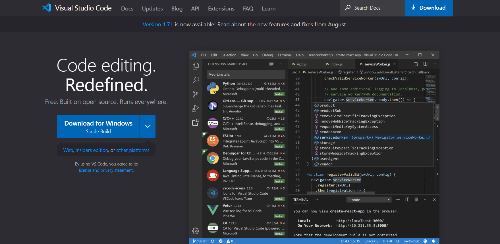
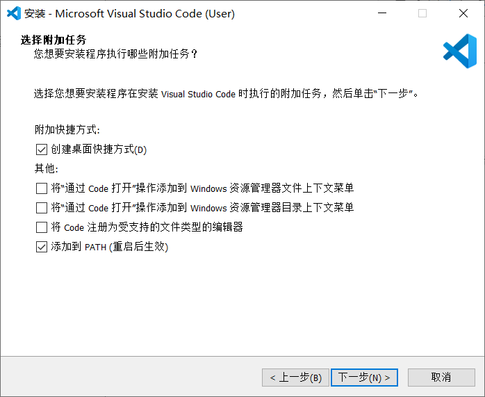
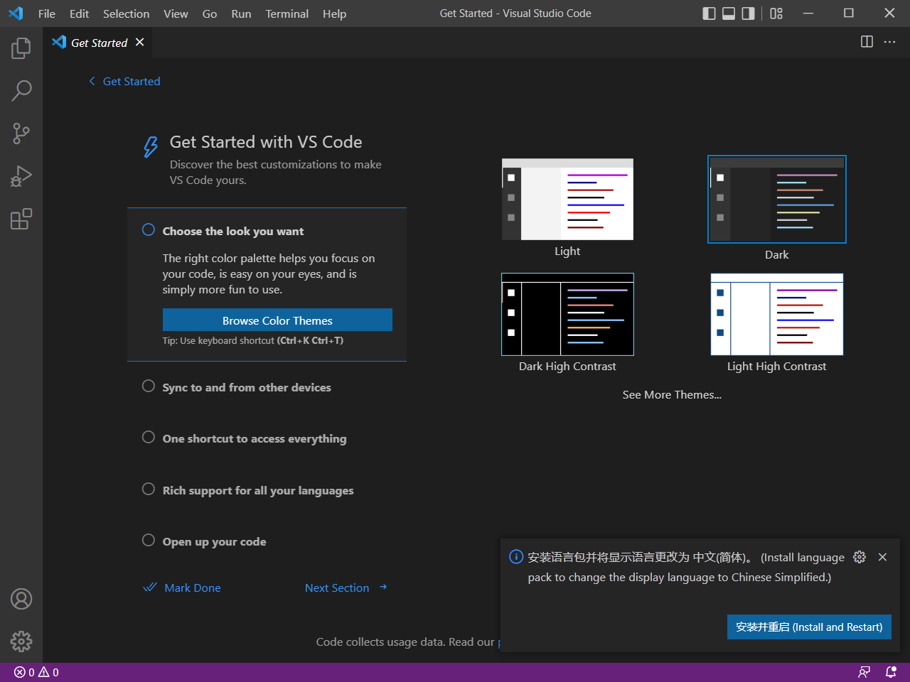
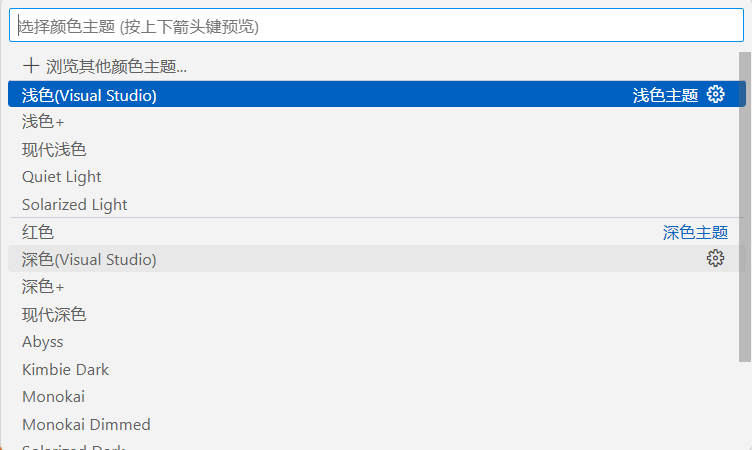

# 初识前端开发

## 1. 邂逅前端开发

### 1.1. 软件开发、软件开发体系

### 1.2. 完善的应用程序包括哪些？

* 服务器开发
* iOS开发、Android开发
* Web开发
* 桌面开发（window mac os）

### 1.3. 前端开发的内容

* 前端开发的任务；
  * web开发、小程序开发
  * 移动端、桌面端（electron、vscode）、服务器开发（Node）
* 前端开发的路线

### 1.4. 学习方法和学习建议

* 学习任何新的东西的，最好了解它的历史、局限性、本质；
* 知识进行分类：
  * 常用的知识：必须非常熟练；
  * 不常用的知识：知道有他，知道在哪里查；

## 2. 邂逅Web开发

### 2.1. 电脑配置、推荐软件

### 2.2. 网站和网页的关系

### 2.3. 网页的显示过程（重要）

* 用户角度
* 前端工程师
* 服务器是什么？

### 2.4. 网页的组成部分

* HTML：网页的结构
* CSS：网页的样式（美化）
* JavaScript：网页的交互（灵魂）

## 3. 浏览器和浏览器内核

常见的浏览器

核心部分浏览器内核：渲染引擎

## 4. VS Code 安装文档

### 4.1. 下载

进入VS Code官网：https://code.visualstudio.com，点击 `DownLoad for Windows`下载windows版本

 

当然也可以点击旁边的箭头，下载Windows版本 或 Mac OS 版本

 

- 备注：
  - Stable：稳定版
  - Insiders：内测版

> 注意：上述下载软件安装包的过程，大家可以不用操作，因为在提供的课程资料中，已经为大家准备好了安装包 。

### 4.2. 安装

   

双击安装包，选择`我同意此协议`，再点击`下一步`

 

选择安装路径（也可以使用默认值: C:\Users\super\AppData\Local\Programs\Microsoft VS Code），点击`下一步` 。

 

继续点击下一步

 

可以勾选创建桌面快捷方式，如果不想使用vscode作为代码默认打开方式，可以取消`将code注册为受支持的文件类型的编辑器`，点击下一步

 

点击安装，开始安装 

 

 

 

安装完成，运行VS Code。

点击左下角的 "设置"  -> "主题" -> "主题颜色"，然后可以根据自己的喜好，选择喜欢的主题颜色。

### 4.3. 插件安装

 

VS Code提供了非常丰富的插件功能，根据你的需要，安装对应的插件可以大大提高开发效率。

完成前端开发，常见插件介绍：

#### 1、Chinese (Simplified) Language Pack

适用于 VS Code 的中文（简体）语言包

 

#### 2、HTML CSS Support

在编写样式表的时候，自动补全功能大大缩减了编写时间。

 

#### 3、JavaScript (ES6) code snippets

支持ES6语法提示

 

#### 4、Mithril Emmet

一个能大幅度提高前端开发效率的一个工具，用于补全代码

 

#### 5、Path Intellisense

路径提示插件

 

#### 6、Vue 3 Snippets

在 Vue 2 或者 Vue 3 开发中提供代码片段，语法高亮和格式化的 VS Code 插件，能极大提高你的开发效率。

 

#### 7、Auto Close Tag

自动闭合HTML/XML标签

 

#### 8、Auto Rename Tag

自动完成另一侧标签的同步修改

 

#### 9、open in browser

vscode不像IDE一样能够直接在浏览器中打开html，而该插件支持快捷键与鼠标右键快速在浏览器中打开html文件，支持自定义打开指定的浏览器，包括：Firefox，Chrome，Opera，IE以及Safari

 

#### 10、Live Server

一个具有实时加载功能的小型服务器，也就是说我们可以在项目中实时用live-server作为一个实时服务器实时查看开发的网页或项目效果。

#### 11、Vue Language Features (Volar)

一个专门为 Vue 3 构建的语言支持插件。它基于@vue/reactivity按需计算一切，实现原生 TypeScript 语言服务级别的性能。 

#### 12、TypeScript Vue Plugin (Volar)

TypeScript Vue Plugin是一个对Vue.js框架进行扩展的插件，它允许开发者使用TypeScript语言编写Vue组件和应用程序，并提供了更好的类型检查和编辑器支持。通过使用TypeScript Vue Plugin，开发者可以在编写Vue应用时获得更好的开发体验和代码可维护性。

 

#### 13、File Utils

File Utils插件,可以方便快捷的来创建、复制、移动、重命名文件和目录。 

#### 14、IntelliJ IDEA Keybindings

安装VSCode的插件 IntelliJ IDEA Keybindings 即可在VSCode中使用IDEA的快捷键。

 

### 4.4. 配置

打开配置面板，根据自己的喜好，可以修改字体、背景样式等偏好设置

## 5. 开发自己的第一个网页

### 5.1. 记事本开发网页

### 5.2. 对网页进行补充

* 增加标记 -> 元素 -> 浏览器 -> 渲染对应的效果
* 增加网页的结构
  * html
    * head
      * title
    * body 
      * h1
      * p
      * div
      * span

### 5.3. HTML语言

* 超文本标记语言
  * 为什么表标记语言？
  * 超文本：图片、音频、视频、超链接

### 5.4. 剖析元素结构

* 开始标签
* 结束标签
* 内容
* 属性
* 元素的嵌套

### 5.5. HTML注释

* 理解注释的作用
* HTML注释的编写方法
  * ctrl + /